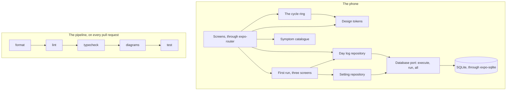
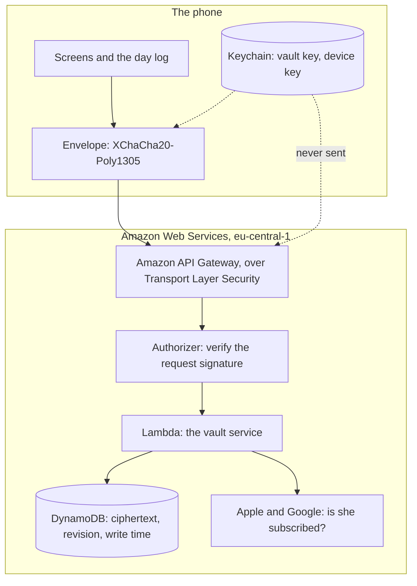

# The architecture of Emi

Emi is a period and cycle tracker. The predictions are arithmetic on her own phone. The cloud holds
ciphertext and no key.

This document says what runs on the phone, what runs in Amazon Web Services, and what crosses
between the two.

## How to read this document

Status: built

Every section below carries one status line. The line is the first line under the heading and it
reads `Status: built` or `Status: designed`.

`built` means the code is in this repository now. You can read it. The pipeline runs it on every
pull request.

`designed` means `.krewe/design.md` describes it and nobody wrote it yet. There is no code. There
is no infrastructure. A document that describes an empty directory as though it were running is
worse than no document, so the two states are kept apart.

Most of this document is `designed` today. That is the honest picture on 2026-09-17.

## What runs today

Status: built

Everything below runs on the phone. There is no server. There is no account. Nothing leaves the
device, because there is nowhere for it to go yet.

The day log table holds one row for each calendar day she recorded anything. The row carries a
`payload` column. Today that column holds plain bytes. Section "The encrypted record" says what it
will hold.

## The directories

Status: built

Every directory in the list below is on disk in this repository now. A test reads this list and
compares it against the workspaces in the root `package.json` and against the disk. A directory in
the list that does not exist fails the pipeline. A workspace on disk that the list does not name
fails it too.

Sections further down name directories that do not exist yet. Those names are outside this list on
purpose, because the design may name a thing before anybody builds it. This list may not.

- `apps/mobile` is the Expo application. It holds the screens and the data layer.
- `packages/tokens` holds the colours, the type scale and the spacing. It is the only place a colour
  value may be written.
- `packages/cycle` holds the symptom catalogue. The prediction arithmetic arrives beside it.
- `packages/crypto` holds the encrypted record format: the envelope, the canonical json and the
  ranges a day is checked against.
- `brand` holds the mark, the icons and the fonts, as drawn files and the programs that write
  them.
- `services/vault` holds the service behind the api: the account, the request signature and the
  authorizer. It holds no key, so it can read nothing it stores.
- `infra` holds the Terraform: the table, the api, the two functions and the two roles. The
  pipeline validates it on every pull request. Nothing is applied yet.
- `tools` holds the checks that guard the repository rather than the product.
- `docs` holds this document and the documents beside it.

## The phone

Status: built

The application is Expo with expo-router. A screen reads from the day log repository and draws with
the design tokens.

The data layer goes through a port with three methods: `execute`, `run` and `all`. The application
satisfies the port with expo-sqlite. The tests satisfy it with `node:sqlite`. There is no hand
written double, so every constraint is proved against a real database engine.

The `day` column is a copy of the date that also sits inside the payload. It is kept in the clear so
the application can query by date. It never leaves the phone.

## The first run

Status: built

The home screen has nothing to draw until she has said when her last period started, so a woman who
has recorded nothing is sent to three screens instead. The first says what Emi is and what it will
not do. The second asks when her last period started. The third asks roughly how long her cycle
runs. Those are the two answers a first forecast needs, and the first run asks for nothing else.

There is no account, no email address and no password, and there is no field to type into at all.
She picks a day from a list of the last ninety one days, and she moves a number between 21 and 45.

Nothing is written until she answers the last screen. The day and both settings are then written in
one transaction, so a first run she walks away from halfway leaves the database as it was. The
`setting` table holds the cycle length she stated and the instant she finished. The second reads
that instant and sends her straight to the home screen.

The day she picks is written as a bleeding day of medium flow. She is never asked how heavy it was,
because the answer changes no forecast, and a record has no other way to say that a day was a
bleeding day. She can change it on the day itself.

## The design tokens

Status: built

`packages/tokens` holds eighteen colours, six type sizes and the spacing scale. Each text colour
carries the ground it sits on and its measured contrast ratio.

A lint rule refuses a hex value anywhere outside `packages/tokens`. A test drives that rule in both
directions, and a second test reads every tracked source file to prove no value escaped before the
rule existed.

## The symptom catalogue

Status: built

`packages/cycle` holds the catalogue of symptoms she can log. Each one carries a slug, a display
name and a group.

The slug is the only part written into a record, so it can never change. A name is display text and
may be rewritten at any time. A symptom that is no longer offered keeps its entry and carries the
day it retired, because six cycles of her history point at that slug. A record that names a slug
nothing resolves is a record she cannot read.

The mood group of the catalogue is not offered as a symptom. The log sheet draws it as a picker of
its own at the top, and what she picks there is written into the `moods` field of a record rather
than into `symptoms`, so a screen that reads her history counts a mood once.

## The application icon

Status: built

One program draws every icon size. It is `brand/icon/generate.ts`, and `npm run generate:app-icon`
runs it through Node with type stripping. It reads one drawn source, `brand/logo/emi-ring.svg`, and
writes the icons into `apps/mobile/assets/icon`. The interface icons are a different set, and they
live in `brand/icons`.

The two stores ask for different lists, and both lists change. The lists are data in
`brand/icon/sizes.ts`, with the reason beside each size. Apple asks only for the 1024 icon today
and derives the rest. Emi draws every size itself, because the mark is a ring with a gap in it, and a
resample closes the gap.

The two lists come to 24 files today: 8 for Apple and 16 for Google.

The program measures the icon it made. It renders the result, finds the ink, and refuses to write
when the ring is not 56 percent of the icon width. On the mark as drawn it reads 56.06 percent. It
also refuses when the drawn source is absent, and the refusal names the step that draws it.

## The cycle arithmetic

Status: designed

The prediction arithmetic arrives beside the catalogue, in `packages/cycle`. It will be pure
functions. No input, no output, no clock.

A cycle starts on the first day of bleeding that is not marked unexpected. The predicted start of
the next period is the last start plus the median of the last six cycle lengths. The median, not the
mean, so that one long cycle after an illness does not drag every forecast after it.

The forecast is a range, never a single day. Estimated ovulation is the predicted start minus the
luteal length. The fertile window runs from five days before that day to one day after it.

This is arithmetic. It is not intelligence, and calling it intelligence would be a claim the code
cannot support. It is also the reason the privacy promise is cheap to keep: there is nothing to send
anywhere.

## Reading a history back

Status: built

The history screen reads her cycles back and names what came back with them. The arithmetic is
`packages/cycle/src/patterns.ts`, and it is pure: the days she recorded in, the patterns out.

A symptom is named once it came back in three of her cycles, at the same point in them. Three is the
smallest count that can tell a repeat from a pair, and it is about three months of her life. The
number is chosen and it is not measured, because no published distribution says when a symptom stops
being a coincidence. A reading may sit a day either side of the day it is grouped at. A window wider
than those three days would cover a fifth of a short cycle, where the same point in her cycle stops
meaning anything.

The day is counted from whichever end of the cycle holds the symptom still. A symptom before her
period keeps its distance from the period while her cycles change length, and a symptom at the start
of one keeps its distance from the start, so one anchor alone would scatter half of what she logs.
Where both ends explain as many cycles, the distance from her period wins.

Only complete cycles are read, at most the last six, which is the window the forecast takes its
median over. The cycle she is in has no next period to count back from. Moods count with symptoms,
because both are slugs of the one catalogue.

Every line on that screen names the cycles behind it, so the count she is trusting is on the screen
with the answer.

## The encrypted record

Status: built

`packages/crypto` holds one envelope format, used by the phone and read by the server.

The bytes are a version byte of `0x01`, then a 24 byte nonce, then the ciphertext and its 16 byte
authentication tag. The cipher is XChaCha20-Poly1305. The plaintext is canonical json with sorted
keys and no whitespace, so the same record always produces the same bytes.

A nonce is drawn fresh for every single write. Two writes of the same day are two different
envelopes, and a source that returns nothing but zeroes is refused rather than used.

The package checks a day before it seals it: the date, the flow, the symptom slugs against the
catalogue, the energy from one to five, the temperature from 34.0 to 42.0, the weight from 20.0 to
400.0 and the note at 2000 characters. It does not check those ranges again when it opens a record,
because a day she wrote years ago is hers to read and a build that refused it would lose her history
rather than protect it.

`packages/crypto/tests/vectors.json` holds a key, a nonce, a plaintext and the envelope those three
produce, byte for byte. A change to the format turns the test red. A new version byte adds vectors
and never edits these.

The libraries are `@noble/ciphers`, `@noble/curves` and `@noble/hashes`. They are audited, they
have no dependencies, and they contain no native code. Nothing to link means nothing that can fail
at launch on a device while every test stays green. Only `@noble/ciphers` is installed today.

The day log still writes the payload column as plain bytes. The step that sends every row through
the envelope comes next.

## The account and the request signature

Status: built

There is no sign up screen, because there is nothing to sign up with. The phone makes an Ed25519 key
pair, writes the private half into the keychain, and never sends it anywhere. The account identifier
is the first 16 bytes of the SHA-256 of the public key, written in Crockford base 32, which is 26
characters.

Registration is the one call with no authorizer. She sends the public key, signed by that same key,
so the request asserts itself and nothing else. The service derives the identifier from the key it
was sent, which is why she cannot choose one and two women cannot land on the same one.

Every later request carries four headers, and the first three of them are what the api reads as an
identity source.

- `emi-account` names the account.
- `emi-instant` is the moment it was signed.
- `emi-body-sha256` is the digest of the body. It travels as a header because an authorizer never
  receives a body, so without it the authorizer could not verify the whole of what was signed.
- `emi-signature` is the Ed25519 signature over the method, the path, the instant and that digest,
  joined by newlines. The path carries the query string where there is one, so a cursor cannot be
  moved under a signature made for another one.

Three refusals hold the contract up.

- A request signed more than 300 seconds from now is refused, in either direction.
- A signature that was accepted once is written down and refused the second time it arrives. That is
  what refuses a captured request inside the window, and it is why the authorizer is allowed one
  write.
- An account that does not exist is refused with the words a bad signature is refused with, and it
  pays for the same Ed25519 verification first, against a key nobody holds. Without that, the time
  the answer takes would say which accounts exist.

The function that receives the body compares it against the signed digest, which is the half of the
check the authorizer cannot make.

## The vault key on the phone

Status: built

The key that encrypts every day she logs is thirty two random bytes. It is made once, on her phone,
at first run. It is never transmitted.

It goes in the keychain and not in the database. The platform deletes an application's database
with the application, so a woman who reinstalls Emi would find her own history unreadable. The
keychain item outlives the delete. That is the platform's behaviour rather than ours, and platforms
change it, so feature 5 step 7 measures it on a real device and writes down the device, the
operating system version and the date.

The item is `emi.vaultKey.v1`, written base 64, readable only while the phone is unlocked. Emi
opens in public, so an item readable on a locked phone would give away the thing the product is
for.

A second creation while one exists is refused. Replacing the key is not losing a password: every
day she ever wrote was sealed under the first one, and nothing would open them again. For the same
reason a keychain item of the wrong length refuses rather than reading as nothing, because nothing
is what sends the caller to make a second key over the top of the first.

The bytes come from expo-crypto's `getRandomValues`. Its other call, `getRandomBytes`, falls back
to Math.random while a remote debugger is attached, and a key drawn from Math.random is a key
anybody can draw again. A generator that is not running returns zeroes, and zeroes are refused
rather than used.

Contract VAULT-1 says the key reaches no log, no export, no error message and no crash report. Two
things hold that up. Every refusal this module raises is read in a test and carries the reason and
never the key. And `tools/pipeline/keyLeak.ts` fails the pipeline over the sink rather than over
the bytes: the application writes to no log at all, and each keychain item is named in one
directory and nowhere else, so an export or a support screen cannot read an item it cannot name.

Nothing writes a day through the key yet. The step that sends every row through the envelope comes
next.

## Deleting everything

Status: built

One press on the delete screen empties the database and the keychain. Nothing is queued and nothing
is held back, so there is no window in which she has asked and Emi still holds her days. Contract
KEEP-3 names a delay or a cooling off period as the error, not only a row that survives.

The tables are read out of `sqlite_master` rather than written down in the code. A table a later
migration adds is emptied by the same call, with nobody having to remember it. The keychain cannot
be listed that way, so each directory that keeps an item declares what it keeps, and a test holds
those declarations against the list the delete uses. An item added and left off the list fails the
pipeline rather than surviving a delete.

Emptying a table is not the same as the bytes leaving the file. `PRAGMA secure_delete` writes
zeroes over what it removes, and the vacuum afterwards rebuilds the file out of the pages still in
use. A test writes four hundred rows carrying one rare word to a real file, deletes, and reads the
bytes back off the disk to prove the word is gone. Without those two statements the word is still
there.

Afterwards the phone holds no key, so the screen says so and offers one thing: start again. Taking
it reads the keychain, finds nothing, makes a key, and the first run asks her the two questions it
asked the first time.

The server half is feature 6 step 6. Until it lands, this empties the phone and nothing else, and
the screen says on this phone rather than everywhere.

## The vault in Amazon Web Services

Status: designed

The server holds an encrypted vault and no keys. Nothing here can read a day.

The Terraform for all of this is in `infra` and it is read on every pull request. None of it is
applied, because the first apply needs a credential the pipeline does not hold yet. The region is
eu-central-1 and the account is 230345688874.

`services/vault` now holds the account, the request signature, the authorizer, the two record
endpoints and the storage that writes the items. The bundle the two functions run is not written,
so what is deployed today is still the two placeholders the Terraform carries.

The storage takes the request shapes DynamoDB takes rather than a client of its own, so the item
the service writes is the item a test reads. The test that reads one writes a day whose note holds
a rare word and then looks for that word in every attribute of the item that reached the table. A
second test walks the service from its entry point and asserts it imports no function that could
open an envelope.

The dotted line is the product. The key never crosses it.

## What crosses between the phone and the cloud

Status: designed

The phone sends the envelope, a record identifier and a revision number. The section above says how
it signs each request.

The server stores the bytes. It refuses a revision that is not greater than the one it holds.

There is no email address, no password and no telephone number in the model.

## What the server can see anyway

Status: designed

This is the honest cost, written here rather than left for a reader to find.

The server learns how many records an account holds. It learns the instant of each write. Padding
the write times would cost battery and buy little, so Emi states this rather than fixes it.

The server cannot see a date, a symptom, a flow, a note or a name, because it holds no key.

## What this deliberately does not defend

Status: designed

A woman who loses her phone and loses her recovery code has lost her data. Emi cannot recover it. An
Emi that could recover it would be an Emi that could read it.

A person holding an unlocked phone can read everything, until the biometric lock is on.

## What version 1 does not do

Status: designed

Partner sharing. Medication tracking. The modes for premenstrual dysphoric disorder, polycystic
ovary syndrome and perimenopause. Import from another tracker or from a health platform. Every
wearable. The conversational assistant.

The assistant is out for a reason worth naming. A model that answers questions about a cycle is a
server call carrying the question. That cannot be true at the same time as the promise that nothing
is sent to a server, so version 1 keeps the promise and drops the assistant.

Emi is not a contraceptive. Emi is not a medical device. Emi makes no claim to prevent or achieve a
pregnancy, and it carries no certification badge that an auditor did not sign.
