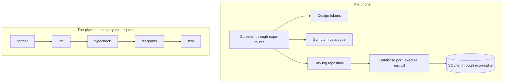
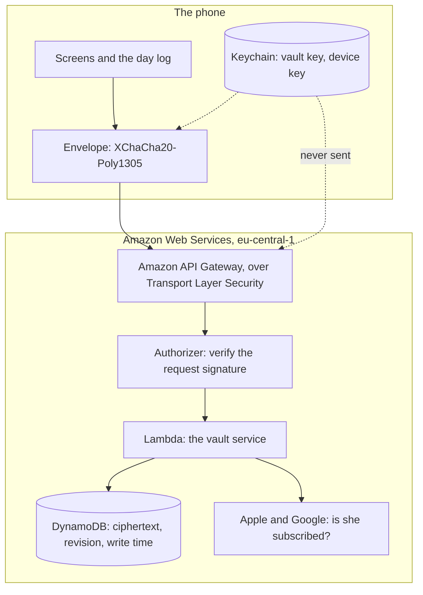

# The architecture of Emi

Emi is a period and cycle tracker. The predictions are arithmetic on her own phone. The cloud holds
ciphertext and no key.

This document says what runs on the phone, what runs in Amazon Web Services, and what crosses
between the two.

## How to read this document

Status: built

Every section below carries one status line. The line is the first line under the heading and it
reads `Status: built` or `Status: designed`.

`built` means the code is in this repository now. You can read it. The pipeline runs it on every
pull request.

`designed` means `.krewe/design.md` describes it and nobody wrote it yet. There is no code. There
is no infrastructure. A document that describes an empty directory as though it were running is
worse than no document, so the two states are kept apart.

Most of this document is `designed` today. That is the honest picture on 2026-09-17.

## What runs today

Status: built

Everything below runs on the phone. There is no server. There is no account. Nothing leaves the
device, because there is nowhere for it to go yet.

The day log table holds one row for each calendar day she recorded anything. The row carries a
`payload` column. Today that column holds plain bytes. Section "The encrypted record" says what it
will hold.

## The directories

Status: built

Every directory in the list below is on disk in this repository now. A test reads this list and
compares it against the workspaces in the root `package.json` and against the disk. A directory in
the list that does not exist fails the pipeline. A workspace on disk that the list does not name
fails it too.

Sections further down name directories that do not exist yet. Those names are outside this list on
purpose, because the design may name a thing before anybody builds it. This list may not.

- `apps/mobile` is the Expo application. It holds the screens and the data layer.
- `packages/tokens` holds the colours, the type scale and the spacing. It is the only place a colour
  value may be written.
- `packages/cycle` holds the symptom catalogue. The prediction arithmetic arrives beside it.
- `packages/crypto` holds the encrypted record format: the envelope, the canonical json and the
  ranges a day is checked against.
- `brand` holds the drawn sources of the mark, and the programs that generate assets from them.
- `tools` holds the checks that guard the repository rather than the product.
- `docs` holds this document and the documents beside it.

## The phone

Status: built

The application is Expo with expo-router. A screen reads from the day log repository and draws with
the design tokens.

The data layer goes through a port with three methods: `execute`, `run` and `all`. The application
satisfies the port with expo-sqlite. The tests satisfy it with `node:sqlite`. There is no hand
written double, so every constraint is proved against a real database engine.

The `day` column is a copy of the date that also sits inside the payload. It is kept in the clear so
the application can query by date. It never leaves the phone.

## The design tokens

Status: built

`packages/tokens` holds eighteen colours, six type sizes and the spacing scale. Each text colour
carries the ground it sits on and its measured contrast ratio.

A lint rule refuses a hex value anywhere outside `packages/tokens`. A test drives that rule in both
directions, and a second test reads every tracked source file to prove no value escaped before the
rule existed.

## The symptom catalogue

Status: built

`packages/cycle` holds the catalogue of symptoms she can log. Each one carries a slug, a display
name and a group.

The slug is the only part written into a record, so it can never change. A name is display text and
may be rewritten at any time. A symptom that is no longer offered keeps its entry and carries the
day it retired, because six cycles of her history point at that slug. A record that names a slug
nothing resolves is a record she cannot read.

## The application icon

Status: built

One program draws every icon size. It is `brand/icon/generate.ts`, and `npm run icons` runs it
through Node with type stripping. It reads one drawn source, `brand/logo/emi-ring.svg`, and writes
the icons into `apps/mobile/assets/icon`.

The two stores ask for different lists, and both lists change. The lists are data in
`brand/icon/sizes.ts`, with the reason beside each size. Apple asks only for the 1024 icon today
and derives the rest. Emi draws every size itself, because the mark is a thin ring with a gap in it,
and a resample closes the gap.

The program measures the icon it made. It renders the result, finds the ink, and refuses to write
when the ring is not 56 percent of the icon width. It also refuses when the drawn source is absent.

## The cycle arithmetic

Status: designed

The prediction arithmetic arrives beside the catalogue, in `packages/cycle`. It will be pure
functions. No input, no output, no clock.

A cycle starts on the first day of bleeding that is not marked unexpected. The predicted start of
the next period is the last start plus the median of the last six cycle lengths. The median, not the
mean, so that one long cycle after an illness does not drag every forecast after it.

The forecast is a range, never a single day. Estimated ovulation is the predicted start minus the
luteal length. The fertile window runs from five days before that day to one day after it.

This is arithmetic. It is not intelligence, and calling it intelligence would be a claim the code
cannot support. It is also the reason the privacy promise is cheap to keep: there is nothing to send
anywhere.

## The encrypted record

Status: built

`packages/crypto` holds one envelope format, used by the phone and read by the server.

The bytes are a version byte of `0x01`, then a 24 byte nonce, then the ciphertext and its 16 byte
authentication tag. The cipher is XChaCha20-Poly1305. The plaintext is canonical json with sorted
keys and no whitespace, so the same record always produces the same bytes.

A nonce is drawn fresh for every single write. Two writes of the same day are two different
envelopes, and a source that returns nothing but zeroes is refused rather than used.

The package checks a day before it seals it: the date, the flow, the symptom slugs against the
catalogue, the energy from one to five, the temperature from 34.0 to 42.0, the weight from 20.0 to
400.0 and the note at 2000 characters. It does not check those ranges again when it opens a record,
because a day she wrote years ago is hers to read and a build that refused it would lose her history
rather than protect it.

`packages/crypto/tests/vectors.json` holds a key, a nonce, a plaintext and the envelope those three
produce, byte for byte. A change to the format turns the test red. A new version byte adds vectors
and never edits these.

The libraries are `@noble/ciphers`, `@noble/curves` and `@noble/hashes`. They are audited, they
have no dependencies, and they contain no native code. Nothing to link means nothing that can fail
at launch on a device while every test stays green. Only `@noble/ciphers` is installed today.

The day log still writes the payload column as plain bytes. The step that sends every row through
the envelope comes next.

## The vault in Amazon Web Services

Status: designed

The server holds an encrypted vault and no keys. Nothing here can read a day.

The planned directories are `services/vault` for the Lambda service and `infra` for the Terraform.
Neither exists. The region is eu-central-1 and the account is 230345688874.

The dotted line is the product. The key never crosses it.

## What crosses between the phone and the cloud

Status: designed

The phone sends the envelope, a record identifier and a revision number. It sends three headers on
every request: the account identifier, an instant, and an Ed25519 signature over the method, the
path, the instant and the SHA-256 of the body.

The server stores the bytes. It refuses an instant more than 300 seconds from now, which stops a
captured request being replayed. It refuses a revision that is not greater than the one it holds.

There is no email address, no password and no telephone number in the model. The account identifier
is the first 16 bytes of the SHA-256 of the device public key.

## What the server can see anyway

Status: designed

This is the honest cost, written here rather than left for a reader to find.

The server learns how many records an account holds. It learns the instant of each write. Padding
the write times would cost battery and buy little, so Emi states this rather than fixes it.

The server cannot see a date, a symptom, a flow, a note or a name, because it holds no key.

## What this deliberately does not defend

Status: designed

A woman who loses her phone and loses her recovery code has lost her data. Emi cannot recover it. An
Emi that could recover it would be an Emi that could read it.

A person holding an unlocked phone can read everything, until the biometric lock is on.

## What version 1 does not do

Status: designed

Partner sharing. Medication tracking. The modes for premenstrual dysphoric disorder, polycystic
ovary syndrome and perimenopause. Import from another tracker or from a health platform. Every
wearable. The conversational assistant.

The assistant is out for a reason worth naming. A model that answers questions about a cycle is a
server call carrying the question. That cannot be true at the same time as the promise that nothing
is sent to a server, so version 1 keeps the promise and drops the assistant.

Emi is not a contraceptive. Emi is not a medical device. Emi makes no claim to prevent or achieve a
pregnancy, and it carries no certification badge that an auditor did not sign.
