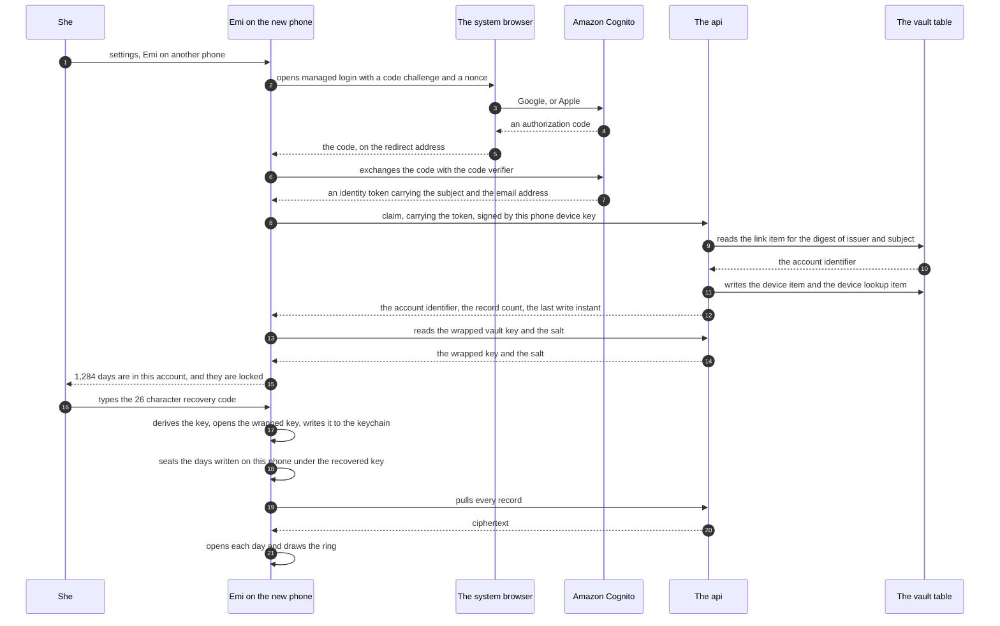
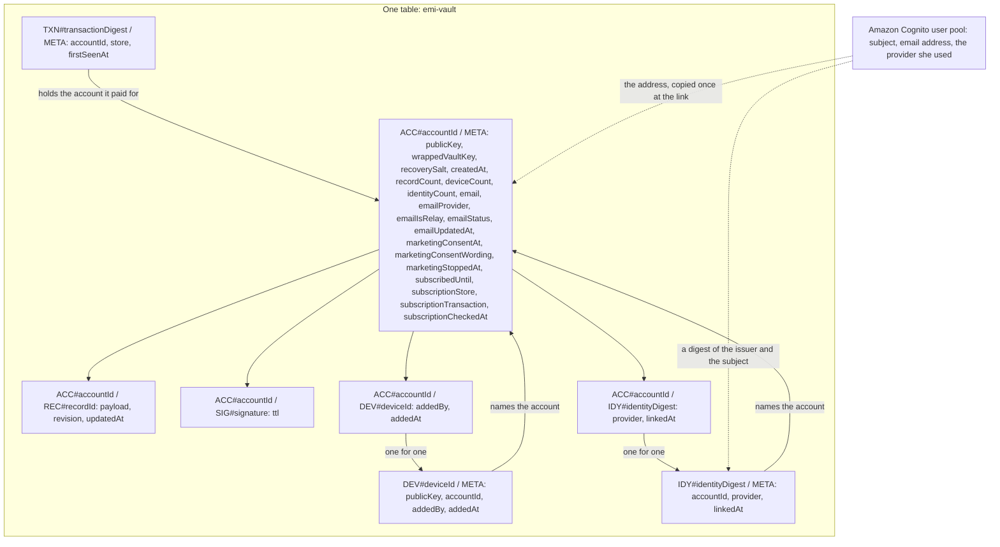

# The account: Google, Apple, and the code that is not an account

Emi has a vault account today, and nobody signs in to it. The phone makes an Ed25519 key pair, the
account identifier falls out of the public key, and every request carries a signature. This document
designs a sign in on top of that, through Amazon Cognito, with Google and Apple and nothing else.

Two sentences hold the whole design up.

A sign in proves who may reach a partition of the vault. The recovery code of contract VAULT-2 is
the only thing that wraps the vault key, and it stays the only way to open a history on a second
phone.

So a woman who signs in and has no recovery code reaches her own ciphertext and cannot read one day
of it. That is the design working. It is also the moment the product feels broken, so a large part
of this document is about what she sees in that moment.

Nothing here is built. The pull request that carries this document builds no product code.

## How to read this document

Status: designed

Every section carries one status line, the same as `architecture.md` and `privacy.md`. `Status:
built` means the code is in this repository now. `Status: designed` means this document describes it
and nobody wrote it yet.

Three sections say built. They report what the repository and the cloud account hold on 2026-09-19.
Everything else is a proposal.

## The decisions this design starts from

Status: designed

The operator settled four things. They are written here as given. This document builds them and does
not argue with them.

Google and Apple only. There is no email address and no password anywhere in this feature. Amazon
Cognito holds federated identities alone, so there is no password to reset and no reset path to
design.

Nothing about signing in opens a record. The recovery code stays the only thing that wraps the vault
key.

Emi has an account and it carries an email address, so Emi can write to her. Both providers hand the
address over at sign in, so no screen asks her to type one.

She signs in later, never in the first run. Contract SCREEN-1 stays exactly as it is, and so do its
tests.

## What I read

Status: built

Each line names the fact taken from the source.

- `docs/contracts.md`. WIRE-1 registers a public key, a wrapped vault key and a recovery salt.
  AUTH-1 signs the method, the path, an instant and the digest of the body. VAULT-2 makes the
  recovery code the one way back. SCREEN-1 names an account, an email address or a password asked
  for as an error of the first run. WIRE-5 and PAY-4 keep reading open through a lapse.
- `docs/architecture.md`, the account and the request signature, the vault key on the phone, and the
  vault in Amazon Web Services. The account identifier is the first 16 bytes of the SHA-256 of the
  public key, in Crockford base 32.
- `services/vault`, the whole service. Four handlers, one authorizer, one storage port and one
  DynamoDB implementation. The authorizer reads the account item, verifies the signature against the
  stored public key, and writes the signature down to refuse a replay.
- `apps/mobile/src/services/sync`. `deviceKey.ts` makes the key pair once and keeps it in the
  keychain. `sign.ts` puts four headers on every request. `deleteAccount.ts` takes the server half
  first, because the key that proves the account is about to be destroyed.
- `apps/mobile/src/services/vault` and `packages/crypto/src/recovery.ts`. The recovery code derives
  one key through Argon2id, and that key wraps the vault key. It derives nothing else today.
- `infra`. One HTTP api, four routes, two functions, one table, four roles. The pipeline validates
  on a pull request and applies on a merge.
- `apps/mobile/tests/integration/6.2.test.ts` and `apps/mobile/tests/integration/2.3.test.tsx`. Two
  cases pin what the product may hold and ask for. The section "What this design moves" names them.

I read these outside the repository on 2026-09-19.

- Apple, App Store Review Guidelines, guideline 4.8 and guideline 5.1.1(v), at
  `https://developer.apple.com/app-store/review/guidelines/`. Quoted in the section on Sign in with
  Apple.
- Apple, "Communicating using the private email relay service", at
  `https://developer.apple.com/documentation/signinwithapple/communicating-using-the-private-email-relay-service`.
  The page body is drawn by a script and I could not read it. I took the requirement from two other
  readings and say so where I use it.
- Amazon Web Services, the Amazon Cognito pricing page, the social identity provider guide, and the
  json web token authorizer guide for an HTTP api. A route takes one authorizer.
- Amazon Web Services, "Request production access" for Amazon Simple Email Service, and the
  reputation alarm guide. The sandbox allows 200 messages in 24 hours, one a second, to verified
  addresses only. The service recommends a bounce rate under 5 percent and a complaint rate under
  0.1 percent, and it may pause an account above 10 percent and 0.5 percent.

I also read the cloud account, read only, on 2026-09-19, with the credentials this machine holds.

- `aws sesv2 get-account --region eu-central-1` answers `ProductionAccessEnabled: true`,
  `SendingEnabled: true`, `EnforcementStatus: HEALTHY`, a quota of 50,000 messages in 24 hours at 14
  a second, and 0 sent in the last 24 hours. So account 230345688874 is already out of the sandbox
  in the region the vault runs in.
- `aws sesv2 list-email-identities --region eu-central-1` answers one identity, `datexpats.com`,
  with `VerificationStatus: FAILED` and sending disabled. So no domain in that account can send
  today, and Emi needs its own.
- `aws sesv2 list-configuration-sets --region eu-central-1` answers an empty list.

## What is built today, and the hole this design lands in

Status: built

The service registers an account, writes a record, reads a page of records and deletes everything.
The phone makes the keys, signs every request, wraps the vault key under the recovery code and sends
the wrapped bytes with the registration.

One gap sits in the middle of it.

A second phone makes its own device key, so it derives a different account identifier. It cannot
name the first account and it cannot sign for it. There is also no endpoint that reads the wrapped
vault key and the salt back: `registerAccount` writes them and no handler returns them. The case at
`services/vault/tests/register.test.ts` line 281 says the bytes are written down "so a second phone
can ask for them back", and nothing asks.

So feature 6 step 7, the restore onto a second phone, cannot run today. The sign in is what names
the old partition. The device binding is what lets the new phone sign for it. The recovery code is
what opens the days, and it always was.

## What a sign in does, and what it never does

Status: designed

It does three things.

1. It names her vault partition from a phone that holds neither her device key nor her recovery
   code.
2. It binds a new device key to that partition, so the new phone can sign.
3. It gives Emi an email address, and it carries her subscription between the two stores.

It never does these.

It never wraps a key, and no key is derived from anything a provider returns. It never decrypts. It
never reads a day. A person who takes her Google account reaches ciphertext, a count of records and
a write time, and stops there.

The identity token is verified and dropped. No part of it is written to the table.

## Question 1: the identity beside the account identifier

Status: designed

Both run, and the signature stays the proof on every request. The identity authorizes two calls
only: link an identity to the account, and claim an account from a new phone.

The account identifier is derived and not chosen. `accountIdFor` cuts it from the public key, so two
women cannot land on one and the service never trusts a caller to name herself. A Cognito subject as
the partition key would give that property away and rewrite WIRE-1, AUTH-1, the table and every
test.

An identity token is a bearer token. Whoever holds it can act while it lives. The signature is a
proof of possession, bound to the method, the path, the instant and the digest of the body, and it
is refused the second time it arrives. Moving every request onto a bearer token would weaken every
request for the sake of two calls.

A route takes one authorizer, so the signature authorizer cannot share a route with a json web token
authorizer. The two new calls verify the token inside the handler, against the key set the pool
publishes.

## Where the sign in is offered

Status: designed

Status of the first run: unchanged. Nothing in this feature adds a screen, a field or a question to
it. Contract SCREEN-1 keeps its three screens and its error for an account, an email address or a
password asked for.

The sign in is offered in two places, and she is doing something related in both.

The first is the screen that follows the recovery code, in feature 6. She has just written 26
characters on paper, so the question of losing this phone is already in her head. Emi says what the
sign in is for and offers it there, with a control to skip that is as easy to press as the one to
take it.

The second is settings, under an entry that says what it does rather than what it is called: Emi on
another phone. That entry is where she goes on the day the question becomes real. A woman who
skipped the first offer finds it here, and a woman on a new phone finds it here as well.

A third place arrives with feature 7, because a subscription that follows her needs an identity to
follow. That is out of this design and named in the path as a dependency.

The words at the first offer, which are hers to read in one breath.

Title: Use Emi on another phone.

Lines: Sign in with Google or Apple, and a new phone can find this vault. Your days stay locked to
your recovery code either way. Signing in does not open them, and Emi still cannot read them.

Actions: Sign in, and Not now.

## What works before she ever signs in

Status: designed

Everything. The whole product runs on one phone with no sign in: the first run, logging, the ring,
the forecast, the history, the export, the lock, the delete, the encrypted vault in the cloud and
the subscription.

A woman who never signs in still has a vault account. It is made by her device key when the phone
first registers, under contract WIRE-1, with no email address and no sign in of any kind. Her
account identifier is the 26 characters derived from her public key, and every record she has is
already filed under it.

So a sign in adds an identity to an account that exists. It never makes a second one. The words in
the product keep the two apart: the vault account is what her records are filed under, and the sign
in is the thing that finds it again.

## The sign in path, on a second phone

Status: designed

She installs Emi on a new phone. She answers the first run, because nothing here changes it. Then
she opens settings, and this happens.

Read the answer at the claim. It carries a count and an instant and no day. Read the two lines after
it. The wrapped key and the salt cross the wire, and neither opens without the code she has not
typed yet.

## Between the sign in and the recovery code

Status: designed

This is the moment the product feels broken, so it is designed at field level and at screen level.

### Whether the pull happens before the code, or after it

Status: designed

After. Three reasons, and the third is the one that decides it.

A record pulled before the code is ciphertext the phone cannot open, sitting in a local database
whose every reader expects a row to open. The history screen, the export and the ring would each
need a second state for unreadable rows, and that is the state that looks like loss.

It costs her a download she may never use. A woman with no recovery code would spend her data
allowance on bytes that will never open for anybody.

The merge needs the key. A day she wrote on this phone before signing in is sealed under this
phone's key, and the pulled days are sealed under the recovered key. One of the two has to be
sealed again, and nothing can be sealed again until the code arrives.

The wrapped vault key and the salt are read before the code, at the claim. They are two small values
and they open nothing, so fetching them early costs nothing and buys a great deal: the code she
types is checked on the phone, against her own wrapped key, with no request and no wait. A wrong
code is refused instantly and offline.

### What the screen shows, and what it says

Status: designed

The locked screen appears the moment the claim answers. It carries three facts from the claim
answer, and no day.

It names the number of days the account holds, written as a number. It names when the last one was
written, as a plain interval, for example three days ago. It names the provider she signed in with
and the email address it handed over.

The words.

Title: Your days are here. They are locked.

Lines: This account holds 1,284 days, and the last one was written three days ago. Emi cannot open
one of them without your recovery code. The code is the 26 characters Emi showed you on your other
phone, and Emi keeps no copy of it.

Actions: Enter my recovery code, and I do not have my code.

Three rules make that screen impossible to misread, and each one is a case.

The word lost never appears, and neither does missing, gone, empty or error, because none of them is
true. The screen is held to that list by the copy test that already reads every string in the
application.

The count is never zero on this screen. An account that holds no record skips the locked screen and
goes to the home screen, because there is nothing to unlock and a locked screen over nothing is the
scariest screen in the product.

The history screen may never show its empty state while the vault is locked and the account holds
records. It shows the locked state, the count and the control that asks for the code. A woman who
presses past the locked screen and goes looking for her history finds the same answer there.

While the code runs, the screen says Opening 1,284 days, and it does not say Loading. When it
finishes, the ring is on the screen and the words are Your cycle is back.

### The woman who has no recovery code

Status: designed

She presses I do not have my code. This screen says the thing plainly, once, and offers her a way
forward rather than a way round.

Title: Without the code, these days cannot be opened.

Lines: Emi cannot open them, and nobody at Emi can. There is no reset, because a reset would mean
Emi could read your days, and Emi cannot. The days stay in your account as bytes nobody can read
until you delete them.

Actions: Start again on this phone, and Delete what is in my account.

Start again keeps the sign in and leaves the old account alone. She logs from today, on a new vault
key, and the old ciphertext sits there. Emi says that in one line before she confirms, because a
woman who finds the code in a drawer next month can still use it.

Delete what is in my account is the existing delete, pointed at the account she just claimed. It is
one press, it has no cooling off period, and it says what it took.

No screen in this path offers to email her the code, to answer a security question, or to talk to
anybody. Each of those would be a claim that somebody at Emi can get her days back.

## The days she wrote before she signed in

Status: designed

They are all hers, they stay under one account, and the sign in never makes a second one.

Two cases, and the second is the one with an order that matters.

She signed in before the phone ever registered. The phone holds days sealed under the vault key it
made at first run, and the server holds nothing for this device key. The claim binds the device key
to her account. She types the code, the phone takes the recovered vault key, seals every local
row again under it and raises each revision, and then pulls. Her new days and her old days are one history
under one account.

She registered first and signed in afterwards. Now two accounts exist: the one her identity names,
and the one this phone registered for itself. The phone deletes its own account first, while its
device key still names it, and only then claims hers. The order is the same one the delete already
uses, and for the same reason: a device key names one account, so after the claim this phone can
never sign for the account it left behind.

The second sealing is the part a test has to watch. Every local row is opened with the key in the keychain,
sealed again under the recovered key, and written back with its revision raised by one. The keychain
item is replaced last. A phone that stops halfway holds rows under two keys, so the step writes a
marker first and finishes the sealing on the next launch before it draws anything.

Contract VAULT-1 refuses a second creation of the vault key. Replacing it with a recovered key is
not a creation, and this design gives that path its own call, so the refusal stays exactly as strict
for every other caller.

## One sign in, one account, and what a person may hold

Status: designed

An identity belongs to one vault account. A vault account holds at most one identity for each
provider, and at most two.

A link is refused when that identity already names another account. The refusal says the identity is
already in use and never which account, because an answer that named one would let anybody test who
uses Emi.

She may link both providers to one account, and that is the recommended state: two ways back rather
than one. The account screen shows which providers are linked and offers the other.

Unlinking is hers to do. It removes the link and the address it carried, and it never touches a
record.

## What Google and Apple learn

Status: designed

Both learn that she uses Emi. Google records the grant, and she can read it and withdraw it under
the third party access page of her Google account. Apple lists Emi under Settings, her name, Sign in
with Apple, where she can stop it. Neither company sees a day, a symptom or a date, because neither
one ever receives a payload.

She is told this on the screen where she chooses, above the two buttons, in her words.

Google tells Google that you use Emi. Apple tells Apple that you use Emi, and Apple can hide your
email address from us.

Emi gets your email address from whichever you choose, so there is nothing to type. Emi writes to
you about your account. Emi writes to you about anything else only if you ask for it.

The same cost goes in `privacy.md`, beside the one already there about the store knowing she bought
a subscription.

## Sign in with Apple, and the review rule

Status: designed

I read guideline 4.8 on 2026-09-19 at `https://developer.apple.com/app-store/review/guidelines/`. It
says that an app which uses a third party or social login service, and it names Google Sign-In among
them, to set up or authenticate the user's primary account must also offer as an equivalent option
another login service with three features: the service limits data collection to the user's name and
email address, it allows users to keep their email address private as part of setting up their
account, and it does not collect interactions with the app for advertising purposes without consent.

Offering both providers satisfies it. Sign in with Apple has all three features, and it sits beside
Google on the same screen, in the same release.

The same page carries guideline 5.1.1(v). An app that supports account creation must also offer
account deletion inside the app. Emi deletes everything in one action already, and the path extends
that action to remove the identity and the Cognito user.

One risk, stated because I did not test it. A Cognito user pool federates with Apple through its
managed login pages, which the phone opens in an authentication session owned by the operating
system. That is the system browser and not a web view, and the Apple page inside it is Apple's own
page rather than the native sheet. The guide describes an address carrying
`identity_provider=SignInWithApple` that goes straight to the provider, which is what the path uses.
If review asks for the native sheet, the way to give it is a custom authentication flow in the pool
that accepts a token from Apple's own framework, which is three more functions and a bigger change.
I have not put a build through review.

## The email address

Status: designed

### What Emi sends, and under what permission

Status: designed

Two kinds, kept apart because the permission, the wording and the way to stop them are different.

Transactional mail goes to her because she has an account. There are four messages and no more in
version 1. A new phone was bound to your account, which is the one that matters if somebody else
signs in as her. Your subscription renewed, or it did not. Your recovery code is the only way back,
sent once, a week after she signs in, and never again. Your account and everything in it was
deleted, sent as the last act of a delete.

Each transactional message carries no day, no symptom, no date from her records and no count of
them. A message says that something happened to the account and never what is in it. That rule is a
case: the sender is handed a record identifier by no code path at all.

Marketing mail goes to her only if she asked for it. She is asked once, on the account screen, with
the box clear and empty. One press stops it forever, from a link in the mail and from the account
screen, and stopping it never affects the transactional mail.

### The service that sends them

Status: designed

Amazon Simple Email Service, in eu-central-1, in the account the vault already uses.

The reason is the account state I measured rather than a preference. Production access is granted in
that region already, sending is enabled, the enforcement status is healthy, and the quota is 50,000
messages in 24 hours at 14 a second. So Emi does not have to leave the sandbox, which is the part of
a new sender that takes days and can fail.

It costs nothing while nobody is sent anything. The Essentials plan carries no monthly fee, and mail
is 0.10 United States dollars for each 1,000 messages. The plans above it carry a fixed monthly
charge, so the cost rule refuses them until a measurement asks for one.

One cost to state. Sender reputation belongs to the account and the region, not to the product, and
that account sends for another product. A complaint rate earned anywhere in it pauses Emi as well.
Emi gets its own configuration set so its own bounce and complaint rates are visible on their own,
and the alarm on each rate names Emi. If the two products ever pull in different directions, the
answer is an account of its own, and this document says so now rather than after the pause.

### The sender domain, and what a relay address needs

Status: designed

Emi has no domain yet, and that is an open decision. This section says what the domain must carry
whenever it is chosen.

It is verified as an identity in the region, with DomainKeys Identified Mail signing turned on and
its own mail from subdomain, so the envelope sender and the visible sender are both Emi. It
publishes a Sender Policy Framework record and a Domain based Message Authentication record.

Apple needs one more thing, and it is the step that is easy to miss. A private relay address only
receives mail from a sender Apple knows. The sending domain and each sending address are registered
in the Apple developer account, under Certificates, Identifiers and Profiles, in the Sign in with
Apple configuration, and Apple matches the mail against them by Sender Policy Framework on the
visible sender domain and by the DomainKeys signature. Mail from a source Apple does not hold is
rejected. I could not read Apple's own page, because it is drawn by a script, so I took this from
Apple's documentation title, a deliverability guide that describes the same registration, and a
developer forum thread about mail to relay addresses bouncing. Treat it as read and not as measured,
and prove it by sending to a relay address before the feature ships.

That gives a rule worth a case: the sender refuses to send to an address at
`privaterelay.appleid.com` unless the sending address it is configured with is one of the registered
ones. A silent bounce to every Apple user is the failure this prevents.

### Bounces and complaints

Status: designed

A configuration set named for Emi carries an event destination to a notification topic, and a small
function writes the outcome onto the account item. A hard bounce sets the address to undeliverable.
A complaint sets it to complained and stops every marketing message immediately.

The account level suppression list is already on for bounces and complaints in that region, which I
measured, so a suppressed address is refused by the service before Emi spends anything on it.

An undeliverable address is shown to her in the account screen, in one line, with the way to fix it:
sign in again with the other provider, or turn the relay forwarding back on in her Apple account. A
relay address that she switches off looks exactly like a hard bounce, so the line says both causes.

Two alarms, one on the bounce rate at 5 percent and one on the complaint rate at 0.1 percent, which
are the rates the service recommends staying under. The service may pause an account above 10
percent and 0.5 percent, so the alarms are set at half the rate that matters and not at the rate
that hurts.

### What the server then holds, and for how long

Status: designed

This is the honest change, and it is a real one.

Before this feature, the vault table held no personal datum at all. A person reading it saw an
account identifier derived from a public key, ciphertext, revisions and write times. After it, an
account that has signed in also holds an email address. So a person reading the table learns that a
named inbox has a period tracker, and how many days it holds, and when the last one was written.
They still learn nothing about a single day.

That is stated in `privacy.md` as a cost, in these terms. What is stored: the email address the
provider handed over, which provider it came from, whether it is an Apple relay address, and whether
it is deliverable. What it is used for: the four transactional messages, and marketing only with her
consent. How long it is kept: as long as the link. Unlinking removes the address. Deleting the
account removes it with everything else, in the same press, with no retention period.

What a relay address changes. Apple's relay hides her real address from Emi, so the table holds an
address that identifies her to Apple and to nobody else. It still ties an inbox to a partition. She
can switch the forwarding off at any time and Emi stops being able to reach her, which the account
screen explains rather than treating as an error.

A woman who wants no company to learn that she uses Emi does not sign in. Everything except the
second phone works without it, and this document says that on the screen where she chooses.

## The money

Status: designed

The store owns the purchase. The identity carries it between the two stores. The vault account holds
the answer the write gate reads.

Contract PAY-3 already has the server check the receipt with Apple or with Google, and the date the
subscription runs to lands on the account item. Contract PAY-2 reads the store on launch and keeps
the last known answer when the store cannot be reached. Neither changes.

The identity makes it portable. A receipt is filed against the vault account that presented it, and
the identity names that vault account from any phone in either store. So a woman who buys on one
platform and moves to the other keeps her year, as long as she signs in.

Three rules for a disagreement, each one a case.

The store says subscribed and the account item says lapsed. The phone shows the subscribed state and
sends the receipt again. Writes stay refused until the server has checked it. She sees no paywall
she already paid for.

The account item says subscribed and the store cannot be reached. The phone keeps the last known
answer and writes keep working until the date passes.

The receipt is already filed against another vault. The write is refused and the screen says the
subscription belongs to another Emi account. One receipt pays for one vault, and a lock item keyed
by a digest of the original transaction identifier makes that a conditional write rather than a
search.

Contracts WIRE-5 and PAY-4 are untouched. A pull, an export and a delete work whatever any of this
says.

## The data model, at field level

Status: designed

One table, as today. It is `emi-vault`, with a partition key `pk` and a sort key `sk`, both strings,
and a local index `byUpdated` that sorts records by their write time. None of that changes.

### The items that exist today

Status: built

The account item is `ACC#<accountId>` and `META`. It holds `publicKey` as 32 bytes,
`wrappedVaultKey` as bytes, `recoverySalt` as 16 bytes, `createdAt` as an instant string and
`recordCount` as a number.

The record item is `ACC#<accountId>` and `REC#<recordId>`. It holds `payload` as bytes, `revision`
as a number and `updatedAt` as an instant string. The identifier is a universally unique identifier
of version 7.

The remembered signature is `ACC#<accountId>` and `SIG#<signature>`, with `ttl` as a number of
seconds.

### The identity lookup item

Status: designed

`pk` is `IDY#` and the identity digest. `sk` is `META`.

The identity digest is 26 characters of Crockford base 32, cut from the first 16 bytes of the
SHA-256 of the issuer, a newline and the subject. The helper that makes an account identifier makes
this one, so there is one implementation of that shape.

`accountId` is the 26 character account identifier, and finding it is the whole purpose of the item.

`provider` is `google` or `apple`. There is no third value, because there is no third provider and
no local user.

`linkedAt` is an instant as a string.

The subject is not written in the clear and no token is written at all. Anybody who holds the
subject computes the same digest and finds the same item, so the digest defends against a reader who
holds the table and not the pool, and against nobody else.

### The identity item on the account side

Status: designed

`pk` is `ACC#` and the account identifier. `sk` is `IDY#` and the identity digest. It holds
`provider` and `linkedAt`.

It exists for the delete. The delete reads every key under the partition, finds this item, reads the
digest from the sort key and removes the lookup item that the digest names. Without it a lookup item
survives a delete, and she could never link that identity again.

### The device lookup item

Status: designed

`pk` is `DEV#` and the device identifier. `sk` is `META`.

The device identifier is 26 characters, and it equals `accountIdFor(publicKey)`, so a device cannot
choose its own name any more than an account can.

It holds `publicKey` as 32 bytes, `accountId` as 26 characters, `addedBy` as one of `registration`,
`claim` or `recovery`, and `addedAt` as an instant string.

This is the one item the authorizer reads. It carries no wrapped key, no salt, no email address and
no count.

### The device item on the account side

Status: designed

`pk` is `ACC#` and the account identifier. `sk` is `DEV#` and the device identifier. It holds
`addedBy` and `addedAt`. It exists for the delete, the same as the identity item, and the public key
is written once so the two copies cannot disagree.

### The receipt lock item

Status: designed

`pk` is `TXN#` and the transaction digest. `sk` is `META`. It holds `accountId`, `store` and
`firstSeenAt`.

The transaction digest is 26 characters, cut from the first 16 bytes of the SHA-256 of the store
name, a newline and the original transaction identifier. The receipt is never stored and the
transaction identifier never travels past the digest.

### The new attributes of the account item

Status: designed

`deviceCount` and `identityCount` are numbers, so a cap is a conditional write rather than a count
of items.

`email` is the address the provider handed over, as a string. It is absent until she links an
identity.

`emailProvider` is `google` or `apple`. `emailIsRelay` is a boolean, true when the address ends in
`privaterelay.appleid.com`, worked out once at the link and written down so no sender has to parse
an address.

`emailStatus` is `deliverable`, `bounced` or `complained`. `emailUpdatedAt` is an instant string.

`marketingConsentAt` is an instant string and it is absent until she asks for marketing mail. Its
presence is the consent, so nothing has to read a boolean that somebody could default to true.

`marketingConsentWording` is the identifier of the exact sentence she agreed to, for example
`marketing-2026-09-19`. A change to the wording makes a new identifier, so an old consent can never
stand for a new promise.

`marketingStoppedAt` is an instant string, written the moment she stops. Both fields present means
she agreed and then stopped, and every sender reads stopped over agreed.

`subscribedUntil`, `subscriptionStore`, `subscriptionTransaction` and `subscriptionCheckedAt` carry
the money, and feature 7 writes them.

### What the user pool holds

Status: designed

The subject, the email address the provider returned, and which provider it was.

The app client lists Google and Sign in with Apple as its only identity providers. It does not list
the pool itself, so there is no local user, no password, no sign up form and no forgotten password
path anywhere in the product. There is no custom attribute, so the pool carries no account
identifier, no device identifier and no record count.

## What the authorizer reads on a request

Status: designed

The four headers do not change: `emi-account`, `emi-instant`, `emi-body-sha256` and `emi-signature`.
The first three stay the identity sources of the api.

`emi-account` carries the device identifier. For a phone that registered, the device identifier and
the account identifier are the same 26 characters, so nothing a phone sends changes on the day this
lands.

The authorizer reads the headers and refuses an instant more than 300 seconds from now. It reads one
item, `DEV#<emi-account>` and `META`, with a consistent read. It verifies the signature against
`publicKey`, or against the decoy public key when the item is absent, so an unknown device costs the
same time as a bad signature. It writes the signature item under `ACC#<accountId>` with the
condition that it does not exist. It hands the function `accountId` and `deviceId`.

One trap, named because it fails at run time and not at compile time. `authorizedAccountIn` compares
the account identifier in the context against the account identifier in the header today. Those two
values differ the moment a second device exists. The handler must compare the device identifier
against the header and read the account identifier from the context alone. A step that changes the
authorizer and forgets this refuses every authorized request.

## The rules a test can fail

Status: designed

1. The first run asks for no account, no email address and no password. The cases of contract
   SCREEN-1 stay green with no edit to them.
2. A device lookup item whose device identifier is not `accountIdFor(publicKey)` is refused at the
   write.
3. A request naming a device with no lookup item is refused, and it costs the same time as a bad
   signature, measured the way the existing timing case measures it.
4. An identity token is refused when the issuer is not the pool, when the audience is not the app
   client, when it is expired, when the nonce does not equal the digest of the device public key,
   when the signature does not verify, or when the use is not identity.
5. The token reader returns a digest and the email address. It never returns the subject.
6. A link is written only for the account in the authorizer context. The handler cannot create an
   account.
7. An identity already linked to another account is refused, and the refusal names no account.
8. An account holds at most one identity for each provider and at most two in total.
9. The two link items are written in one transaction, so neither can exist without the other.
10. A claim answers with the account identifier, the record count and the last write instant, and
    with no record.
11. A claim for an identity with no link is refused in the words a bad token is refused with.
12. The recovery material endpoint answers a bound device with the wrapped key and the salt, and
    with no third value.
13. The bytes it returns do not open with a wrong code, and the refusal is raised on the phone with
    no request.
14. No record is pulled before the vault key is in the keychain. A case drives the claim and asserts
    the local database is still empty.
15. The locked screen shows the count and never the words lost, missing, gone, empty or error. The
    copy test reads the strings.
16. An account with no record never shows the locked screen.
17. The history screen shows the locked state, and never its empty state, while the vault is locked
    and the count is above zero.
18. Every local row is sealed again under the recovered key and its revision rises by one. A case
    writes a day before the sign in and reads it back after the restore.
19. A phone that registered its own account deletes that account before it claims another, and a
    case reads the table and finds no item under the abandoned one.
20. A transactional message carries no day, no symptom, no date from her records and no count of
    them.
21. Marketing mail is sent only when the consent instant exists, the stop instant is absent and the
    address is deliverable. A case sets each of the three the wrong way and asserts nothing is sent.
22. A message to an address at `privaterelay.appleid.com` is refused unless the configured sender
    address is one registered with Apple.
23. A hard bounce sets the address to undeliverable, and the account screen says so in one line.
24. The delete removes every item under the account partition, every device lookup item, every
    identity lookup item, the receipt lock, the email address and the Cognito user. A case reads the
    table and the pool double afterwards.
25. No log line carries an email address, a subject, an identity token, a device identifier or a
    transaction identifier. The existing logging case drives the new endpoints as well.
26. No module under the account directory of the application names a keychain item that belongs to
    the vault, and the key leak gate fails the pipeline on one.

## The path

Status: designed

Twenty two steps. Each one is one intention, one pull request, and it reverts on its own. Each names
what it depends on, the files it touches, the behaviour it changes, what proves it, and why the
promise still holds after it.

Each step ships its behaviour test in the repository shape, in the file named for the step. The
feature number is the one the operator gives these steps, so the file names take that number.

### 1. The contracts for the sign in

Depends on: the other session's feature list, which is in flight now. No code step waits for this
one, because the pipeline reads the two documents against each other and never against the code.
Files: `docs/contracts.md`, `docs/features.md`.
Behaviour: declares the contracts for the link, the claim proof, the locked state, the email address
and its consent, and the delete of all of it, each with its errors, mapped under one feature.
Proof: `npm run check:documents`, which fails on a contract that one document names and the other
does not.
The promise: a document holds no key.

### 2. The user pool, in Terraform

Depends on: nothing.
Files: `infra/cognito.tf`, `infra/variables.tf`, `tools/pipeline/infrastructure.test.ts`,
`infra/README.md`.
Behaviour: one user pool on the Lite tier, a managed login prefix domain, and one public app client
with the authorization code grant and no client secret. The app client lists no identity provider
yet and never lists the pool itself.
Proof: the infrastructure test reads the Terraform text and asserts the tier, the absent client
secret, the grant, the absent custom attribute, and that the pool itself is not a provider of the
app client, so no password can exist.
The promise: a pool holds an email address and a subject. It holds no vault key and no record.

### 3. The identity token reader

Depends on: nothing.
Files: `services/vault/src/identity/token.ts`, `services/vault/tests/identity.test.ts`.
Behaviour: verifies a token against the key set and checks the issuer, the audience, the use, the
expiry and the nonce. It returns the digest and the email address. It is a module with no route.
Proof: rules 4 and 5, one case for each refusal, by name. A mutation that drops the nonce check is
watched failing and then passing again.
The promise: the reader returns a digest and an address. It returns no subject and holds no key.

### 4. The link endpoint

Depends on: 3.
Files: `services/vault/src/handlers/linkIdentity.ts`, `services/vault/src/store/identities.ts`,
`services/vault/src/store/dynamo.ts`, `infra/api.tf`, `services/vault/tests/link.test.ts`.
Behaviour: `POST /v1/account/identity` writes both link items and the email attributes in one
transaction, behind the signature authorizer that exists.
Proof: rules 6 to 9. The table double refuses the transaction when either condition fails.
The promise: the handler writes an account identifier, a digest and an address. It holds no key.

### 5. The unlink endpoint

Depends on: 4.
Files: `services/vault/src/handlers/unlinkIdentity.ts`, `infra/api.tf`,
`services/vault/tests/link.test.ts`.
Behaviour: `DELETE /v1/account/identity/{provider}` removes both items and the email attributes,
signed by a device key of that account.
Proof: a case unlinks and then links the same identity to another account and expects it to work. A
case asserts that an unlink with no link answers 404 and removes nothing. A case asserts the address
is gone from the item.
The promise: an unlink moves no key and touches no record.

### 6. The delete takes the identity and the address

Depends on: 4.
Files: `services/vault/src/store/dynamo.ts`, `services/vault/src/handlers/deleteAccount.ts`,
`services/vault/src/identity/pool.ts`, `infra/lambda.tf`, `services/vault/tests/delete.test.ts`.
Behaviour: the partition read carries the identity digest, the delete removes each lookup item
before its account side item, and the service deletes the Cognito user. The role gains the one
Cognito action on that pool alone.
Proof: rule 24. A mutation that narrows the projection again is watched failing.
The promise: a delete removes bytes and reads none of them.

### 7. The sign in on the phone

Depends on: 2.
Files: `apps/mobile/src/services/account/signIn.ts`,
`apps/mobile/src/services/account/identityStore.ts`, and the integration test for this step.
Behaviour: opens managed login in the authentication session the operating system owns, with a code
challenge and a nonce equal to the digest of the device public key, exchanges the code, and keeps
the refresh token in the keychain as `emi.identityRefresh.v1`.
Proof: a case drives the real module against a stub token endpoint and asserts the nonce. A case
asserts a mismatched state value is refused.
The promise: this module never reads the vault key, and step 9 makes that a rule the pipeline holds.

### 8. Where the sign in is offered

Depends on: 7, 4.
Files: `apps/mobile/src/features/account/`, `apps/mobile/src/app/settings/account.tsx`,
`apps/mobile/src/features/recovery/`, and the integration test for this step.
Behaviour: the entry in settings, the offer after the recovery code, the screen that names what each
provider learns, and the account screen that shows which providers are linked.
Proof: a case presses the control, lets the link happen and reads the screen again. A case asserts
the first run is untouched, by running the existing first run cases unchanged. The copy test reads
the new strings.
The promise: the screen shows a provider, an address and an instant. It shows no key.

### 9. The key leak rule for the account directory

Depends on: 7.
Files: `tools/pipeline/keyLeak.ts`, `tools/pipeline/keyLeak.test.ts`.
Behaviour: `emi.identityRefresh.v1` may be named only under `src/services/account`, and that
directory may not name the vault key item or import the vault key module.
Proof: rule 26, watched going red on a deliberate import and green again once it is removed.
The promise: this step is the promise, written as a gate nobody can forget.

### 10. The device item, read by the authorizer

Depends on: nothing, and it is the first step of the second phone half.
Files: `services/vault/src/store/devices.ts`, `services/vault/src/store/dynamo.ts`,
`services/vault/src/auth/authorizer.ts`, `services/vault/src/handlers/register.ts`,
`services/vault/tests/auth.test.ts`, `services/vault/tests/register.test.ts`.
Behaviour: registration writes a device item and a device lookup item beside the account item, and
the authorizer reads the lookup item instead of the account item.
Proof: rules 2 and 3, and a phone that registered writes and pulls with no change to what it sends.
A mutation that reads the account item again is watched failing.
The promise: the authorizer verifies a signature and reads a public key. A public key opens nothing.

### 11. The claim endpoint

Depends on: 10, 4.
Files: `services/vault/src/handlers/claimAccount.ts`, `infra/api.tf`,
`services/vault/tests/claim.test.ts`.
Behaviour: `POST /v1/account/claim` takes an identity token and a self signed new device key, reads
the lookup item, writes the device items, and answers with the account identifier, the record count
and the last write instant.
Proof: rules 10 and 11. A case asserts the answer carries no record and no wrapped key.
The promise: the claim writes a public key. It reads no record and it moves no key.

### 12. The recovery material endpoint

Depends on: 10.
Files: `services/vault/src/handlers/recoveryMaterial.ts`, `infra/api.tf`,
`services/vault/tests/recovery.test.ts`.
Behaviour: `GET /v1/account/recovery` answers a bound device with the wrapped vault key and the
salt.
Proof: rules 12 and 13.
The promise: the service hands out bytes it cannot open. What opens them is on paper.

### 13. The locked state and the code

Depends on: 11, 12.
Files: `apps/mobile/src/features/restore/`, `apps/mobile/src/features/history/`, and the integration
test for this step.
Behaviour: the locked screen with the count, the code screen, the offline check of the code, the
pull after it, and the history screen that says locked rather than empty.
Proof: rules 14 to 17. A case signs in, asserts the local database is still empty, types a wrong
code and asserts no request was made, then types the right one and reads the ring off the screen.
The promise: the pull waits for the key, so no unreadable row ever reaches her database.

### 14. The screen for a woman with no code

Depends on: 13.
Files: `apps/mobile/src/features/restore/NoCode.tsx`, and the integration test for this step.
Behaviour: the plain screen, the way to start again on this phone, and the way to delete what is in
the account.
Proof: a case asserts both controls and asserts the words. A case presses start again and asserts
the old account is untouched. A case presses delete and asserts the table is empty afterwards.
The promise: nothing on this screen suggests anybody can open her days, because nobody can.

### 15. The days she wrote before she signed in

Depends on: 13.
Files: `apps/mobile/src/features/restore/sealAgain.ts`, `apps/mobile/src/services/vault/vaultKey.ts`,
`apps/mobile/src/services/sync/claim.ts`, and the integration test for this step.
Behaviour: the second sealing under the recovered key, with the marker that survives a stop halfway, and the
delete of an account this phone registered before it claims another.
Proof: rules 18 and 19. A case writes a day before the sign in and reads that same day back after
the restore. A case kills the process halfway and asserts the next launch finishes the sealing.
The promise: the vault key is replaced by one derived on this phone from her code. It crosses no
wire either way.

### 16. Google as an identity provider

Depends on: 8. It needs a Google client identifier and secret, which the operator creates.
Files: `infra/cognito.tf`, `apps/mobile/src/features/account/SignIn.tsx`,
`tools/pipeline/infrastructure.test.ts`.
Behaviour: the provider, the scopes, the attribute mapping for the email address, and the button
that opens the provider page directly.
Proof: the infrastructure test asserts the provider reads its secret from a parameter and never from
a literal in the repository.
The promise: Google returns a subject and an address. It never sees a payload.

### 17. Sign in with Apple as an identity provider

Depends on: 16, and it ships in the same release. It needs the Apple developer account, a Services
identifier, a team identifier, a key identifier and a private key.
Files: `infra/cognito.tf`, `apps/mobile/src/features/account/SignIn.tsx`,
`tools/pipeline/infrastructure.test.ts`.
Behaviour: the provider, and the Apple button beside the Google one on the same screen.
Proof: the infrastructure test asserts the provider reads its private key from a parameter. A case
asserts that every screen offering Google offers Apple as well, so the two cannot drift apart and
leave guideline 4.8 unmet.
The promise: Apple returns a subject and an address, which may be a relay address. It never sees a
payload.

### 18. The sender, and the domain that may write to a relay address

Depends on: the domain decision, which is the operator's.
Files: `infra/email.tf`, `tools/pipeline/infrastructure.test.ts`, `infra/README.md`.
Behaviour: the verified domain identity with DomainKeys Identified Mail signing and its own mail
from subdomain, the configuration set, the event destination to a notification topic, the two
reputation alarms, and the readme step that registers the domain and the sending address with Apple.
Proof: the infrastructure test asserts the signing, the mail from subdomain, the configuration set
and both alarm thresholds. The readme names the manual Apple step, because no test can see the Apple
developer account.
The promise: a mail server holds an address. It holds no key and no day.

### 19. The transactional messages

Depends on: 18, 4.
Files: `services/vault/src/email/send.ts`, `services/vault/src/email/messages.ts`,
`services/vault/tests/email.test.ts`.
Behaviour: the four messages, each one rendered from the account item alone, and the refusal to
write to a relay address from an unregistered sender.
Proof: rules 20 and 22. A case asserts the sender is handed no record identifier by any code path.
The promise: a message says something happened to the account. It never says what is in it.

### 20. The bounce and the complaint

Depends on: 18, 19.
Files: `services/vault/src/email/events.ts`, `infra/email.tf`,
`services/vault/tests/email.test.ts`, `apps/mobile/src/features/account/`.
Behaviour: the function behind the topic writes the outcome onto the account item, and the account
screen says an undeliverable address in one line, with both causes.
Proof: rule 23, driven from a real notification payload.
The promise: an event carries an address and a reason. It carries nothing about her days.

### 21. The marketing consent

Depends on: 19.
Files: `apps/mobile/src/features/account/`, `services/vault/src/handlers/consent.ts`,
`services/vault/src/email/send.ts`, `services/vault/tests/consent.test.ts`.
Behaviour: the empty box on the account screen, the wording identifier written with the consent, the
one press that stops it, and the unsubscribe link in every marketing message.
Proof: rule 21, and a case that asserts stopping marketing mail leaves the transactional mail
working.
The promise: consent is an instant and a wording identifier. Neither one is a key.

### 22. The documents

Depends on: 17, 21.
Files: `docs/architecture.md`, `docs/privacy.md`, `docs/design/accounts.md`.
Behaviour: architecture gains the sign in section with its status line. Privacy gains what the
server holds, for how long, and what a relay address changes. This document turns its designed lines
into built ones.
Proof: `npm run check:documents` reads every status line, and the claims gate reads the new words.
The promise: a document that described an empty pool as though it guarded something would be worse
than no document.

## What this design moves, and what it may not touch

Status: designed

Decision D keeps the first run still, so this list is short and every line is a file I read.

It moves one test. `apps/mobile/tests/integration/6.2.test.ts`, in the case "leaves the server
holding her public key and nothing else about her", asserts
`expect(JSON.stringify(held)).not.toContain('@')`. An account that has signed in holds an email
address, so that assertion becomes false. It moves to the registration path, where it stays true and
says more: an account that has never signed in holds nothing about her.

It moves one string. `apps/mobile/src/features/onboarding/copy.ts` line 11 reads "There is no
account. Emi never asks for your email address or a password." The second sentence stays true, and
Google and Apple hand the address over so no screen ever asks her to type one. The first sentence
becomes false once a sign in exists. A line that stays true reads: there is no account to start, and
Emi never asks you to type an email address or a password.

It moves one line of the architecture. `docs/architecture.md` line 439 reads "There is no email
address, no password and no telephone number in the model." The password and the telephone number
stay out. The email address arrives with a link.

It adds sections rather than moving them, in `docs/architecture.md` and `docs/privacy.md`, and it
adds contracts in `docs/contracts.md` and their map in `docs/features.md`.

It reaches the store listing, which does not exist in this repository yet. Feature 7 step 6 writes
it, and it says no account to start rather than no account ever.

It may not touch these, and a pull request that does is wrong. Contract SCREEN-1 keeps its words.
`apps/mobile/tests/integration/2.3.test.tsx` keeps its case "asks her for no account, no email
address and no password", and that case keeps passing without an edit. The first run keeps three
screens and no field to type into.

Nothing above is changed in this pull request. This document names them so the operator can see the
whole cost of the decision in one place.

## How sure I am

Status: designed

The plan overall: 80 percent. The parts differ.

The locked state, the ordering of the pull and the second sealing: 90 percent. It follows from the keys and
from what a phone can hold, and each rule is a case.

The data model and the authorizer change: 90 percent. The indirection costs one read that the
authorizer already performs.

The email service: 85 percent, and higher than I expected because I read the account rather than the
documentation. Production access is granted, sending is enabled and the quota is 50,000 a day. The
part I did not measure is a message actually arriving at a relay address.

The Apple relay registration: 60 percent. Apple's own page would not open for me, so I took the
requirement from two other readings. It is the one thing in this design that can fail silently for
every Apple user at once, so step 18 proves it by sending to a relay address before the feature
ships.

Sign in with Apple through managed login: 60 percent. The guideline text is quoted and the path is
documented, and I have not put a build through review.

The money: 70 percent. Feature 7 is not built, so the three rules are designed against contracts
rather than against a receipt I watched arrive.

## What this design does not answer

Status: designed

The operator holds each of these, and the path names the step that waits for it.

The domain, which step 18 cannot start without, and which also decides the sending address that Apple
must know.

The Apple developer account, which step 17 cannot start without.

The Google client, which step 16 cannot start without.

The name. A trademark search is still not run, and the pool, both providers and the sending domain
all carry the name.

The feature number these steps belong to, which decides the name of every behaviour test file in the
path.
