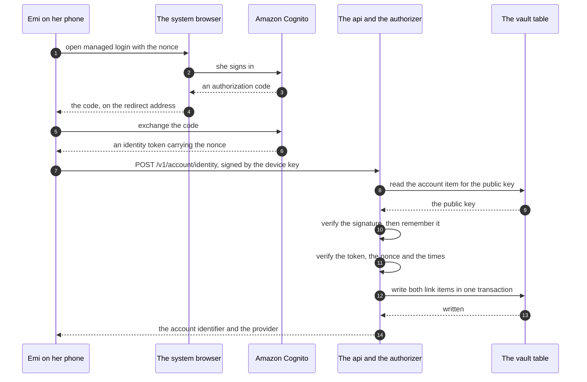
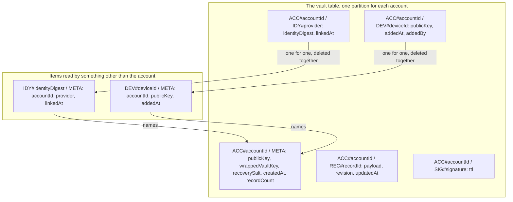

# The account, and what it may never do

An account tells the vault which partition of ciphertext belongs to her. It does nothing else.

The server holds ciphertext and no key. A sign in proves who may reach a partition. It never opens a
record. The vault key is made on the phone. It stays in the keychain. It is wrapped under the key
that her recovery code derives. Nothing in this design moves a key to a place the service can read.

This document answers the account questions. It gives a data model at field level. It gives a
numbered path. Nobody has written any of the code in it.

## How to read this document

Status: built

Every section carries one status line, the same as `architecture.md` and `privacy.md`.

`Status: built` means the code is in this repository now. You can read it.

`Status: designed` means this document describes it and nobody wrote it yet. There is no code and no
infrastructure.

On 2026-09-19 every account section is `designed`. The sections that describe the vault as it stands
are `built`, and they are here because this design rests on them.

## The decision the operator made

Status: designed

The identity claims the account that already exists. The account identifier stays the identifier
that the device public key derives. A link item holds the mapping from the identity to that
identifier.

This document designs that. It does not offer an alternative to it.

## What I read

Status: built

I read these in the repository, on 2026-09-19, at commit `f2828b4`.

- `docs/contracts.md`, the contracts `WIRE-1` to `WIRE-5`, `AUTH-1`, `VAULT-1`, `VAULT-2`,
  `SCREEN-1`, and the `TABLE`, `ENVELOPE`, `PAY` and `KEEP` groups around them.
- `docs/architecture.md`, the sections "The account and the request signature", "The vault key on
  the phone", "Deleting everything" and "The vault in Amazon Web Services".
- `docs/privacy.md`, the five keys and the four attacks it does not answer.
- `services/vault`, the whole service: `api.ts`, `auth/authorizer.ts`, `auth/signedBody.ts`, the
  four handlers, `store/accounts.ts`, `store/records.ts` and `store/dynamo.ts`.
- `apps/mobile/src/services/sync`, which is `deviceKey.ts`, `sign.ts`, `vaultAddress.ts` and
  `deleteAccount.ts`, and `apps/mobile/src/services/vault/wrapKey.ts` beside them.
- `infra`, which is `api.tf`, `dynamodb.tf`, `lambda.tf`, `github-oidc.tf`, `main.tf` and
  `variables.tf`, and `.github/workflows/deploy.yml`.
- `packages/crypto/src/signature.ts` and `packages/crypto/src/recovery.ts`.

I read these outside the repository, on 2026-09-19.

- Apple, App Store Review Guidelines, guideline 4.8 Login Services, and guideline 5.1.1 part five.
  `https://developer.apple.com/app-store/review/guidelines/`
- Amazon, Cognito pricing, the three tiers and the definition of a monthly active user.
  `https://aws.amazon.com/cognito/pricing/`
- Amazon, using social identity providers with a user pool, and what Sign in with Apple asks for.
  `https://docs.aws.amazon.com/cognito/latest/developerguide/cognito-user-pools-social-idp.html`
- Amazon, understanding the identity token, and the `nonce`, `auth_time`, `sub`, `iss`, `aud` and
  `token_use` claims.
  `https://docs.aws.amazon.com/cognito/latest/developerguide/amazon-cognito-user-pools-using-the-id-token.html`
- Amazon, the `DeleteUser` operation, which a signed in user calls for herself.
  `https://docs.aws.amazon.com/cognito-user-identity-pools/latest/APIReference/API_DeleteUser.html`
- Amazon, control access to an http api with a token authorizer, and one authorizer for each route.
  `https://docs.aws.amazon.com/apigateway/latest/developerguide/http-api-jwt-authorizer.html`

## What is built today

Status: built

The phone makes an Ed25519 key pair. It writes the private half into the keychain as
`emi.deviceKey.v1`. The account identifier is the first 16 bytes of the SHA-256 of the public half,
written in Crockford base 32. That is 26 characters.

Every request but registration carries four headers. `emi-account` names the account. `emi-instant`
is the moment of signing. `emi-body-sha256` is the digest of the body. `emi-signature` covers the
method, the path, the instant and that digest.

The authorizer reads the account item, takes the stored public key, and verifies the signature. It
refuses an instant more than 300 seconds from now. It writes the signature down and refuses it a
second time. It verifies an unknown account against a decoy key, so the time an answer takes says
nothing about which accounts exist.

The table is one table, `emi-vault`. One account holds one partition, `ACC#` and the account
identifier. The account item is `META`. A record item is `REC#` and the record identifier. A
remembered signature is `SIG#` and the signature. An index named `byUpdated` sorts records by their
write time.

Four routes exist: register, put a record, pull records, delete the account.

## The hole this design lands in

Status: built

I found one gap while reading, and the account design has to answer it.

A second phone makes its own device key. That key derives a different account identifier. So the
second phone is a different account. Nothing today lets it reach the first account. There is no
endpoint that reads the wrapped vault key and the salt back, and `registerAccount` is the only
writer of them. The test at `services/vault/tests/register.test.ts` line 281 says the bytes are
written down "so a second phone can ask for them back", and no code asks.

So feature 6 step 7, the restore onto a second phone, cannot run today. The link this design builds
is the thing that names the old partition. The device binding at the end of the path is the thing
that lets the new phone sign for it.

## The promise, and why each part keeps it

Status: designed

The vault key is 32 random bytes in the keychain. Nothing in this design reads it, sends it or
derives anything from it.

The link holds an account identifier and a digest. Neither one opens an envelope.

The identity token is verified and then dropped. The service writes no part of it to the table.

The password is a Cognito password. It wraps no key. It derives no key.

A woman who signs in and holds no recovery code gets ciphertext she cannot read. That is the design
working, and the next sections state it as a cost rather than hide it.

## The sign in path

Status: designed

The phone opens managed login in the system browser. It uses the authorization code grant with
Proof Key for Code Exchange. The app client is a public client and carries no secret.

The phone puts a `nonce` on the authorize request. The nonce is the lowercase hexadecimal SHA-256 of
the device public key. Cognito writes that value into the identity token. The vault checks it. So
one token is usable by one phone.

## How the claim is proved

Status: designed

The claim is a signed request to the vault. It is `POST /v1/account/identity`. The identity token
travels in the body. The route uses the signature authorizer that already exists.

Four checks stand between a stranger and a partition. Each one refuses on its own.

First, the authorizer verifies the Ed25519 signature over the method, the path, the instant and the
body digest, against the public key stored for that account. That proves the caller holds the device
private key of that account, at that moment. A stranger with a Google account holds no such key.

Second, the authorizer refuses an instant outside 300 seconds, and refuses a signature it saw
before. So a captured claim stops working quickly, and it never works twice.

Third, the handler compares the body against the `emi-body-sha256` header, the way every other
handler does. So the identity token in the body is the token that was signed. A token swapped in
flight fails.

Fourth, the handler verifies the identity token itself. It checks the signature against the user
pool key set, `iss` against the configured issuer, `aud` against the configured app client,
`token_use` equal to `id`, `exp` in the future, `auth_time` within 300 seconds of the request
instant, and `nonce` equal to the digest of the device public key that signed the request.

The request signature alone is enough to stop a stranger attaching an identity to her account,
because the stranger cannot make one. The token checks stop the other direction. Without the nonce
and `auth_time`, somebody who captured her token could attach her identity to their own account.
That does not read her days, and it does take her identity away from her, because one identity links
to one account. The nonce makes the token useless on any phone but the one that asked for it.

The cost of the design, stated plainly. After the link exists, the identity alone is enough to bind
a new phone and pull ciphertext. Whoever controls her Google account can reach her ciphertext. They
cannot read one day of it without her recovery code.

## One account, more than one identity

Status: designed

Yes. One account carries up to three identities, one for each provider: a password, Google and
Apple. She signs in with Google today and with Apple next year, and both reach the same vault.

Two items hold each link, and the key shape enforces both rules with no query and no count.

The account side item is keyed `ACC#` with the account identifier, and `IDY#` with the provider. So
a second Google link on one account meets an item that exists, and a conditional write refuses it.

The lookup item is keyed `IDY#` with the identity digest, and `META`. So an identity already linked
to another account meets an item that exists, and a conditional write refuses it.

An identity that is already linked and tries to claim a second account is refused with status 409.
The message says the identity is linked to an Emi vault already. It never names the account. She
unlinks it from the phone that holds the first account, or she deletes that account. Then the link
succeeds.

The two writes go in one transaction, with a condition on each. Two separate writes can half
succeed, and a half written link takes an identity that points at nothing. She could then never link
that identity anywhere. So the store gains one operation, `transactWriteItems`, and the double in
`services/vault/tests/fixtures/dynamoTable.ts` refuses the whole transaction when either condition
fails.

## The data model, at field level

Status: designed

One table, `emi-vault`. The partition key is `pk` and the sort key is `sk`, both strings. The index
`byUpdated` sorts on `updatedAt`. This design adds no index.

### The account item, which exists today

Status: built

`pk` is `ACC#` and the 26 character account identifier. `sk` is `META`.

`publicKey` is 32 bytes. `wrappedVaultKey` is 73 bytes. `recoverySalt` is 16 bytes. `createdAt` is
an instant as a string. `recordCount` is a number.

This design adds no attribute to it.

### The identity link item, on the account side

Status: designed

`pk` is `ACC#` and the account identifier. `sk` is `IDY#` and the provider.

`provider` is one of `password`, `google` and `apple`. It sits in the sort key, so one account holds
at most one of each.

`identityDigest` is a string. It is the lowercase hexadecimal SHA-256 of the issuer, a newline, and
the subject claim.

`linkedAt` is an instant as a string.

The item carries no email address, no name, no telephone number, no picture, no token and no
subject in the clear.

This item exists for the delete. The delete reads every key under the partition. It finds this item,
it reads the digest off it, and it removes the lookup item that the digest names. Without it, a
lookup item survives a delete, and she could never link that identity again.

### The identity lookup item

Status: designed

`pk` is `IDY#` and the identity digest. `sk` is `META`.

`accountId` is the 26 character account identifier. This is the whole point of the item.

`provider` is one of the three values above. The screen tells her which one she signed in with.

`linkedAt` is an instant as a string.

Why a digest, and what it buys. The subject is an identifier that Cognito chose, and it is not a
secret. The digest keeps the provider identifier out of the table, so a copy of the table cannot be
read against a copy of a user pool by eye. Anybody who holds the subject computes the same digest
and finds the same item, so the digest defends against a reader who does not hold the subject, and
against nobody else. The issuer is inside the digest, so a new user pool makes new digests, which is
correct: a new pool issues new subjects too.

What a reader of the table would learn from this item. An account exists. It has one identity of a
named provider. The link was made at a stated moment. The reader learns nothing about who she is,
unless the reader already holds the subject. A reader who holds the subject learns which partition
is hers. No item here says anything about a day.

### The record item and the remembered signature, which exist today

Status: built

A record item is `ACC#` with the account identifier, and `REC#` with the record identifier. It
carries `payload`, `revision` and `updatedAt`.

A remembered signature is `ACC#` with the account identifier, and `SIG#` with the signature. It
carries `ttl` and nothing else.

### The device items, which the second half of the path adds

Status: designed

A device item is `ACC#` with the account identifier, and `DEV#` with the device identifier. It
carries `publicKey`, `addedAt`, and `addedBy`, which is one of `registration`, `claim` and
`recovery`.

A device lookup item is `DEV#` with the device identifier, and `META`. It carries `accountId`,
`publicKey` and `addedAt`.

The device identifier is what `accountIdFor` derives from that device public key. For the first
phone it equals the account identifier, so nothing about the first phone changes.

## Where the link lives, and why

Status: designed

The link lives in the vault table, as two item kinds of its own. It does not get a table of its own.

Three reasons, in order of weight.

The delete decides it. `WIRE-4` removes every item under the partition, and a test reads the table
back to prove it. An item in a second table is a second place to forget, and a delete that misses it
leaves an identity that points at an account that is gone.

Contract `TABLE-4` decides the second part. A test reads every attribute of every written item and
looks for a date, a symptom, a flow or a note. Items in the vault table are inside that test. Items
in a second table would need their own, and the one test that the whole product rests on would stop
covering everything the service writes.

Cost decides nothing here. Both tables would bill on demand, and both cost only storage while
nobody uses them.

The read is by identity and never by account, which is why the lookup item is keyed by the digest
and sits outside the account partition. That is one `GetItem` on the whole key. It needs no index
and no scan.

## What the authorizer reads on a request

Status: designed

Today it reads the account item at `ACC#` and the header value, sort key `META`, and takes
`publicKey` from it.

After the device step it reads the device lookup item at `DEV#` and the header value, sort key
`META`, and takes `publicKey` and `accountId` from it. It verifies, remembers the signature under
the account partition, and hands on two values: the account identifier and the device identifier.

One trap, named here because it costs a red pipeline. `authorizedAccountIn` in
`services/vault/src/auth/authorizer.ts` compares the value the authorizer handed on against the
`emi-account` header, and refuses when they differ. After the indirection those two differ on every
phone but the first. The same step changes both, or every authorized request fails.

The link endpoint changes none of this. It is a signed request like any other.

## What a delete does

Status: designed

`WIRE-4` stands as it is. One request, no confirmation on the server, no delay.

The delete reads every key under the partition. It already does. The read carries `pk` and `sk`
only, so the step that adds the link widens it to carry `identityDigest` as well. Then, for each
`IDY#` item it finds, it removes the lookup item that the digest names. The order is the lookup
item first, then the account side item, so a delete that stops half way leaves no lookup item
pointing at an account that is gone.

The same shape holds for a device item and its lookup item.

A delete that does not widen the projection is the failure this section exists to stop. It removes
the account side item, the lookup item stays, and that identity can never be linked to anything
again. The test is plain: delete, then link the same identity to a new account, and expect it to
succeed.

What happens when she signs in again with the same identity. The user pool user is a separate thing
from the vault account, so she signs in and the token verifies. The vault finds no lookup item and
answers 404. The phone says there is no Emi vault for this sign in. She may start again, which makes
a new device key, a new account identifier and a new vault, and the same identity links to it
cleanly, because both link items went with the delete.

The Cognito user itself. Apple's guideline 5.1.1 part five says an app that supports account
creation must offer account deletion in the app, so leaving the user behind is not an option. The
phone deletes it, not the server: `DeleteUser` takes the signed in user's own access token and the
scope `aws.cognito.signin.user.admin`, which means the server never needs the subject and the table
never has to hold it. The phone keeps the refresh token in the keychain as `emi.identityRefresh.v1`,
named in the account directory and nowhere else.

The refresh token has a cost and a failure. It is a credential that mints tokens for her user pool
user while it is valid. It reaches no vault, because the vault takes signatures and not tokens, and
it opens no day. The proposal is a validity of 365 days, and the number is the operator's. When the
token is gone or the call fails, the vault account still goes, and the screen says the one true
thing: the Emi vault is gone, the sign in account may still exist, and signing in once and pressing
delete again removes it.

The rejected option, with the reason. The server could delete the user, if the delete request
carried a fresh identity token. That puts a sign in inside a delete. Contract `KEEP-3` refuses a
delay and a cooling off period, and the phone half of the delete never waits on the network. So the
phone carries the token instead.

## The rules, written so a test can fail them

Status: designed

Each line below is one case.

- A link request with no signature is refused, and writes nothing.
- A link request whose signature does not verify is refused, and writes nothing.
- A link request signed more than 300 seconds from now is refused, and writes nothing.
- A link request whose signature arrived before is refused, and writes nothing.
- A link request whose body does not match `emi-body-sha256` is refused, and writes nothing.
- A link request whose token fails its signature, `iss`, `aud`, `token_use` or `exp` is refused.
- A link request whose token has an `auth_time` more than 300 seconds from the request instant is
  refused.
- A link request whose token nonce is not the digest of the signing device public key is refused.
- A second link for one provider on one account is refused with 409, and the first link is
  unchanged.
- A link of an identity that is linked to another account is refused with 409, and neither item is
  written.
- A link that is refused by either condition writes neither item.
- A successful link writes both items, and changes no other item of the account.
- No attribute of either link item holds the subject, the email address or any part of the token. A
  test reads every attribute of both items and looks for each.
- A delete removes both link items, proved by reading the table.
- After a delete, the same identity links to a new account.
- A log line from any of these carries a request identifier and a duration, and nothing else. That
  is contract `KEEP-1`, and the subject and the token join the list it greps for.

## Her password, and what a reset costs

Status: designed

The password wraps no key and derives no key. The recovery code stays the only way back into the
days.

A forgotten password costs her nothing. She resets it by email through the user pool. She signs in.
She reaches her own ciphertext again. Her days open if she still holds her recovery code, and they
stay closed if she does not.

The other design, written here so the choice is visible. A password that wrapped the vault key would
make a reset destroy every day, because nothing else would open the wrapped key. The only escape
from that is a second copy of the key that the service can reach, and that is the one thing this
product refuses. So the password stays away from every key.

Say it on the screen, in the same words: the password gets her back to her vault, and the recovery
code is what opens it.

## The account is optional

Status: designed

Optional, and offered later.

Contract `SCREEN-1` says the first run asks for no account, no email address and no password, and
names an error for each. That contract is built and tested. This design keeps it word for word: the
first run does not change.

The account is offered in three places. It is offered after the recovery code is confirmed. It is
offered on the settings screen. It is offered on the new phone, at the moment she asks for her
history back.

A required account would change `SCREEN-1`, the store listing answers and the privacy claim, because
an email address is a personal datum that the model does not hold today. Nothing in the research
makes it necessary, so the answer is no.

One warning about the word optional. An optional account has to stay optional on the day it matters,
which is the day she opens a new phone. The path keeps a way back that needs no account, and the
operator may drop it. Dropping it makes the account required in practice for a restore, and this
document says so rather than letting it happen quietly.

## What Google and Apple learn

Status: designed

They learn that she uses Emi. That is the cost, and it is stated here and on the screen.

Google records the grant. She sees it under the third party applications of her Google account. The
consent screen names Emi before she taps.

Apple records the sign in. She sees it under her name in Settings, then Sign in with Apple. Apple's
own page says she can turn off email forwarding for an app that she hid her address from, and it
says she can remove the app from that list.

Apple lets her keep her address private with Hide My Email. Google does not.

Emi learns her email address, which is new. It lives in the user pool in eu-central-1, and it never
reaches the vault table. A woman who wants no company to learn that she uses Emi uses no account at
all, and every day she writes stays on her phone.

Where she is told. One sentence on the screen that offers the account, above the buttons, not behind
a link. One section in `docs/privacy.md`, beside the four attacks it already states.

## Sign in with Apple

Status: designed

Offer it, on iOS, in the same release as Google.

I read guideline 4.8, Login Services, on 2026-09-19. It says that an app which uses a third party or
social login service "to set up or authenticate the user's primary account with the app must also
offer as an equivalent option another login service" with three features: the service limits data
collection to the name and the email address, it lets the user keep the email address private, and
it does not collect interactions with the app for advertising without consent.

The guideline lists five cases where another login service is not required. The first is an app that
"exclusively uses your company's own account setup and sign-in systems". Emi would offer Google, so
it is not exclusive, and the exception does not hold. None of the other four fits a period tracker.

Sign in with Apple has the three features. So it ships with Google, never after it.

The same guideline page carries 5.1.1 part five, which says an app that supports account creation
must offer account deletion in the app. Emi deletes everything in one action already, and the delete
section above extends it to the user pool user.

Two practical points from the Cognito documentation. Sign in with Apple through a user pool needs an
Apple developer account, an app identifier, a Services identifier, a key and a team identifier. The
operator has not decided the Apple developer account, so step 12 waits for it. And the authorize
endpoint takes an `identity_provider` parameter that goes straight to the provider page, so the
button in Emi can open Apple's own page without an Emi page in between.

## The money

Status: designed

The store account owns the purchase. The identity carries it between stores. Both, with one rule for
a disagreement.

The store is the source of truth for whether she bought a year. Contract `PAY-2` reads it on launch
and keeps the last known answer when the store cannot be reached. That does not change.

The server holds its own answer on the account item, from the receipt check of `PAY-3`, as a date
the subscription runs to. The write gate of `WIRE-2` reads that date and nothing else.

The identity makes it portable. A receipt is filed against the vault account that presented it, and
the identity names that vault account from any phone, in either store. So a woman who buys on one
platform and moves to the other keeps her subscription, as long as she signs in.

When the two disagree, three rules, each one testable.

The store says subscribed and the server says lapsed. The phone shows her the subscribed state and
sends the receipt again. Writes stay refused until the server has checked it. She never sees a
paywall she already paid for.

The server says subscribed and the store says nothing. The phone keeps the last known answer, which
`PAY-2` already requires, and writes keep working until the server's date passes.

One receipt, one vault. A receipt already filed against another account is refused, and the screen
says the subscription belongs to another Emi vault. The account item holds a digest of the original
transaction identifier for this, never the receipt, and a lock item keyed by that digest makes the
rule a conditional write rather than a search.

Contracts `WIRE-5` and `PAY-4` are untouched. A pull, an export and a delete work whatever any of
this says.

## What this costs to run

Status: designed

Nothing bills while nobody uses it. I read the Cognito pricing page on 2026-09-19.

A user pool with no active users costs nothing. Billing counts a monthly active user, which the page
defines as a user for whom the application generated an identity operation in the calendar month,
such as a sign up, a sign in, a token refresh or a password change.

The Lite tier carries 10,000 monthly active users a month for each account at no charge. Above that
it costs $0.0055 for each one, for the first 90,000, and $0.0046 for each one after that. The
Essentials tier carries the same free allowance at $0.015 for each one. The Plus tier has no free
allowance at $0.020.

Users who sign in with a social identity provider are billed at the tier rate above. The separate
allowance of 50 users a month is for federation through SAML and OpenID Connect, which Emi does not
use.

Take Lite. Emi needs a password sign in, Google, Apple, a password reset and a token refresh, and
Lite carries all of it. The Plus tier buys threat detection at nearly four times the price for each
user, and this design does not need it.

The pool adds no resource that bills at rest. The managed login prefix domain is part of the pool.
Emi has no domain of its own yet, so the prefix domain is what step 2 creates.

## The path

Status: designed

Eighteen steps. Each one is a pull request. Each one reverts on its own.

The first twelve build the link. The last six make it worth having, and the operator may stop after
step 12 and take them later. The whole path is written for somebody who was not in this
conversation.

Each step adds its own behaviour test in the repository shape, at
`apps/mobile/tests/integration/9.<step>.test.ts` for a phone step, or beside the service for a
service step. The feature number is 9 here as a placeholder. The operator decides which feature
these steps belong to, and the file names take that number.

### 1. The contracts for the account

Depends on: the other session's feature list, which is in flight now.
Files: `docs/contracts.md`, `docs/features.md`.
Behaviour: declares `ACCOUNT-1` the link, `ACCOUNT-2` the claim proof, and `ACCOUNT-3` the delete of
the link, each with its errors, and maps them under one feature.
Proof: `npm run check:documents` passes, which fails on a contract that one document names and the
other does not.
The promise: a document holds no key.

### 2. The user pool, in Terraform

Depends on: nothing.
Files: `infra/cognito.tf`, `infra/variables.tf`, `tools/pipeline/infrastructure.test.ts`.
Behaviour: one user pool on the Lite tier, email as the sign in attribute, a public app client with
the authorization code grant and no secret, a managed login prefix domain, and no identity provider
yet.
Proof: the infrastructure test reads the Terraform text and asserts the tier, the absence of a client
secret, the grant, and that the pool requires a verified email address. The pipeline applies it.
The promise: a user pool holds an email address and a password. It holds no vault key and no record.

### 3. The identity token reader

Depends on: nothing.
Files: `services/vault/src/identity/token.ts`, `services/vault/tests/identity.test.ts`.
Behaviour: verifies a token against a key set, and checks `iss`, `aud`, `token_use`, `exp`,
`auth_time` and `nonce`. It is a module with no route.
Proof: a test signs tokens with its own key pair and asserts one refusal for each check, by name. A
mutation that drops the nonce check is watched failing.
The promise: the reader returns a digest of the issuer and the subject. It never returns the subject.

### 4. The link endpoint

Depends on: 3.
Files: `services/vault/src/handlers/linkIdentity.ts`, `services/vault/src/store/identities.ts`,
`services/vault/src/store/dynamo.ts`, `infra/api.tf`, `services/vault/tests/link.test.ts`.
Behaviour: `POST /v1/account/identity` writes both link items in one transaction, behind the
signature authorizer that exists.
Proof: every line of the rules section above, as one case each. The double refuses the transaction
when either condition fails.
The promise: the handler writes an account identifier and a digest. It holds no key.

### 5. The unlink endpoint

Depends on: 4.
Files: `services/vault/src/handlers/unlinkIdentity.ts`, `infra/api.tf`,
`services/vault/tests/link.test.ts`.
Behaviour: `DELETE /v1/account/identity/{provider}` removes both items, signed by a device key of
that account.
Proof: a test unlinks, then links the same identity to another account, and expects it to succeed. A
test asserts that an unlink of a provider with no link answers 404 and removes nothing.
The promise: an unlink moves no key and touches no record.

### 6. The delete takes the lookup item

Depends on: 4.
Files: `services/vault/src/store/dynamo.ts`, `services/vault/tests/delete.test.ts`.
Behaviour: the partition read carries `identityDigest`, and the delete removes each lookup item
before its account side item.
Proof: a test seeds an account with two identities, deletes, reads the table, and asserts no item of
either kind remains. A mutation that narrows the projection again is watched failing.
The promise: a delete removes bytes. It reads none of them.

### 7. Managed login on the phone

Depends on: 2.
Files: `apps/mobile/src/services/account/signIn.ts`,
`apps/mobile/src/services/account/identityStore.ts`,
`apps/mobile/tests/integration/9.7.test.ts`.
Behaviour: opens the browser with a code challenge and the nonce, exchanges the code, and keeps the
refresh token in the keychain as `emi.identityRefresh.v1`.
Proof: a test drives the real module against a stub token endpoint, and asserts the nonce equals the
digest of the device public key. A test asserts a mismatched state value is refused.
The promise: the vault key is not read by this module, and the key leak rule of step 9 enforces it.

### 8. The account screen

Depends on: 7, 4.
Files: `apps/mobile/src/features/account/`, `apps/mobile/src/app/settings/account.tsx`,
`apps/mobile/tests/integration/9.8.test.tsx`.
Behaviour: she creates an account, signs in, links, sees which provider is linked, and signs out.
The screen carries the sentence about what an account does not do.
Proof: the test presses the control, lets the link happen, and reads the screen again. The claims
test reads the copy.
The promise: the screen shows a provider and an instant. It shows no key.

### 9. The key leak rule for the account directory

Depends on: 7.
Files: `tools/pipeline/keyLeak.ts`, `tools/pipeline/keyLeak.test.ts`.
Behaviour: `emi.identityRefresh.v1` may be named only under `src/services/account`, and that
directory may name no vault key item and no device key item.
Proof: the test moves each name into the wrong directory and watches the rule fail, then passes.
The promise: the rule is the promise, held over the sink.

### 10. The delete removes the Cognito user

Depends on: 7, 6.
Files: `apps/mobile/src/features/settings/DeleteEverything.tsx`,
`apps/mobile/src/services/account/deleteUser.ts`, `apps/mobile/tests/integration/9.10.test.tsx`.
Behaviour: the phone calls `DeleteUser` with its own access token, and the screen states the outcome
when it cannot.
Proof: a test with no refresh token asserts the vault account still goes and the screen names what
is left. A test with one asserts the call was made before the screen said everything was gone.
The promise: the delete removes an account. It never sends a key anywhere.

### 11. Google as an identity provider

Depends on: 8. Waiting on the Google client identifier and secret, which the operator holds.
Files: `infra/cognito.tf`, `apps/mobile/src/features/account/`,
`apps/mobile/tests/integration/9.11.test.tsx`.
Behaviour: a Google button opens the provider page directly.
Proof: the infrastructure test asserts the provider and the scopes. The screen test asserts the
button opens the authorize address with the provider parameter.
The promise: Google returns a subject and an email address. Neither reaches the vault table.

### 12. Sign in with Apple as an identity provider

Depends on: 11. Waiting on the Apple developer account, which the operator has not decided.
Files: `infra/cognito.tf`, `apps/mobile/src/features/account/`,
`apps/mobile/tests/integration/9.12.test.tsx`.
Behaviour: an Apple button beside the Google one, in the same release.
Proof: the same two assertions as step 11, plus a test that both buttons appear on iOS.
The promise: Apple returns a subject and a private relay address. Neither reaches the vault table.

### 13. The device item, read by the authorizer

Depends on: nothing, and it is where the second half starts.
Files: `services/vault/src/auth/authorizer.ts`, `services/vault/src/store/devices.ts`,
`services/vault/src/handlers/register.ts`, `services/vault/tests/auth.test.ts`.
Behaviour: registration writes a device item and a device lookup item beside the account item, and
the authorizer resolves the lookup item instead of the account item.
Proof: a test signs as the first phone and asserts nothing changed for it. A test with a missing
lookup item asserts the refusal and the timing. `authorizedAccountIn` changes in the same step, and
a test asserts a request whose context and header disagree is refused.
The promise: the authorizer verifies one signature against one public key, as it does today.

### 14. The claim endpoint for a new phone

Depends on: 13, 4.
Files: `services/vault/src/handlers/claimAccount.ts`, `infra/api.tf`,
`services/vault/tests/claim.test.ts`.
Behaviour: `POST /v1/account/claim` takes an identity token and a self signed new device key, reads
the lookup item, and writes the two device items for the new phone.
Proof: a test claims with a valid token and asserts the new phone can then sign. A test with an
unlinked identity asserts 404 and no write. A test asserts a claim writes no record and reads none.
The promise: the claim binds a public key. The vault key is not in the request or the answer.

### 15. The recovery material endpoint

Depends on: 13.
Files: `services/vault/src/handlers/readRecovery.ts`, `infra/api.tf`,
`services/vault/tests/recovery.test.ts`.
Behaviour: `GET /v1/account/recovery` answers with the wrapped vault key and the salt, to a bound
device.
Proof: a test asserts the bytes equal the bytes registered. A test asserts a device of another
account is refused. A test asserts the answer opens with the right code and refuses a wrong one.
The promise: the bytes are the wrapped key. Opening them needs 26 characters that the service has
never seen.

### 16. The restore screens

Depends on: 14, 15.
Files: `apps/mobile/src/features/recovery/`, `apps/mobile/src/services/sync/restore.ts`,
`apps/mobile/tests/integration/9.16.test.tsx`.
Behaviour: on a new phone she signs in, types her recovery code, and her days come back.
Proof: the test drives the whole path against the service doubles and reads the history screen at
the end, not the call in the middle.
The promise: the phone opens the wrapped key locally. The key stays in the keychain.

### 17. A way back with no account

Depends on: 14. The operator may drop this step, and the account then becomes required for a
restore.
Files: `packages/crypto/src/recovery.ts`, `services/vault/src/handlers/register.ts`,
`services/vault/src/handlers/claimAccount.ts`, `packages/crypto/tests/recovery.test.ts`.
Behaviour: the recovery code derives an Ed25519 key pair as well as the wrapping key. Registration
sends its public half. A claim signed by that key binds a new phone with no identity at all.
Proof: a test derives the pair twice from one code and asserts they match. A test claims with it. A
test asserts a wrong code derives a key that the claim refuses.
The promise: the derived key comes from her code. The service stores the public half only.

### 18. The documents

Depends on: 4, and on this document.
Files: `docs/architecture.md`, `docs/privacy.md`.
Behaviour: architecture gains an account section with its status line. Privacy gains the section on
what Google and Apple learn, beside the four attacks.
Proof: `npm run check:documents` passes, and the wording gate reads both files.
The promise: the documents say what the code does, which is the point of a public repository.

## What this design does not do

Status: designed

It does not make the account a way into her days. An account with no recovery code reaches ciphertext
and stops there.

It does not hold a second copy of any key anywhere, for any reason, including for support.

It does not add an identity provider beyond Google and Apple, and it adds no telephone number.

It does not change `SCREEN-1`, `AUTH-1`, `WIRE-1`, `WIRE-2`, `WIRE-3` or `WIRE-5`.

It does not say which feature these steps belong to, and it does not open a pull request for any of
them.

## What the operator still decides

Status: designed

- Whether step 17 ships, which decides whether a restore can happen with no account.
- The refresh token validity, proposed at 365 days.
- The Google client identifier and secret.
- The Apple developer account, which step 12 cannot start without.
- The feature number these steps belong to.
