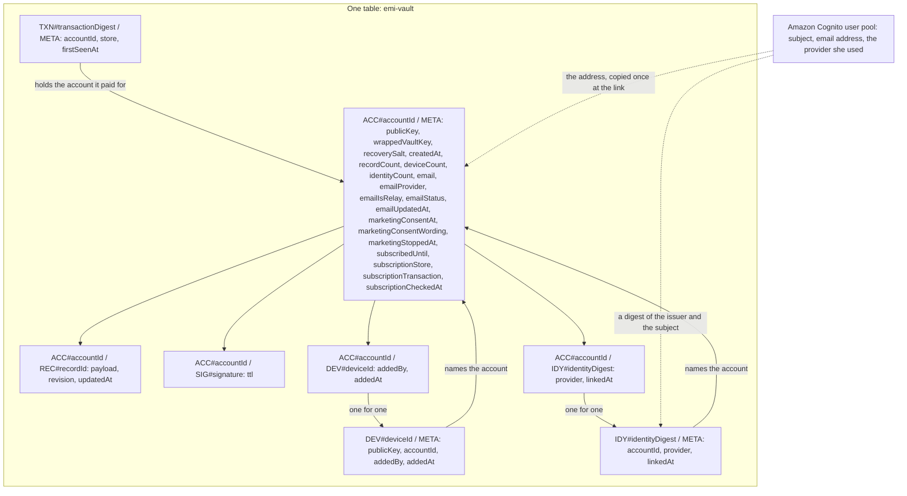
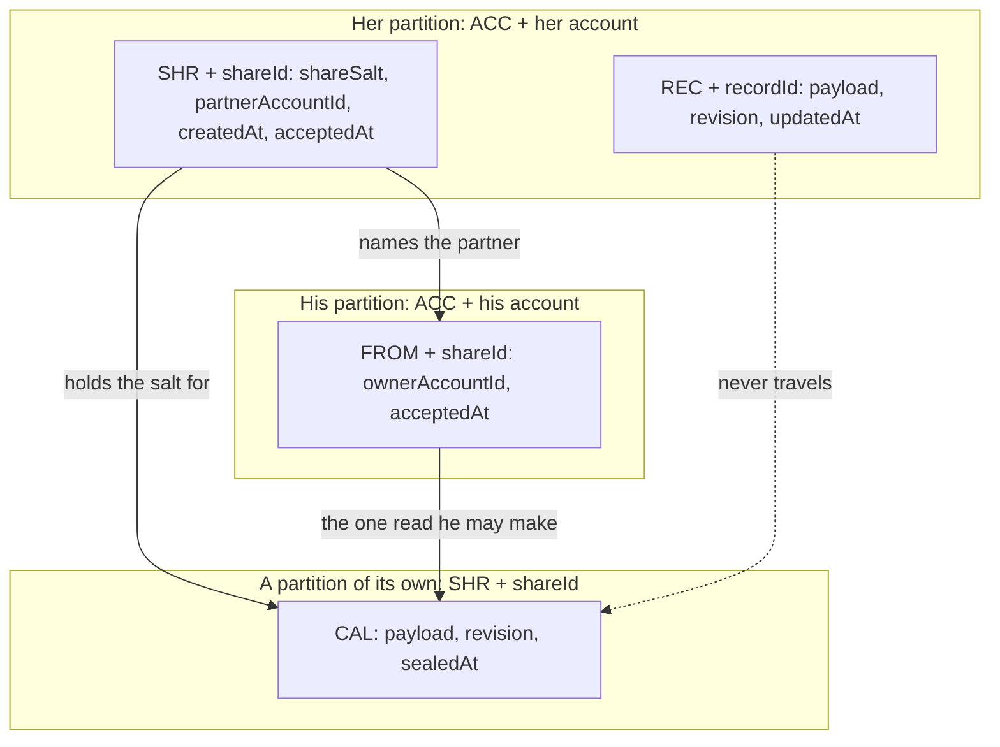
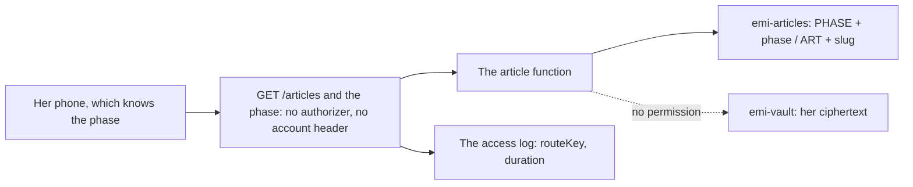

# The data model: every item and every field

Emi keeps one table in Amazon Web Services. It holds ciphertext and metadata, and it holds no key.
This document names every item in that table, every attribute of every item, and the query that
reads it.

The model was a section of `accounts.md`. It sits here now, because it is not part of a sign in
design. Nothing in it changed in the move.

## How to read this document

Status: designed

Every section carries one status line, the same as `architecture.md`, `accounts.md` and
`privacy.md`. `Status: built` means the code is in this repository now. `Status: designed` means
this document describes it and nobody wrote it yet.

Every attribute below carries its name, its type and whether it is required.

This document builds no product code.

## The data model, at field level

Status: designed

One table, as today. It is `emi-vault`, with a partition key `pk` and a sort key `sk`, both strings,
and a local index `byUpdated` that sorts records by their write time. None of that changes.

### The items that exist today

Status: built

The account item is `ACC#<accountId>` and `META`. It holds `publicKey` as 32 bytes,
`wrappedVaultKey` as bytes, `recoverySalt` as 16 bytes, `createdAt` as an instant string and
`recordCount` as a number.

The record item is `ACC#<accountId>` and `REC#<recordId>`. It holds `payload` as bytes, `revision`
as a number and `updatedAt` as an instant string. The identifier is a universally unique identifier
of version 7.

The remembered signature is `ACC#<accountId>` and `SIG#<signature>`, with `ttl` as a number of
seconds.

### The identity lookup item

Status: designed

`pk` is `IDY#` and the identity digest. `sk` is `META`.

The identity digest is 26 characters of Crockford base 32, cut from the first 16 bytes of the
SHA-256 of the issuer, a newline and the subject. The helper that makes an account identifier makes
this one, so there is one implementation of that shape.

`accountId` is the 26 character account identifier, and finding it is the whole purpose of the item.

`provider` is `google` or `apple`. There is no third value, because there is no third provider and
no local user.

`linkedAt` is an instant as a string.

The subject is not written in the clear and no token is written at all. Anybody who holds the
subject computes the same digest and finds the same item, so the digest defends against a reader who
holds the table and not the pool, and against nobody else.

### The identity item on the account side

Status: designed

`pk` is `ACC#` and the account identifier. `sk` is `IDY#` and the identity digest. It holds
`provider` and `linkedAt`.

It exists for the delete. The delete reads every key under the partition, finds this item, reads the
digest from the sort key and removes the lookup item that the digest names. Without it a lookup item
survives a delete, and she could never link that identity again.

### The device lookup item

Status: designed

`pk` is `DEV#` and the device identifier. `sk` is `META`.

The device identifier is 26 characters, and it equals `accountIdFor(publicKey)`, so a device cannot
choose its own name any more than an account can.

It holds `publicKey` as 32 bytes, `accountId` as 26 characters, `addedBy` as one of `registration`,
`claim` or `recovery`, and `addedAt` as an instant string.

This is the one item the authorizer reads. It carries no wrapped key, no salt, no email address and
no count.

### The device item on the account side

Status: designed

`pk` is `ACC#` and the account identifier. `sk` is `DEV#` and the device identifier. It holds
`addedBy` and `addedAt`. It exists for the delete, the same as the identity item, and the public key
is written once so the two copies cannot disagree.

### The receipt lock item

Status: designed

`pk` is `TXN#` and the transaction digest. `sk` is `META`. It holds `accountId`, `store` and
`firstSeenAt`.

The transaction digest is 26 characters, cut from the first 16 bytes of the SHA-256 of the store
name, a newline and the original transaction identifier. The receipt is never stored and the
transaction identifier never travels past the digest.

### The new attributes of the account item

Status: designed

`deviceCount` and `identityCount` are numbers, so a cap is a conditional write rather than a count
of items.

`email` is the address the provider handed over, as a string. It is absent until she links an
identity.

`emailProvider` is `google` or `apple`. `emailIsRelay` is a boolean, true when the address ends in
`privaterelay.appleid.com`, worked out once at the link and written down so no sender has to parse
an address.

`emailStatus` is `deliverable`, `bounced` or `complained`. `emailUpdatedAt` is an instant string.

`marketingConsentAt` is an instant string and it is absent until she asks for marketing mail. Its
presence is the consent, so nothing has to read a boolean that somebody could default to true.

`marketingConsentWording` is the identifier of the exact sentence she agreed to, for example
`marketing-2026-09-19`. A change to the wording makes a new identifier, so an old consent can never
stand for a new promise.

`marketingStoppedAt` is an instant string, written the moment she stops. Both fields present means
she agreed and then stopped, and every sender reads stopped over agreed.

`subscribedUntil`, `subscriptionStore`, `subscriptionTransaction` and `subscriptionCheckedAt` carry
the money, and feature 7 writes them.

### What the user pool holds

Status: designed

The subject, the email address the provider returned, and which provider it was.

The app client lists Google and Sign in with Apple as its only identity providers. It does not list
the pool itself, so there is no local user, no password, no sign up form and no forgotten password
path anywhere in the product. There is no custom attribute, so the pool carries no account
identifier, no device identifier and no record count.

## The partner link

Status: designed

`docs/features.md` plans four things under "Sex and relationships": a read only calendar a partner
can see, which carries the cycle phase and never a symptom or an intimacy entry; notification
settings for each partner, for a period that approaches and for the fertile window; a push to a
partner; and tracking of more than one partner. This section models them.

### Two different things carry the word partner

A partner she logs is local. An intimacy entry names him, the entry is sealed in her vault like
every other day, and nothing about him reaches the server in the clear. Tracking more than one
partner is a field of the day record. It is not an item of this table and it is not in this section.

A partner she links is a second person, with Emi on his own phone and an account of his own. He
reads a calendar she publishes. That link is what this section models.

She can hold several links at once. The two lists have nothing to do with each other.

### The secret never reaches the server

A link needs a key he holds and the server does not.

Her phone draws two values of 26 characters, from the alphabet the recovery code of contract
VAULT-2 uses. One is the share identifier, and it travels to the server. The other is the link
secret, and it never does. She shows him the secret once, on her screen.

The calendar key is `argon2id` over that secret and a salt of 16 bytes, which is the derivation
`recoveryKeyFrom` already performs. The salt is an attribute of the share item, because a salt is
not a key. Her phone seals the calendar under the key with the envelope of contract ENVELOPE-1, and
the server stores the ciphertext.

A server that hands over the whole table hands over the calendar and no way to read it. That is the
promise the vault already makes, made once more rather than made differently.

It costs her one moment in the same room, or one message she sends over a channel she chooses. A
partner who loses the secret and reinstalls Emi needs a new share.

### The share item, on her side

`pk` is `ACC#` and her account identifier. `sk` is `SHR#` and the share identifier.

- `shareSalt`, 16 bytes, required.
- `partnerAccountId`, a string of 26 characters, optional. It is absent while the invitation is
  open. The accept writes it, with the condition that it does not exist, so one invitation makes one
  link and a second person cannot take it.
- `createdAt`, an instant string, required.
- `acceptedAt`, an instant string, optional.

The account item gains `shareCount`, a number, required once a share exists, so a cap on links is a
conditional write and not a count of items. It sits beside `deviceCount` and `identityCount`.

### The pointer item, on his side

`pk` is `ACC#` and his account identifier. `sk` is `FROM#` and the share identifier.

- `ownerAccountId`, a string of 26 characters, required.
- `acceptedAt`, an instant string, required.

It exists so his phone lists what he may read with one query over his own partition. It holds no
key and no salt. His phone keeps the calendar key it derived when he accepted.

### The calendar item

`pk` is `SHR#` and the share identifier. `sk` is `CAL`.

- `payload`, bytes, required. The sealed calendar.
- `revision`, a number, required. It rises on every write, and a write whose revision is not higher
  is refused by the condition `revision < :revision`, which is the rule a record already follows.
- `sealedAt`, an instant string, required.

It sits in a partition of its own, for two reasons.

The first is the pull. `readRecordsAfter` queries the `byUpdated` index with `pk = :pk` and reads
every item of the partition that carries `updatedAt`. Today only a record carries it. Any other item
in her partition that carried `updatedAt` would arrive at her phone as a record with a nonsense
identifier. So the calendar carries `sealedAt`, and it lives outside her partition.

The second is the read. He reads this item and he may never read her partition. A partition of its
own keeps the rule "an account reads its own partition" with no exception written into it.

### What the envelope holds

The plaintext is canonical json, the same way a day record is. It holds four fields and no fifth.

- `version`, a number, required.
- `builtAt`, an instant string, required.
- `until`, a date as a year, a month and a day, required. After that day his phone says the calendar
  is old. It does not guess.
- `days`, a list, required. Each entry holds `date`, a year, a month and a day, and `phase`, one of
  `period`, `follicular`, `ovulation` and `luteal`.

There is no symptom, no mood, no flow, no note, no weight, no temperature and no intimacy entry. The
type has no room for one.

A day she chose not to share is absent from `days`. That is how the notification settings are kept:
not by a flag his application is asked to respect, but by what is inside the envelope. A partner she
does not tell about the fertile window gets a calendar with no `ovulation` day in it.

### The settings, and the push

Her choice for each partner is a record in her own vault, sealed like every other record. The server
never holds it, and it reaches her second phone through the ordinary pull.

The push is scheduled on his phone. He holds the calendar, so his phone knows when a period
approaches and when the fertile window starts. It raises the notification itself. The server sends
nothing, and it holds no device token for this.

A push timed by the server would mean the server knew when her period approaches. That is the thing
the product refuses, so the push is local.

### How a link is revoked

Three deletes by whole key, and no search:

- `SHR#<shareId>` and `CAL`, the calendar.
- `ACC#<her account>` and `SHR#<shareId>`, her side.
- `ACC#<his account>` and `FROM#<shareId>`, his pointer.

The service knows his account identifier because her own share item holds it.

His next read finds no calendar, and his application says the link ended.

Revocation stops the next read. It cannot unsee what he read already, and it cannot reach the copy
on his phone. The screen says that, rather than promising something Emi cannot do.

Her delete of everything, which is contract KEEP-3, removes the same three items for every share she
holds. `everyKeyUnder` already reads every key of her partition, so her side and every share
identifier come back from a query the delete already runs. The two items outside her partition go by
whole key from what that query returned.

### What proves a symptom never reaches the partner side

Three checks, and each one can fail.

1. The type. The function that builds a calendar takes a list of dates and phases, and answers
   bytes. It never receives a day record, so there is nothing to leave out by accident. A test that
   hands it a day record does not compile.
2. The bytes. A test fills a vault with every symptom and every mood of the catalogue, builds a
   calendar from it, and reads every attribute of the written `SHR#` and `CAL` item, the binary one
   included, looking for each slug. That is the shape `blind.test.ts` uses to prove contract
   TABLE-4, pointed at a second item.
3. The route. The endpoint that answers a calendar reads the calendar item and nothing else. A test
   asserts that the handler touches no `REC#` item, against the table double that throws by name on
   a request it does not know.

The first two are the ones that matter. The screen makes this promise in words, so the promise is
kept in a type and in a search over bytes.

## The article catalogue

Status: built

`GET /v1/articles/{phase}` answers one article for a cycle phase. The request carries the phase and
no account identifier, and it carries no signature. This section says where the catalogue
lives, and why a read of it cannot be tied to a reader.

The code and the configuration are in this repository. Nothing is deployed yet, so the function is
still a placeholder bundle in the account, the same as the other two.

### A second table, and why not the vault one

The catalogue is a second table, `emi-articles`, on demand, in the same account and the same region
as the vault. It bills for storage and nothing else while nobody reads it.

It is not the vault table, and the reason is the role rather than the shape. The function that
answers an article stands behind no authorizer. A function like that which could reach `emi-vault`
would be one mistake away from reading her partition. Its role names one table and one action,
`dynamodb:Query`. It carries no write, so a read cannot leave a trace behind it.

The function is `emi-articles`, it runs as the role of the same name, and it holds the table name
in `EMI_ARTICLES_TABLE`. It never holds the name of the vault table.

### The item

`pk` is `PHASE#` and the phase, one of `period`, `follicular`, `ovulation` and `luteal`, which are
the four names `PhaseName` carries in `packages/tokens`. `sk` is `ART#` and the slug. The slug is
written in the key and nowhere else, the same way a record identifier is.

- `title`, a string, required.
- `body`, a string, required.
- `attribution`, a string, required. Who wrote it, and who read it after them. A card draws it
  under the body, and `@emi/content` refuses an article without one, so an item missing it is
  passed over rather than answered.
- `language`, a string, required. A language tag, for example `en-GB`.
- `publishedAt`, an instant string, required. It is what the newest of a phase is chosen by.
- `revision`, a number, required.
- `link`, a string, optional. The whole piece, where there is a page to open. A link that does not
  begin with `https://` is answered as no link, because a browser would refuse it anyway.

The body is text. It carries no url and no image, because an image inside an article is a second
request, and a second request is a third party that learns a woman opened that article.

No attribute names a reader. There is no read count, no last read instant and no rating. Each one of
those would be a place to write down who read what.

### The query

One query answers a phase: `pk = :pk` on `emi-articles`, where the value is `PHASE#` and the phase.
It reads one partition, which is every article of that phase.

There is no scan. A catalogue small enough to scan today is a catalogue that grows.

### What the answer carries

The answer is one article, in the shape `@emi/content` reads, and that package is the only caller:
`id`, which is the slug, `phase`, `title`, `body`, `attribution` and `link`. It carries no
`language`, no `publishedAt` and no `revision`, because nothing draws them. The table holds more
than the answer carries.

The article is the newest of the phase, and the first slug where two were published in the same
instant. Every reader of a phase is handed the same one. A server that chose between them would
need to know something about her to choose with, and the only thing it knows is the phase.

A phase nobody has written for yet is answered with no article, not with an empty one, because an
empty article is a card drawn blank. It says that the phase holds nothing, where an unknown phase is
told it is not a phase, so whoever stocks the catalogue can tell a gap from a mistake. The
application reads both the same way, which is that there is no card to draw.

### Why a read cannot be tied to a reader

Five things, and each one can be checked.

1. The route has no authorizer. There is no `emi-account` header, no signature and no session, so
   the request carries nothing that names an account. A request that carries one of the four signed
   headers is refused rather than ignored, so a phone cannot start naming her by accident. A request
   an authorizer answered for is refused too, so attaching one to this route breaks it loudly.
2. The phase travels in the path, and the access log format in `infra/api.tf` writes
   `$context.routeKey`, which is the route template, and not `$context.path`. The log records that a
   request reached the articles route. It cannot record which phase.
3. The log carries no identity and no header. That is contract KEEP-1, and `infrastructure.test.ts`
   fails today if `$context.identity`, `$context.authorizer` or `$context.path` appears in the
   format. The function logs the same way as the rest of the service, which is not at all.
4. The answer is the same for every reader of a phase, so a cache in front of it serves most reads
   and the function never sees them.
5. The table has nowhere to write a read down, and the role has no permission to write one.

What is left is small and it is stated here rather than hidden. A read reaches Amazon Web Services
from her internet address, and Emi cannot hide that. Somebody who watches one phone and its
traffic sees a request to Emi. Nothing in this design defends against that reader, and this
document does not claim otherwise.

## The access patterns that run today

Status: built

Every read and every write the service makes, with the query that serves it. There is no scan in any
of them, and no `dynamodb:Scan` in any policy.

- Read an account. `GetItem` on `pk = ACC#<accountId>`, `sk = META`, with a consistent read. The
  authorizer makes this read on every request.
- Create an account. `PutItem` of the whole item with the condition `attribute_not_exists(pk)`. A
  second registration is refused by the condition and not by a read before it.
- Remember a signature. `PutItem` of `SIG#<signature>` with `attribute_not_exists(pk)` and a `ttl`
  of 300 seconds, which is the window an instant is accepted in. A replayed request meets the
  condition.
- Write a record, the first time. `PutItem` with `attribute_not_exists(pk)`.
- Write a record again. `PutItem` with the condition `revision < :revision`.
- Read the record that lost the race. `GetItem` by whole key with a consistent read, so the answer
  carries the revision the table holds.
- Count a record. `UpdateItem` with `ADD recordCount :one` and the condition `attribute_exists(pk)`.
- Pull records. `Query` on the `byUpdated` index, with `pk = :pk`. Where the phone sent a cursor
  it is `pk = :pk AND updatedAt > :after`. The answer is paged by its size.
- Every key of an account, for a delete. `Query` with `pk = :pk` and
  `ProjectionExpression: pk, sk`. It reads keys, so six years of ciphertext does not travel to
  delete it.
- Delete everything. `DeleteItem` by whole key, 25 at a time, then the query above again to prove
  nothing is left.
- Read the articles of a phase. `Query` with `pk = :pk` on `emi-articles`, where the value is
  `PHASE#` and the phase. It is followed page by page, so a partition larger than one page is read
  whole rather than cut.

## The access patterns the designs add

Status: designed

The sign in and the devices:

- Find the account for an identity. `GetItem` on `IDY#<identityDigest>` and `META`.
- Read a device, on every request. `GetItem` on `DEV#<deviceId>` and `META`, with a consistent read.
- List the devices of an account. `Query` with `pk = ACC#<accountId> AND begins_with(sk, 'DEV#')`.
- List the identities of an account. The same query with `IDY#`.
- Cap the devices. `UpdateItem` with the condition `deviceCount < :cap`.
- Claim a receipt. `PutItem` on `TXN#<transactionDigest>` and `META` with
  `attribute_not_exists(pk)`.

The partner link:

- List her shares. `Query` with `pk = ACC#<accountId> AND begins_with(sk, 'SHR#')`.
- List the calendars he may read. `Query` with
  `pk = ACC#<partnerAccountId> AND begins_with(sk, 'FROM#')`.
- Check she owns a share, before a write. `GetItem` on `ACC#<accountId>` and `SHR#<shareId>`.
- Write a calendar. `PutItem` on `SHR#<shareId>` and `CAL` with `revision < :revision`, after the
  check above.
- Check he may read a share. `GetItem` on `ACC#<partnerAccountId>` and `FROM#<shareId>`.
- Read a calendar. `GetItem` on `SHR#<shareId>` and `CAL`, after the check above.
- Revoke a share. Three `DeleteItem` by whole key.

Every one of these reads by a whole key, or along one partition. None of them reads the whole table,
and none of them reads more than it needs and filters afterwards.

## Where the code and this document disagree

Status: built

One disagreement, found while writing this document. Nothing in the code was changed to hide it.

`infra/dynamodb.tf` turns time to live on for the attribute `ttl`, and the comment above it says a
deleted record keeps a headstone for 30 days, so a second phone learns of the delete before the row
disappears underneath it. No headstone item exists. The word appears nowhere else in the repository.
The one item that carries `ttl` is the remembered signature, and its ttl is 300 seconds.

So the table setting is right and it is used. The comment describes an item nobody wrote. Deleting a
single record is not built yet. The step that builds it either writes the headstone the comment
promises, or takes the comment out. That is a decision for that step and not for this document.

## The check that holds the code to this document

Status: built

`tools/pipeline/dataModel.test.ts` reads this document and the service together, and it fails in
four ways.

An attribute that `services/vault` writes or reads, and that this document does not name inside
backticks, fails the run. The document is the source and the code follows it, so an attribute
arriving in the code without a line here is the failure.

A table, a key attribute or an index in `infra` that this document does not name fails it too.

A scan fails it. No file of `services/vault` may name the operation `Scan`, and no policy in
`infra` may carry `dynamodb:Scan`. The pattern is the operation and not the word, so a comment that
says a pull is a query rather than a scan still passes.

A reader that finds nothing fails it. A search that matched no attribute at all would report a clean
run, which is the one result that means nothing.
