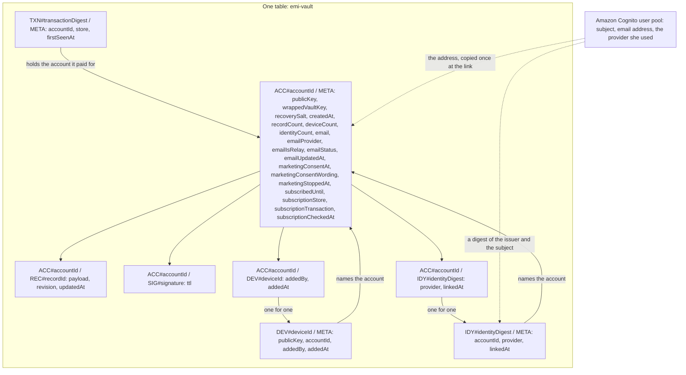

# The data model: every item and every field

Emi keeps one table in Amazon Web Services. It holds ciphertext and metadata, and it holds no key.
This document names every item in that table, every attribute of every item, and the query that
reads it.

The model was a section of `accounts.md`. It sits here now, because it is not part of a sign in
design. Nothing in it changed in the move.

## How to read this document

Status: designed

Every section carries one status line, the same as `architecture.md`, `accounts.md` and
`privacy.md`. `Status: built` means the code is in this repository now. `Status: designed` means
this document describes it and nobody wrote it yet.

Every attribute below carries its name, its type and whether it is required.

This document builds no product code.

## The data model, at field level

Status: designed

One table, as today. It is `emi-vault`, with a partition key `pk` and a sort key `sk`, both strings,
and a local index `byUpdated` that sorts records by their write time. None of that changes.

### The items that exist today

Status: built

The account item is `ACC#<accountId>` and `META`. It holds `publicKey` as 32 bytes,
`wrappedVaultKey` as bytes, `recoverySalt` as 16 bytes, `createdAt` as an instant string and
`recordCount` as a number.

The record item is `ACC#<accountId>` and `REC#<recordId>`. It holds `payload` as bytes, `revision`
as a number and `updatedAt` as an instant string. The identifier is a universally unique identifier
of version 7.

The remembered signature is `ACC#<accountId>` and `SIG#<signature>`, with `ttl` as a number of
seconds.

### The identity lookup item

Status: designed

`pk` is `IDY#` and the identity digest. `sk` is `META`.

The identity digest is 26 characters of Crockford base 32, cut from the first 16 bytes of the
SHA-256 of the issuer, a newline and the subject. The helper that makes an account identifier makes
this one, so there is one implementation of that shape.

`accountId` is the 26 character account identifier, and finding it is the whole purpose of the item.

`provider` is `google` or `apple`. There is no third value, because there is no third provider and
no local user.

`linkedAt` is an instant as a string.

The subject is not written in the clear and no token is written at all. Anybody who holds the
subject computes the same digest and finds the same item, so the digest defends against a reader who
holds the table and not the pool, and against nobody else.

### The identity item on the account side

Status: designed

`pk` is `ACC#` and the account identifier. `sk` is `IDY#` and the identity digest. It holds
`provider` and `linkedAt`.

It exists for the delete. The delete reads every key under the partition, finds this item, reads the
digest from the sort key and removes the lookup item that the digest names. Without it a lookup item
survives a delete, and she could never link that identity again.

### The device lookup item

Status: designed

`pk` is `DEV#` and the device identifier. `sk` is `META`.

The device identifier is 26 characters, and it equals `accountIdFor(publicKey)`, so a device cannot
choose its own name any more than an account can.

It holds `publicKey` as 32 bytes, `accountId` as 26 characters, `addedBy` as one of `registration`,
`claim` or `recovery`, and `addedAt` as an instant string.

This is the one item the authorizer reads. It carries no wrapped key, no salt, no email address and
no count.

### The device item on the account side

Status: designed

`pk` is `ACC#` and the account identifier. `sk` is `DEV#` and the device identifier. It holds
`addedBy` and `addedAt`. It exists for the delete, the same as the identity item, and the public key
is written once so the two copies cannot disagree.

### The receipt lock item

Status: designed

`pk` is `TXN#` and the transaction digest. `sk` is `META`. It holds `accountId`, `store` and
`firstSeenAt`.

The transaction digest is 26 characters, cut from the first 16 bytes of the SHA-256 of the store
name, a newline and the original transaction identifier. The receipt is never stored and the
transaction identifier never travels past the digest.

### The new attributes of the account item

Status: designed

`deviceCount` and `identityCount` are numbers, so a cap is a conditional write rather than a count
of items.

`email` is the address the provider handed over, as a string. It is absent until she links an
identity.

`emailProvider` is `google` or `apple`. `emailIsRelay` is a boolean, true when the address ends in
`privaterelay.appleid.com`, worked out once at the link and written down so no sender has to parse
an address.

`emailStatus` is `deliverable`, `bounced` or `complained`. `emailUpdatedAt` is an instant string.

`marketingConsentAt` is an instant string and it is absent until she asks for marketing mail. Its
presence is the consent, so nothing has to read a boolean that somebody could default to true.

`marketingConsentWording` is the identifier of the exact sentence she agreed to, for example
`marketing-2026-09-19`. A change to the wording makes a new identifier, so an old consent can never
stand for a new promise.

`marketingStoppedAt` is an instant string, written the moment she stops. Both fields present means
she agreed and then stopped, and every sender reads stopped over agreed.

`subscribedUntil`, `subscriptionStore`, `subscriptionTransaction` and `subscriptionCheckedAt` carry
the money, and feature 7 writes them.

### What the user pool holds

Status: designed

The subject, the email address the provider returned, and which provider it was.

The app client lists Google and Sign in with Apple as its only identity providers. It does not list
the pool itself, so there is no local user, no password, no sign up form and no forgotten password
path anywhere in the product. There is no custom attribute, so the pool carries no account
identifier, no device identifier and no record count.
