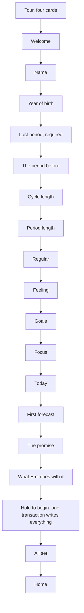
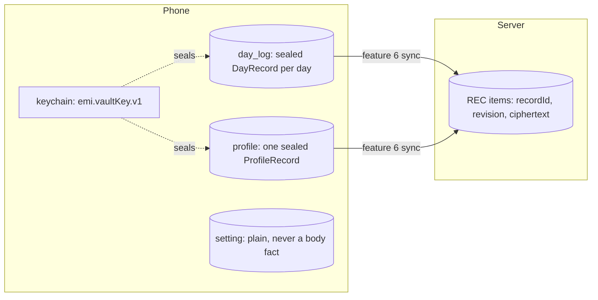

# Design: the longer first run, with her answers stored sealed

Status: designed

The operator approved this design on 2026-09-23. It is delivered as features 10 and 11.

Read on 2026-09-23 against atlantic-blue/emi `main` at `f0df0d5`. Sources read:
`apps/mobile/src/data/` (schema, migrations 001 to 004, setting repository),
`apps/mobile/src/features/onboarding/firstRun.ts`, `apps/mobile/src/services/vault/vaultKey.ts`
and `wipe.ts`, `packages/crypto/src/record.ts` and `envelope.ts`, `packages/cycle/src/symptoms.ts`
and `forecast.ts`, `services/vault/src/store/records.ts`, `docs/contracts.md` (SCREEN-1),
`docs/privacy.md`, issue 165, and the Stitch export of screens 1 to 22. The copy for every screen is
in `copy-review-screens-6-22.md` beside this file.

Not read: how the ring draws the period arc before two periods are logged. Step 11.3 reads it
before it changes anything.

## Decisions this design carries

- The first run asks more than the first forecast needs. SCREEN-1 is written again (section 1).
- Every answer is stored, sealed with her vault key, like a day. Nothing she says about her body is
  written in plain text anywhere.
- The reminder is its own feature and is not in this design. Screen 17 leaves the first run.
- The free month (screen 20) stays with feature 7.
- The home keeps the current tabs (today, history, log, settings) until the operator chooses.

## Birth year

Stored, decided on 2026-09-23. The screen asks the year and nothing finer, so the profile holds a
year and never a full date. Nothing reads it yet. It is the one exception to "a question ships with
its reader", and SCREEN-1 names it as the exception.

## The flow



Every answer is held in memory until the hold. The hold makes her vault key if she has none, then
writes the days and the profile in one transaction. If she leaves before the hold, nothing is
written and the first run starts again next time. Only the last period is required. Every other
question has Skip, and Skip writes nothing for that field.

## 1. SCREEN-1, written again

Replaces the section in `docs/contracts.md`.

### SCREEN-1, first run

Verified by a test.

Output: at most eleven questions and five other screens between the welcome and the home screen.
Only the last period is required. It ends with her answers written in one transaction at the hold.

Errors: a question whose answer nothing in the product reads, except the year of birth. A question with no Skip, other than
the last period. An answer written to the database or the server in plain text. An account, an
email address or a password asked for. Anything written before the hold.

## 2. The data model, field level



### Where each answer goes

- Last period (screen 6): a `day_log` row for that day, `flow: 'medium'`, as `firstRunFlow` writes
  today. Unchanged.
- The period before (screen 7): a second `day_log` row, `flow: 'medium'`, on the day she picks. It
  must be between 21 and 45 days before the last period, the bounds `firstRun.ts` already holds for
  a cycle. Outside that, the screen refuses it and names the bounds.
- Today (screen 14): a `day_log` row for today, with the chosen slugs in `symptoms`. If today is the
  last period day, the same row carries both, because `day_log_day` is a unique index.
- Every other answer: one `ProfileRecord`, sealed, in the new `profile` table.

### ProfileRecord, in `packages/crypto/src/profile.ts`

Canonical JSON, the same envelope as a day (version 0x01, XChaCha20-Poly1305, the vault key). The
key set is closed. An unknown key, a wrong type or a value out of range refuses the seal, the same
way `recordProblems` refuses a day.

- `kind`: the literal string `profile`. Required. It is inside the ciphertext, so the server cannot
  tell a profile from a day.
- `name`: string, 1 to 40 characters after trimming, no line break. Optional.
- `birthYear`: integer, from 1940 to the current year minus 9. Optional.
- `cycleLengthDays`: integer, 21 to 45. Optional. Absent means she chose "I am not sure".
- `periodLengthDays`: integer, 1 to 15. Optional. Absent means not sure or skipped.
- `regularity`: one of `regular`, `moves`, `unknown`. Optional.
- `feeling`: one of `fine`, `hard`, `understand`. Optional.
- `goals`: array of distinct values from `forecast`, `symptoms`, `fertileWindow`, `doctorRecord`.
  At most 4. Optional.
- `focus`: array of distinct `SymptomGroup` values from `sleep`, `mood`, `energy`, `skin`,
  `digestion`, `pain`, in the order she chose. At most 6. Optional.
- `recordedAt`: ISO 8601 instant of the write. Required.

A pulled record is opened, parsed, and read as a profile when `kind` is `profile`, and as a day
otherwise. `DayRecord` does not change.

### The `profile` table, migration `005-profile.ts`

```
CREATE TABLE profile (
  id TEXT NOT NULL PRIMARY KEY,          -- a UUID version 7, made once
  only_one INTEGER NOT NULL DEFAULT 1 UNIQUE CHECK (only_one = 1),
  payload BLOB NOT NULL CHECK (length(payload) > 0),
  revision INTEGER NOT NULL CHECK (revision >= 1),
  created_at TEXT NOT NULL,
  updated_at TEXT NOT NULL,
  synced_revision INTEGER,
  CHECK (updated_at >= created_at),
  CHECK (synced_revision IS NULL OR synced_revision <= revision)
) STRICT
```

The instant checks copy the `GLOB` patterns of migration 001. A trigger refuses an update whose
revision does not rise, as `day_log_revision_rises` does. `wipe.ts` reads the table list from the
database, so delete everything empties `profile` with no change. A test proves it.

### `cycleLengthDays` leaves `setting`

It is a fact about her body in plain text. Migration 006 reads the setting, writes it into the
sealed profile, and deletes the key, in one transaction. `statedCycleLengthDays` reads the profile.
A phone with no setting and no profile keeps working, and a test proves both.

## 3. What reads each answer

A question ships in the same step as its reader, per issue 165.

- `name`: the home screen greets her by name. Without a name, no greeting.
- The period before: the forecast, which already reads days. With two starts, the ring has one
  complete cycle behind it.
- `cycleLengthDays`: the forecast, as today.
- `periodLengthDays`: the length of the period arc on the ring until she logs a period end. Step
  11.3 reads the ring first and states what it does today.
- `regularity`: the sentence under the forecast range. `moves` shows "Your cycle moves, so the range
  is wider." The range itself is always computed from her days.
- `feeling`: the home line on a period day. `hard` shows a line that offers the pain log first.
- `goals`: the home cards. The fertile window card shows only if `fertileWindow` is chosen. An
  export shortcut shows if `doctorRecord` is chosen.
- `focus`: the log sheet shows her groups first, in her order.
- Today's symptoms: the day log, as any logged day.

## 4. The path

Two features, so the foundation merges before any new screen.

### Feature 10: her answers are stored sealed

1. The 17 screens and the copy review enter `docs/design/prototype/`. The README records every
   false claim so it is never built. After: none.
2. SCREEN-1 is written again in `docs/contracts.md`, and this design enters
   `docs/design/first-run.md`. After: 1.
3. `ProfileRecord` in `packages/crypto`: the type, the closed key set, the range checks,
   `sealProfile` and `openProfile`, and reading a pulled record by `kind`. Proven by refusals for
   every field, a round trip, and a day that still opens as a day. After: 2.
4. Migration 005 and `profileRepository.ts`: write and read one sealed profile. Proven by the table
   checks, the revision trigger, and delete everything emptying it. After: 3.
5. `cycleLengthDays` moves from `setting` into the profile. Proven by an upgrade from a phone that
   holds the setting, and by a grep test that no body fact is a setting key. After: 4.
6. The first run holds its answers in memory and writes them at the hold, in one transaction, with
   the key made if absent. The hold screen is built here. Proven by leaving before the hold and
   finding nothing written. After: 5.
7. Four new icons, drawn to the rules in `brand/icons/README.md`: `skin`, `digestion`, `headache`,
   `bloating`. After: 1.

### Feature 11: the longer first run

Each step is one screen, its copy from the review, its reader, and its test. Each comes after 10.6.

1. Welcome, last period and cycle length take the new style. No Skip on the last period.
2. Name, and the greeting on the home screen. Year of birth, stored with no reader.
3. The period before, into the day log.
4. Period length, and the period arc on the ring.
5. Regular, and the sentence under the forecast.
6. Feeling, and the home line on a period day.
7. Goals, and the home cards they choose.
8. Focus, and the order of the log sheet. Needs 10.7.
9. Today, into the day log. Needs 10.7.
10. The first forecast screen.
11. The promise, and what Emi does with it.
12. All set, and the home screen in the new style with the current tabs.

## What this design does not do

- It does not sync the profile. Feature 6 sends records, and the profile is one more record when it
  does.
- It does not put the profile in the export document. That is a separate decision.
- It does not change what a returning phone sees. A phone that finished the old first run keeps its
  answers and is not asked the new questions. A way to answer them later from Settings is not
  designed.
