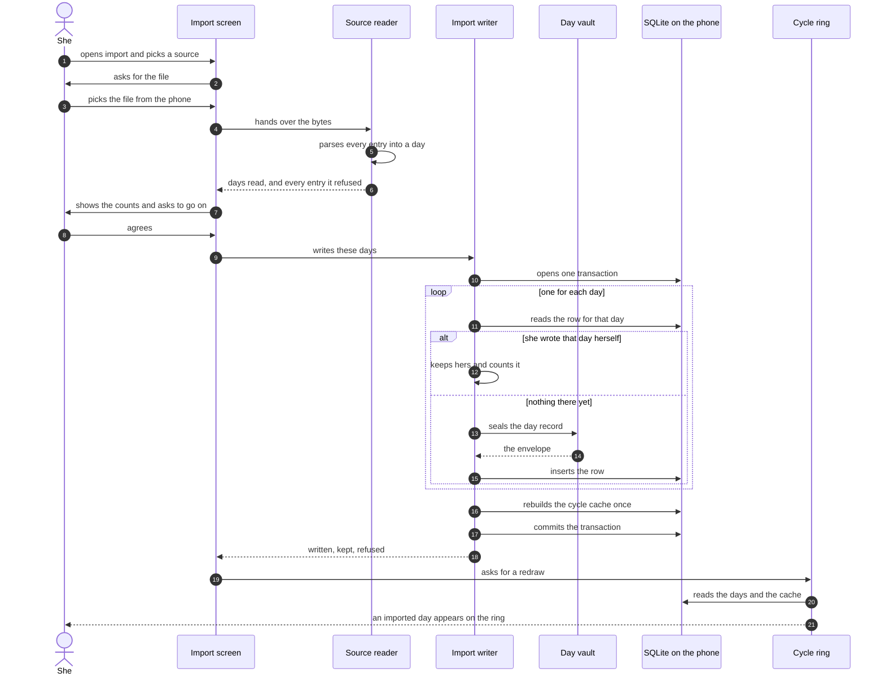

# Design: she keeps her history when she arrives from another tracker

She used Flo for three years. She opens Emi and the ring is empty. Emi says it is still learning,
and it will say that until two cycles are complete. On that day Emi is worse than the application
she left. The history she already owns is the product.

This document measures the four routes that can carry that history into Emi. It is research and a
design. It is not permission to write code. No step here is taken until the operator chooses a
route.

Version 1 refuses every route below. `docs/features.md` names three of them under what version 1 does
not do. They are the import from another tracker, the import from a health platform, and the
reconstruction from a photograph. This document describes version 2. Promoting any part of it is the
operator's decision. It needs an edit to the feature map that this document does not make.

I read every source named here on 2026-09-19. Each claim carries its link. Where I could not read a
page, I say so at the point of the claim.

## The three rules that bound every route

These three rules are conditions, not preferences. A route that breaks one is refused here, and the
refusal is written down rather than left out.

**Emi never holds her account at another service.** Emi asks for no email address. Emi asks for no
password. Emi asks for no one time code and no session token. This holds for Flo, for Clue, for
Apple, for Google and for every other product. Emi never signs in to another product for her. A
route that needs any of these is refused.

This removes one shape of route a reader expects to find here. It is the automated pull from another
company's server. It is not in this document, and it will not be built.

**The import runs on the phone.** She picks a file. The phone reads it. The phone builds a day
record, seals it with her vault key, and writes the row. No byte of the file leaves the phone. No
server sees the file, the days, or the name of the product she left. The vault service cannot help
with an import, because it holds no key, and contract ENVELOPE-4 keeps it that way.

**Emi reads the terms before it recommends a route.** Section 5 carries what the terms say, with the
clause numbers.

## 1. The health platform on her phone, which is route 1

This is the route that needs nothing from the other company, so it is the first one to measure.

### 1.1 What Apple Health holds

Apple Health carries every field the question named. I read the HealthKit reference on 2026-09-19.
Each identifier below is a category sample type, available from iOS 9.0.

- `menstrualFlow`, a category sample type that records menstrual cycles.
  https://developer.apple.com/documentation/healthkit/hkcategorytypeidentifier/menstrualflow
- `intermenstrualBleeding`, spotting outside the normal menstruation period.
  https://developer.apple.com/documentation/healthkit/hkcategorytypeidentifier/intermenstrualbleeding
- `cervicalMucusQuality`.
  https://developer.apple.com/documentation/healthkit/hkcategorytypeidentifier/cervicalmucusquality
- `ovulationTestResult`.
  https://developer.apple.com/documentation/healthkit/hkcategorytypeidentifier/ovulationtestresult
- `sexualActivity`.
  https://developer.apple.com/documentation/healthkit/hkcategorytypeidentifier/sexualactivity
- `basalBodyTemperature`, a quantity sample type, also from iOS 9.0.
  https://developer.apple.com/documentation/healthkit/hkquantitytypeidentifier/basalbodytemperature

The flow values are `unspecified`, `none`, `light`, `medium` and `heavy`.
https://developer.apple.com/documentation/healthkit/hkcategoryvaluemenstrualflow

From iOS 18.0 the same samples also read through `HKCategoryValueVaginalBleeding`, with the same
five values. https://developer.apple.com/documentation/healthkit/hkcategoryvaluevaginalbleeding

One detail decides how much a flow sample is worth. Every `menstrualFlow` sample must carry the
metadata key `HKMetadataKeyMenstrualCycleStart`, a boolean. Apple states the key is required for
these samples.
https://developer.apple.com/documentation/healthkit/hkmetadatakeymenstrualcyclestart

That key gives Emi the cycle start directly. Emi does not have to guess which bleeding day began a
cycle, which is exactly what contract CYCLE-1 needs.

Apple Health also carries 39 symptom types, from iOS 13.6. The list includes `abdominalCramps`,
`bloating`, `fatigue`, `headache`, `moodChanges`, `breastPain`, `pelvicPain`, `acne`, `nightSweats`,
`sleepChanges` and `hotFlashes`.
https://developer.apple.com/documentation/healthkit/symptom-type-identifiers

Each symptom sample carries a severity: `notPresent`, `mild`, `moderate`, `severe` or `unspecified`.
https://developer.apple.com/documentation/healthkit/hkcategoryvalueseverity

### 1.2 The finding that changes this route

Apple Health holds everything. Her Flo history is not in it.

Flo says so on its own help page. It states: "For example, logged Menstruation data in Flo will not
be sent to the Health app." Flo reads the Health app and shows what it finds. It does not write her
period back.
https://help.flo.health/hc/en-us/articles/34890229122068-How-to-import-data-from-the-Health-app-to-Flo-iOS
Read 2026-09-19.

Clue moves data the other way, and it has its own limit. The Clue support page states three things.
The sync carries her period and her flow from Clue to the Health app. It is not possible to import
from the Health app into Clue. Only data tracked after she gives permission is transferred.

I could not open that page from this machine. Cloudflare refused the request. The wording above
comes from the search index summary of the page. It does not come from the page itself. Treat it as
unverified until somebody opens it.
https://support.helloclue.com/hc/en-us/articles/20199556038813-Can-I-export-my-data-from-Clue-to-Apple-Health-or-Apple-Health-to-Clue

So route 1 on an iPhone carries a real history only in two cases. She used Apple's own cycle
tracking. Or she used an application that writes, such as Clue, and she turned the sync on years
ago. A woman who used Flo for three years gets nothing from route 1. A screen that offers it to her
wastes her time.

### 1.3 What Health Connect holds on Android

Health Connect carries six record types for this work. I read the Android source on 2026-09-19.

- `MenstruationFlowRecord`, one instant, with `flow` of `FLOW_UNKNOWN`, `FLOW_LIGHT`, `FLOW_MEDIUM`
  or `FLOW_HEAVY`. There is no value for no flow and no value for spotting.
- `MenstruationPeriodRecord`, an interval with a start and an end, limited to 31 days.
- `IntermenstrualBleedingRecord`, one instant and nothing else. It carries no intensity at all.
- `CervicalMucusRecord`, with an appearance and a sensation.
- `OvulationTestRecord`, with a result of inconclusive, positive, high or negative.
- `SexualActivityRecord`, with `protectionUsed`.

Source, read at
https://github.com/androidx/androidx/tree/androidx-main/health/connect/connect-client/src/main/java/androidx/health/connect/client/records

`MenstruationPeriodRecord` is better than anything Apple offers for this job. It states the period
start and the period end as one record, so Emi does not have to infer either.

Health Connect holds no symptom type, no mood type, no note and no energy. Those four are lost on
Android, completely, whatever the source application recorded.

### 1.4 The wall on Android

Health Connect refuses old data by default. The Android documentation states: "By default, all
applications can read data from Health Connect for up to 30 days prior to when any permission was
first granted." It then gives the restriction for each platform version.

- Android 14 and higher: no historical limit on an application reading its own data. A 30 day limit
  applies to an application reading other data.
- Android 13 and lower: a 30 day limit on reading any data.

https://developer.android.com/health-and-fitness/health-connect/read-data Read 2026-09-19.

Emi writes nothing into Health Connect, so every record it reads is other data. The 30 day limit
applies to all of it.

The way past it is the permission `PERMISSION_READ_HEALTH_DATA_HISTORY`. The same page states:
"Otherwise, without this permission, an attempt to read records older than 30 days results in an
error." It also states that a reinstall resets the window. It says: "If the user deletes your app,
all permissions, including the history permission, are revoked."

That permission has two costs.

First, Google Play needs a declaration. The Play policy states that an application must "Submit a
declaration form in your Play Console and provide a clear and detailed justification explaining how
your app will use the data to benefit the user". It lists fitness and wellness among the approved
use cases. https://support.google.com/googleplay/android-developer/answer/9888170 Read 2026-09-19.

Emi is a cycle tracker, so it fits an approved use case. The form is still a cost. It is also a
review that somebody else runs.

Second, the React Native wrapper reports the grant back incompletely. `react-native-health-connect`
version 4.1.3 does accept the request: `PermissionUtils.kt` maps a read permission whose record type
is `ReadHealthDataHistory` onto `HealthPermission.PERMISSION_READ_HEALTH_DATA_HISTORY`. Its
`mapPermissionResult` then pushes the record permissions, the exercise route write and the
background read back to JavaScript, and it never pushes the history permission. So Emi can ask for
the permission and cannot read back whether she granted it. Emi has to detect it by attempting one
read of an old record and handling the error.
https://github.com/matinzd/react-native-health-connect/blob/main/android/src/main/java/dev/matinzd/healthconnect/permissions/PermissionUtils.kt
Read 2026-09-19.

I did not verify whether Flo writes menstruation into Health Connect. The Flo help page for Android
gives the pairing steps and never states the direction per field.
https://help.flo.health/hc/en-us/articles/34890469974292-How-to-pair-Flo-with-Health-Connect-Android
The measurement that settles it: install Flo on an Android device, log one period day, then read
`MenstruationFlowRecord` and `MenstruationPeriodRecord` out of Health Connect. That measurement
needs a device, so it waits for the operator.

### 1.5 Route 1 measured

Fields that cross on an iPhone:

- Period start, because the cycle start metadata key carries it.
- Period end, from the last consecutive flow day.
- Flow intensity, in five values.
- Spotting, as an intermenstrual bleeding sample.
- Symptoms, from the 39 symptom types.
- Temperature, from basal body temperature.
- Weight, from the body mass quantity type.

Fields that cross on Android:

- Period start and period end, from the period record.
- Flow intensity, in three values.
- Spotting, as a bare date with no intensity.
- Temperature.
- Weight.

What is lost on an iPhone, named field by field:

- The note. Apple Health has no free text field for a day. Every note she wrote is gone.
- Energy. Emi holds a scale of 1 to 5. Apple Health has no equivalent. The state of mind sample,
  from iOS 18.0, holds a valence and a set of labels, and it is a different measurement.
- Mood as Emi models it. Apple Health offers one symptom, `moodChanges`. Emi's catalogue holds ten
  mood slugs, from `irritable` to `content`. Ten values collapse to one.
- Symptom severity, in the other direction. Apple Health holds four severity levels. Emi's day
  record holds a symptom slug and no severity, so the severity is dropped on the way in.
- Roughly half of Emi's 73 symptom slugs. The catalogues overlap on cramps, bloating, fatigue,
  headache, acne, nausea, and about twenty more. Emi holds slugs with no Apple counterpart, among
  them `brain-fog`, `food-craving`, `greasy-hair` and `restless-sleep`.

Android loses everything above. It also loses every symptom, because Health Connect holds none. It
also loses the difference between no flow and spotting, because the flow record has neither value.

How far back it reaches. On an iPhone, as far back as the samples go, with no platform limit. On
Android, 30 days. The limit lifts only when she grants the history permission and Google Play
approves the declaration.

How long it takes her. On an iPhone, three steps. She opens the import screen. She taps allow on the
Apple permission sheet. She waits for the read. On Android, the same three steps, plus the two extra
permission sheets that Health Connect shows.

Whether she needs a subscription to the other product: no. Neither platform charges, and neither
asks anything of Flo or Clue.

## 2. The other product's own export, which is route 2

### 2.1 Flo

The path she takes, from the Flo help page read on 2026-09-19:

1. Open Flo.
2. Tap the avatar, which is the menu.
3. Tap Help.
4. Scroll down and tap Contact us.
5. Send a message asking for a data export.

https://help.flo.health/hc/en-us/articles/360054973811-How-do-I-get-a-copy-of-my-data

There is no button. The export is a support request that a person answers.

The page names two formats. It describes the first as "plain text that is easy for you to read and
review". It describes the second as "machine-readable data (digital values only)", and says it is
the better one for transferring her data to another application. Emi reads the second.

A registered account is needed. A woman in anonymous mode must register first, through the avatar
and then Profile. The page states no subscription requirement, and it mentions no paid tier.

The page I read states no timeline. A secondary source says the files arrive within 72 hours. I did
not verify that figure. Treat it as unverified.
https://splaitor.com/how-to-export-data-from-flo/

What the file holds. I hold no Flo export, so I did not open one. Four independent programs that do
read one agree on the shape, and I read all four on 2026-09-19.

- The root object carries a key `operationalData`.
- `operationalData.cycles` is an array. Each entry carries `period_start_date` and
  `period_end_date`, each a calendar date written as `YYYY-MM-DD`. One reader also reads a
  `pregnant` flag on the same entry and skips those cycles.
- `operationalData.point_events_manual_v2` is an array. Each entry carries `date`, `category` and
  `subcategory`, and sometimes `value`.

Sources:
https://github.com/EmmaTellblom/Mensinator/blob/main/app/src/main/java/com/mensinator/app/business/FloImport.kt
https://github.com/SaraVieira/flo-to-drip/blob/main/src/formatjson.js
https://github.com/Diyasingh03/charakbloom/blob/main/src/lib/floImport.ts
https://github.com/lino-zurmuehl/FLux/blob/main/ml/preprocessing/flo_parser.py

The `cycles` array and the `point_events_manual_v2` array are corroborated by three readers each, so
I treat both as verified.

The categories inside the events are weaker evidence. One reader maps them like this:

- `Period`, with a numeric value of 0 to 3, onto spotting, light, medium and heavy.
- `Symptom`, onto eleven subcategories. They include `DrawingPain` for cramps and `TenderBreasts`.
- `Mood`, onto twelve subcategories. They include `Panic` for anxious.
- `Fluid`, onto six subcategories.
- `Bbt`, onto a temperature.

Two other readers corroborate three of these only. They are `OvulationTest` with `Positive`,
`Ovulation` with `OtherMethods`, and `Fluid` with `Eggwhite`. The first reader's own comment says the
export format varies by version. So the category names are provisional. The step that builds the Flo
reader must measure them against a real export before it ships. It must also refuse an unknown
category loudly rather than drop it.

### 2.2 Clue

The path she takes, from the Clue support page. Cloudflare refused my request for that page from
this machine, so the steps below come from the search index summary of it and are unverified.

1. Open Clue.
2. Open the menu at the top right.
3. Tap Settings.
4. Tap Request data.
5. Copy the password the screen shows.
6. Open the email Clue sends and follow the link, which expires after 72 hours.
7. Open the zip archive with the password.

https://support.helloclue.com/hc/en-us/articles/17320910724125-How-do-I-get-a-copy-of-my-Clue-data

The file inside is `measurements.json`. Two converters read it, and both treat it as a flat array of
entries. Each entry carries `date`, `type` and `value`. The value is a scalar, an object with an
`option` key, or an array of such objects.

https://github.com/forcegk/clue2drip/blob/master/clue2drip_convert.py
https://github.com/fabfabretti/clue-to-drip/blob/main/conversionrules.md
Read 2026-09-19.

The types those two readers name:

- `period`, with options `light`, `medium`, `heavy` and `very_heavy`.
- `spotting`, which carries no intensity.
- `pain`, with options including `period_cramps`, `lower_back`, `breast_tenderness`, `headache`,
  `ovulation`, `migraine` and `pain_free`.
- `feelings`, with `sad`, `happy`, `angry`, `anxious` and `indifferent`.
- `energy`, with `energetic`, `fully_energized`, `tired` and `exhausted`.
- `discharge`, with `none`, `sticky`, `creamy`, `egg_white` and `atypical`.
- `bbt`, with a temperature.
- `mind`, `pms`, `digestion`, `sex_life`, `tags` and `sleep_duration`.
- `collection_method`, `craving`, `exercise`, `skin` and `stool`.
- `hair`, `medication`, `appointments`, `ailments` and `birth_control_pill`.

An older Clue backup file, named with the extension `.cluedata`, is a different shape: an object
with a `data` key holding one object per day. A reader must accept both or refuse the one it cannot
read by name. https://github.com/isosphere/Clue-Period-Tracker-Backup-Converter

Clue's own privacy policy names this route as her right. It says she may "Gain access to your
information by requesting a copy of your data in a format that is readable by other companies or
organizations (data portability)."
https://helloclue.com/privacy Read 2026-09-19.

### 2.3 The Apple Health export file

There is a third file, and it costs Emi almost nothing once the file readers exist.

The Health app on an iPhone exports every record as a zip archive holding `export.xml` and
`export_cda.xml`. She reaches it through her profile picture in the Health app and the entry at the
bottom of the list. This route needs no HealthKit permission, no entitlement and no native module.
She hands Emi a file, and the same reader shape handles it.

The cost is size. A secondary source reports 200 to 500 megabytes unzipped for five to ten years of
data, and 50 to 150 megabytes zipped. I did not measure this and it is unverified.
https://www.aihealthexport.com/guides/apple-health-xml-format A file that size needs a streaming
reader on a phone. A reader that loads the whole document into memory will fail on a real device.

### 2.4 Route 2 measured

Fields that cross from Flo:

- Period start, period end, and every calendar day between them.
- Flow intensity, if the `Period` events carry the value that one reader describes.
- Symptoms, mood and temperature.
- Ovulation test results.

The note appears in no reader's field list. I could not confirm whether the export carries one.

Fields that cross from Clue:

- Period days, with four intensities.
- Spotting.
- Pain, feelings and energy.
- Temperature.
- Roughly twenty other tag categories. Each maps onto an Emi symptom slug or onto nothing.

What is lost from Flo, named field by field:

- Energy. No reader names an energy field, and Emi's scale of 1 to 5 has no source.
- Weight. No reader names it.
- The note, if the export holds one. Unknown, and worth measuring against a real file.
- Every symptom whose subcategory has no Emi slug. That number is unknown until a real export is
  read.
- The fourth Clue intensity, `very_heavy`, collapses onto Emi's `heavy`, because Emi holds five flow
  values and the fifth is `none`.

What is lost from Clue, named field by field:

- Energy as a scale, because Clue records energy as tags.
- Weight.
- The distinction inside categories Emi has no slug for. Two of them are `collection_method` and
  `appointments`.

How far back it reaches: all of it. This is the only route with no limit of any kind. Three years of
Flo is three years in the file.

How long it takes her. In Flo: five steps, then a wait measured in hours or days, then three steps
in Emi. In Clue: five steps, then an email, then two more steps, then three in Emi. The wait is the
cost. It is the one thing Emi cannot shorten.

Whether she needs a subscription to the other product: no. Neither help page states one. Both
describe a right she holds, and the right does not depend on a paid tier.

## 3. A photograph of her old records, which is route 3

Text recognition runs on the device on both platforms, with no network.

On an iPhone, `VNRecognizeTextRequest` finds and recognizes text in an image, from iOS 13.0.
https://developer.apple.com/documentation/vision/vnrecognizetextrequest Read 2026-09-19.

On Android, ML Kit text recognition runs on device. The model ships in one of two ways. Unbundled,
through Google Play services, at about 260 kilobytes for each script. Bundled into the application,
at about 4 megabytes for each script. It supports Latin, Chinese, Devanagari, Japanese and Korean,
from application programming interface level 23.
https://developers.google.com/ml-kit/vision/text-recognition/v2/android Read 2026-09-19.

It reads four things from a calendar of coloured squares. The day numbers. The month name. The year.
The position of each number on the screen. That is the whole of it.

What it cannot read: the colour. A period day in Flo and in Clue is a coloured dot or a coloured
ring behind a number. Text recognition returns text and a bounding box. It does not return the
colour inside the box.

So this route needs a second stage that Emi writes itself. It samples the pixels inside each
recognised box. It then compares them against a table of colours. The table is specific to that
product, to that version, and to the light or dark setting she uses. Every one of those three
changes on its own.

A product that repaints its calendar breaks the table with no warning. The failure is silent. A day
comes back with the wrong flow rather than with an error.

Fields that cross: the date of a period day, and nothing else. Flow intensity crosses only in two
conditions. The product must draw intensity as a colour that can be told apart. The table must be
right.

What is lost: flow intensity in most cases, spotting, every symptom, every mood, energy,
temperature, weight, and every note.

How far back it reaches: one month for each photograph. Three years is 36 photographs.

How long it takes her: 36 screen captures, then 36 file picks. One multiple selection replaces the
second part if the picker allows it. Call it 40 steps and twenty minutes. Every one of them is hers.

Whether she needs a subscription to the other product: no. She does need the other product still
installed and still signed in. A woman who already left it may have neither.

This route is the least accurate of the four. It also carries the largest maintenance cost. The
colour table is a calibration against somebody else's design, and that design changes without
notice.

## 4. The questionnaire, which is route 4

This route needs no other product, so it always works. It is also the least accurate, and this
section derives how much less rather than asserting it.

### 4.1 What the arithmetic already demands

The cycle package decides this, and it is already written. `forecastFrom` returns the learning state
until `CYCLES_BEFORE_A_FORECAST` complete cycles exist, and that constant is 2. A complete cycle
needs the start of the cycle after it. So two complete cycles need three period start dates.

This gives the questionnaire its shape, and the shape is derived, not chosen. A questionnaire that
asks for her last period only produces zero complete cycles, and Emi stays in the learning state of
contract CYCLE-3. A questionnaire that produces a forecast at all must ask her for at least three
period start dates.

The first run already asks for one. `firstRunScreens` holds `welcome`, `lastPeriod` and
`cycleLength`, and a test holds that list at three screens because contract SCREEN-1 refuses a
fourth. The questionnaire is therefore not the first run. It is a separate screen she reaches later,
and SCREEN-1 stays as it is.

### 4.2 How accurate the forecast is on day one

Emi's forecast is a range. Its half width is the spread of the last six cycle lengths, rounded, with
a floor of one day. With three remembered start dates there are two lengths, so the spread is
measured over two numbers.

The floor on that spread is her own cycle to cycle variation. The confidence module already cites
the figure. Across 612,613 ovulatory cycles from 124,648 users, the mean per user cycle length
variation was 2.6 days. Its standard deviation was 2.5 days. The source is "Real-world menstrual
cycle characteristics of more than 600,000 menstrual cycles", npj Digital Medicine, 2019.
https://pmc.ncbi.nlm.nih.gov/articles/PMC6710244/

So a questionnaire profile with perfect recall gives a range of about plus or minus 3 days. That
lands at the edge of the high confidence band. The module sets that edge at a spread of 2.6 days.

If she cannot give three dates and states a typical length instead, the profile carries no spread at
all. The honest band is then the population spread, which the same study gives as 5.2 days around a
mean cycle length of 29.3 days. That is a range of about plus or minus 5 days, which is the low
confidence band.

Recall error makes both worse, and I have no figure for it. I found no published measurement of how
accurately a woman recalls a period start date from memory. So Emi cannot claim a number for the
questionnaire beyond the two above. The interface must say the history is remembered.

One measurement would replace this gap. Ask a sample of women for three remembered start dates. Then
compare each one against the record in their old application. Until somebody runs it, the accuracy
of the questionnaire has a floor of 2.6 days and no ceiling.

### 4.3 The claim, stated honestly

A profile in under five minutes is achievable. Three dates and one period length make four
questions. On day one she gets three things. A forecast range of at least plus or minus 3 days. A
ring with three marks on it. Nothing behind them.

What she does not get is her history. The calendar is still empty. The symptom patterns are still
absent. No chart has anything to draw.

It improves as she logs real days. The sixth complete cycle replaces the last remembered length, and
from then on the forecast rests on measured cycles only. At roughly 29 days per cycle that is about
four months from the day she starts.

### 4.4 Route 4 measured

Fields that cross: period start, three times or more, and period length as one number she gives
once.

What is lost: everything else. Flow intensity, spotting, every symptom, every mood, energy,
temperature, weight and every note. Not lost by a mapping failure, but because she was never asked.

How far back it reaches: as far as she remembers, which is three dates in practice.

How long it takes her: four questions, under five minutes, in one screen.

Whether she needs a subscription to the other product: no. She does not need the other product at
all.

## 5. What the terms say

Flo's terms of use, effective 20 August 2026, read at https://flo.health/terms-of-use on 2026-09-19.

Clause 7.2 lists what materially breaches the agreement. Clause 7.2.2 forbids modifying, reverse
engineering, decompiling or disassembling the application. Clause 7.2.7 forbids the user to "use or
access the App to compile data in a manner that is used or usable by a competitive product or
service". That list holds no clause about robots, scrapers, crawlers or automated access.

Two things follow. Emi never touches Flo's application or its servers, so 7.2.2 does not reach any
code Emi writes. Clause 7.2.7 binds her, not Emi, and a reasonable reading of it covers handing a
Flo export to a competitor. I am not qualified to say whether a statutory right of data portability
overrides a contract clause, and this document does not answer that. The operator should take legal
advice before Emi names Flo anywhere in its store listing or its marketing.

Clue's terms of service, last updated 25 June 2026, operated by BioWink GmbH, read at
https://helloclue.com/terms on 2026-09-19. I searched the document for robots, scrapers, crawlers,
automated access, reverse engineering and competitive use, and found none of them. Section 8.1
reserves copyright over Clue's own content, services and software. It says nothing about her own
tracked data. Clue's privacy policy then names data portability as a right she may exercise, quoted
in section 2.2 above.

So the terms refuse nothing that this design does. The route that the terms would refuse is the one
rule one already removed: signing in to another product on her behalf.

## 6. The data model, at field level

### 6.1 An imported day onto `day_log`, column by column

Contract TABLE-1 holds eight columns. An imported day fills them like this.

- `id`. A new universally unique identifier version 7, made on the phone. Never taken from the
  source file. The source identifier is not unique inside Emi. Carrying it would also put a fact
  about the other product into a column that never travels through the envelope.
- `day`. The calendar date of the source record, written as `YYYY-MM-DD`. The migration already
  refuses any other form with a `GLOB` check.
- `payload`. The envelope of section 6.2, sealed on the phone with her vault key. An import that
  runs before the vault key exists is refused.
- `revision`. 1 for a new row. A row that replaces an earlier import writes the stored revision plus
  one, through `updateDayLog`, so the table's own trigger is satisfied.
- `created_at`. The instant of the import. Not the instant the source recorded the day, because the
  column holds one instant and the import is the moment this row began to exist.
- `updated_at`. The same instant as `created_at` on a new row.
- `deleted_at`. Null. An import never deletes a day.
- `synced_revision`. Null. Every imported row is unsent, so the sync of feature 6 sends it.

That last line carries a cost worth naming. Three years is at most 1,096 rows, one for each calendar
day. Contract WIRE-2 takes one record for each call. So a full import makes up to 1,096 calls to the
vault before her history is safe on a second phone. The step that builds the writer must measure
that, and the sync must not run inside the import transaction.

No migration is needed. The import adds no column to any table.

### 6.2 What the envelope gains

The plaintext of a day gains one optional field.

- `source`, an object, optional. Absent means she logged the day herself.
  - `kind`, a string, one of `apple-health`, `health-connect`, `flo-export`, `clue-export`,
    `apple-health-export`, `questionnaire` or `photograph`.
  - `importedAt`, a string, the instant the import ran.
  - `recordedAt`, a string, optional, the instant the source says it recorded the day, where the
    source gives one.

It goes inside the envelope, not into a column in the clear. The server may not learn which product
she left. That is the same reasoning contract TABLE-4 already applies to a date and a symptom.

Three consequences follow, and each one is a test.

The key `source` joins `recordKeys` in `packages/crypto/src/record.ts`, which refuses any key
outside that list. A `kind` outside the seven values is refused with a named problem, in the same
shape as an out of range temperature.

Every record in the frozen vectors must still validate. They carry no `source`, and the field is
optional, so they do. The vectors file may not be edited, and this change does not edit it.

The cycle package is untouched. Its `DayRecord` reads `day`, `flow` and `bleedingIsUnexpected`, and
nothing else. It does not learn about `source`, which is the point of the next section.

### 6.3 When an imported day meets a day she already wrote

The rule: a day she wrote herself is never overwritten by an import.

The import reads the existing row for that day first. A row whose record carries no `source` is hers.
The imported day is dropped and counted as kept. A row whose record carries a `source` came from an
earlier import. The new import replaces it through `updateDayLog`, so the revision rises.

There is no field by field merge. A merge cannot be undone and she cannot see what it changed. A
refusal she can read is worth more than a silence she cannot.

The collision is not rare, and the first run makes it. The first run writes her last period day with
a flow of `medium`, through `firstRunFlow`. An import that brings the same date with a flow of
`heavy` must leave `medium` in place.

The test that proves it: the first run writes 2026-09-10 with flow `medium`. The import brings
2026-09-10 with flow `heavy`. After the import, `readDayLog` for that day gives flow `medium` and
revision 1, and the report says one day was kept.

### 6.4 Whether the cycle arithmetic treats an imported day differently

It does not, and it must not.

Contract CYCLE-1 says a cycle starts on the first bleeding day not marked unexpected. An imported
bleeding day starts a cycle exactly as a day she logged herself does. A cycle is a fact about her
body. It is not a fact about which application recorded it.

The code already enforces this by construction. The `DayRecord` of `packages/cycle` carries three
fields, and `source` is not one of them. So the arithmetic cannot see the difference, even if
somebody wanted it to.

The honesty goes in the interface instead, not in the arithmetic. The home screen says the history is
remembered while any cycle inside the forecast window came from the questionnaire. The confidence
band stays a function of the spread alone. Contract CYCLE-5 requires every band edge to trace to a
citation, and no published figure for recall error exists to derive a fourth band from.

The test that proves it: build two day sets that differ only in the `source` field of every record.
Run `cyclesFrom` over both. Assert the two results are equal, field for field.

### 6.5 What an imported period does to the cycle cache

Contract TABLE-2 says the `cycle` table is rebuilt entirely from `day_log` and never written by
hand. `replaceCycles` already does exactly that: it deletes every row, then inserts the rebuilt set.

So the import writes every day first, then rebuilds the cache once, at the end, inside the same
transaction. Never once for each day. An import of 1,096 days that rebuilds per day does 1,096 full
table deletions, and the last one is the only one that mattered.

One trap is specific to Flo. Its export gives `period_start_date` and `period_end_date`. Those read
exactly like the `started_on` and `ended_on` columns of the `cycle` table. Writing them straight
into `cycle` would break TABLE-2 in the most direct way possible.

So the reader expands each Flo cycle into one bleeding day for each date in the range. It writes
those days into `day_log`. The rebuild then produces the cycle rows.

Two tests prove it. Import a file holding three cycles, then assert `listCycles` returns rows whose
every value can be derived from `listDayLogs`. Count the calls to `replaceCycles` across one import
and assert the count is one.

### 6.6 A partial import

The rule: all or nothing, in two stages that never overlap.

Stage one reads the file and produces days in memory. Nothing is written. A file that fails to parse
writes no row at all. A line the reader cannot understand is collected as a refusal with its reason,
and the count is shown to her before anything is written.

Stage two writes, inside one SQLite transaction. Every day, then one cache rebuild, then the commit.
If any write fails, the transaction rolls back, and no row remains. If the application dies mid
import, the transaction never commits and no row remains. She is never left with half a history.

She sees one report at the end. It gives four numbers. Days read. Days written. Days kept because she
already wrote them. Days refused, with the reason for each.

A report is shown even when nothing was written.

An import that writes zero days fails rather than reporting success. A reader that finds no day in a
file it accepted is a reader that did not work. Success and silence must not look the same. This is
the same rule the documents check already applies to a render that finds no diagram.

## 7. The import as a sequence

## 8. What to build first

Build route 2, the file she already has a right to.

The reason is the woman in the first paragraph. She used Flo for three years. Route 1 gives her
nothing. Flo does not write her period into the Health app. On Android the platform refuses anything
older than 30 days without a permission that Google reviews.

Route 3 gives her a date and no intensity, and it costs a colour table that somebody else can break.
Route 4 gives her three dates and a range of about plus or minus 3 days, and it leaves the calendar
empty. Route 2 is the only one of the four that carries three years.

It also has the lowest long term cost. A file reader is code Emi owns end to end. It needs no
entitlement, no permission sheet, no declaration form and no review by another company. It works the
same on both platforms. The same screen and the same writer also serve the Apple Health export file,
which is route 1 arriving through route 2's door.

The cost is the wait. She asks Flo, and the file arrives hours or days later. Emi cannot fix that.

It is why the questionnaire follows immediately after, and not later. Four questions give her a ring
today. The file replaces the estimate when it arrives. The collision rule of section 6.3 makes that
replacement sound.

What the others cost to add afterwards, once the reader interface and the writer exist:

- Route 4, the questionnaire. One screen and one reader that makes days from four answers. It needs
  no file picker and no parsing. The smallest of the four.
- The Apple Health export file. One reader for a zip archive and a streaming reader for Extensible
  Markup Language. No native module, no permission, no store declaration.
- Route 1 on an iPhone, through HealthKit. One native dependency, a permission sheet, an entry in
  the application's property list, and a development build. `@kingstinct/react-native-healthkit`
  version 16.0.0 exists and was published on 2026-09-18.
- Route 1 on Android, through Health Connect. One native dependency, two permission sheets, and a
  Google Play declaration form with a written justification. It also needs a detection path for the
  history permission, because the wrapper does not report it back.
  `react-native-health-connect` version 4.1.3 exists and was published on 2026-08-06.
- Route 3, the photograph. One native dependency for each platform, a colour table for each product
  and each theme, and a maintenance cost with no end. It should not be built until somebody asks for
  it twice.

## 9. The contracts this needs

These are proposed. `docs/contracts.md` declares none of them. `docs/features.md` names them under no
feature. Both documents describe version 1, and version 1 refuses this work. Adding them is part of
promoting this design, and it is the operator's decision.

`IMPORT-1`, the source marker. The day record carries an optional `source` with a `kind` from a list
of seven, an `importedAt` instant and an optional source instant. Errors: a `kind` outside the list.
A `source` in a record whose envelope fails to seal. Any frozen vector that stops validating.

`IMPORT-2`, the import is all or nothing. One transaction holds every write and the single cache
rebuild. Errors: a row remaining after a failed import. A cache rebuild inside the day loop. An
import that writes zero days and reports success.

`IMPORT-3`, a day she wrote herself wins. Errors: an imported day replacing a record that carries no
`source`. A field by field merge of any kind. A report that does not say how many days were kept.

`IMPORT-4`, the arithmetic cannot see the source. Errors: any function in `packages/cycle` reading
the `source` field. A forecast that differs between two day sets that differ only in `source`.

`IMPORT-5`, the file never leaves the phone. Errors: `services/vault` gaining any import code. Any
network call on the import path. The name of the source product appearing in any attribute the
server holds.

`IMPORT-6`, a reader refuses loudly. Errors: an entry of an unknown category silently dropped. A
parse failure that writes a row. A reader that accepts a file and produces no day without saying so.

## 10. The numbered path

The repository carries no `.greenlight` directory. I checked the working tree and the tracked files
on branch `main` at commit f2828b4. So the slices are here, in the shape `.krewe/path.md` uses, and
they move into whatever directory the operator names.

Each step is one pull request. Each step ships its tests in the same change. No step is taken until
the operator chooses.

Each step also adds one behaviour test, in the shape the repository already uses. The file is
`apps/mobile/tests/integration/<feature>.<step>.test.tsx`. Its outer describe is the scenario line of
that step, written out in full. Shared builders go in `apps/mobile/tests/fixtures/`.

### 1. The day record carries where it came from

What changes and why. The envelope plaintext gains the optional `source` field of section 6.2, and
`recordKeys` gains one key. Nothing else can be built until a day can say it was imported.

What this touches. `packages/crypto/src/record.ts`, `packages/cycle/src/index.ts` for the list of
source kinds, and the crypto tests.

What proves it. A record with a valid `source` seals and opens again unchanged. A `kind` outside the
list is refused with a named problem. Every record in the frozen vectors still validates, and the
vectors file is unchanged. Mutation: remove `source` from `recordKeys` and watch the seal refuse a
valid record.

The scenario that proves it: a day record says where it came from

### 2. The import writer, all or nothing

What changes and why. One function takes a list of day records and writes them. One transaction,
the collision rule of section 6.3, one cache rebuild at the end, and a report. This is the spine.
Every reader that follows plugs into it.

What this touches. `apps/mobile/src/features/import/writeImport.ts`, the day log repository, the
cycle rebuild, and an integration test file.

What proves it. A failed write in the middle leaves no row. A day she wrote herself survives an
import that carries the same date. `replaceCycles` is called once for an import of many days. An
import that writes zero days fails. Mutation: move the rebuild inside the loop and watch the call
count assertion go red.

The scenario that proves it: an import that fails half way leaves nothing behind

### 3. The questionnaire, four questions and a ring today

What changes and why. A screen asks for three period start dates and one period length, and makes
days from the answers. It is the smallest reader, it needs no file, and it proves the writer against
a real screen. It is a separate screen and it does not touch the first run, so contract SCREEN-1
keeps its three screens.

What this touches. `apps/mobile/src/features/import/`, a new route, and an integration test file.

What proves it. Three dates produce two complete cycles and a forecast appears. Two dates produce
one complete cycle and the learning state stays. The home screen says the history is remembered
while a questionnaire cycle sits inside the forecast window. Mutation: drop the remembered line and
watch the screen test go red.

The scenario that proves it: she answers four questions and her ring is no longer empty

### 4. The file picker and the reader interface

What changes and why. One screen picks a file through `expo-document-picker`, and one interface
describes what a reader is: bytes in, days and refusals out. Every reader after this is a small
addition rather than a new screen.

What this touches. `apps/mobile/src/features/import/`, and the application manifest for the file
types.

What proves it. A file of the wrong type is refused by name. A reader that throws is reported and
writes nothing. Mutation: make the picker accept every type and watch the refusal test go red.

The scenario that proves it: she picks a file Emi cannot read and Emi says which one it wanted

### 5. The Clue reader

What changes and why. Clue comes before Flo for two reasons. Two readers corroborate the Clue file
shape, and both handle the same `measurements.json`. Clue's own privacy policy names this route as
her right. It is also the cheaper of the two to get right.

What this touches. `apps/mobile/src/features/import/readers/clue.ts` and its tests.

What proves it. A fixture file of one cycle produces the right days. The `.cluedata` shape is
refused by name rather than half read. An unknown type is reported as a refusal and never dropped.
Every type in section 2.2 maps onto a slug or onto a named refusal.

The scenario that proves it: a Clue export becomes her days

### 6. The Flo reader

What changes and why. This is the route the woman in the first paragraph needs. It is second because
its category names are provisional, and this step must measure them against a real export before it
ships.

What this touches. `apps/mobile/src/features/import/readers/flo.ts` and its tests.

What proves it. The cycles array expands into one bleeding day for each date in the range, and no
row is written into the `cycle` table directly. A cycle marked pregnant is skipped. An unknown
category is reported. The text format is refused by name with the wording that tells her to ask for
the machine readable one.

The scenario that proves it: a Flo export becomes her days

### 7. The Apple Health export file reader

What changes and why. Route 1 through route 2's door. It needs no entitlement and no native module.
It reaches a woman who used Apple's own cycle tracking, and a woman who turned the Clue sync on
years ago.

What this touches. A zip reader, a streaming reader for Extensible Markup Language, and tests.

What proves it. A fixture archive of a few hundred records produces the right days. A file of 200
megabytes is read without loading it whole, proven by a memory bound in the test rather than by a
comment.

The scenario that proves it: a Health export becomes her days

### 8. Reading Apple Health directly, on a device

What changes and why. The live read, for a woman who would rather tap allow than export a file. It
uses `HKMetadataKeyMenstrualCycleStart` to find each cycle start rather than guessing.

What this touches. A native dependency, the application property list, a development build, and
tests.

What proves it. The device half of this step needs a real iPhone, so it waits for the operator.

The scenario that proves it: she taps allow and her Health days appear on the ring

### 9. Reading Health Connect directly, on a device

What changes and why. The Android half. It must request the history permission. It must then detect
the grant by attempting one old read, because the wrapper does not report that permission back.

What this touches. A native dependency, the Android manifest, the Google Play declaration, and
tests.

What proves it. A read older than 30 days without the permission produces the platform error. She
sees a message she can act on, not an empty result that looks like no history. The device half waits
for the operator.

The scenario that proves it: Emi says why it can only see the last 30 days

### 10. The photograph

Not designed here. It needs its own document and its own measurement of a colour table against at
least two products, two themes and two versions. It should wait until somebody asks for it twice.

## 11. What I did not verify

Stated plainly, because a reader who cannot tell a measurement from a guess should not trust either.

- I hold no Flo export and no Clue export. Every field name in section 2 comes from reading programs
  that read those files, not from opening one.
- The Flo category and subcategory names in section 2.1 rest on one reader whose own comment says
  the format varies by version. Step 6 must measure them.
- The Clue export steps in section 2.2 and the Clue sync direction in section 1.2 come from search
  index summaries. Cloudflare refused my requests for those two support pages from this machine.
- The 72 hour figure for the Flo export comes from a secondary source, and so does the size of the
  Apple Health export file. I measured neither.
- I did not confirm whether Flo writes menstruation into Health Connect on Android. The measurement
  is named in section 1.4 and it needs a device.
- I found no published measurement of how accurately a woman recalls a period start date. The
  questionnaire accuracy in section 4.2 is therefore bounded below and open above.
- The luteal length constant in `packages/cycle` is 13 days. The study cited in section 4.2 reports
  a mean luteal phase of 12.4 days, with a standard deviation of 2.4 days. That is a finding for
  contract CYCLE-5. It is not a change this document makes.
