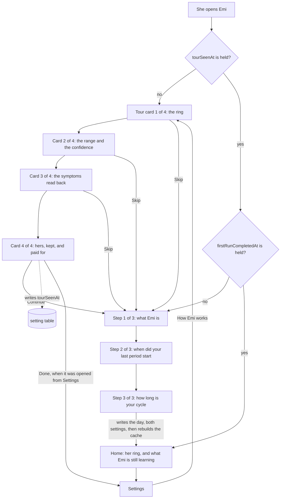

# Design: the tour she sees before Emi asks her anything

A woman opens Emi for the first time. She reads one screen about what Emi is. She says when her
last period started. She says how long her cycle is. Then she is on her home screen, and it says
this.

```
Emi
Nothing to draw yet
The ring needs a period. Log a day you bled and it appears.
Still learning
Emi needs 2 more complete cycles before it forecasts.
Until then Emi counts a cycle of 30 days, the length you gave at the first run.
Log today   History   Export   Settings
```

Those are the strings the application renders today. I read them out of the rendered tree under the
test runner, not off a simulator. Section 3 says how to run it again.

She told Emi the day she bled, thirty seconds earlier. The screen asks her for it again.

Nothing before that moment tells her what she gets for answering. The operator drove the
application in the simulator and said the product is unusable at the beginning, because a new woman
cannot see what Emi offers. This document designs the tour that shows her, and it repairs the screen
she lands on afterwards.

## How to read this document

Status: designed

Every section carries one status line, the same as `architecture.md`, `accounts.md` and
`privacy.md`. `Status: built` means the code is in this repository now. `Status: designed` means
this document describes it and nobody wrote it yet.

Two sections say built. They report what the repository holds on 2026-09-19. Everything else is a
proposal.

This document builds no screen. The pull request that carries it changes no product code.

## The decision this design starts from

Status: designed

The operator settled the order, and it is not open. The tour comes before the two questions of the
first run. She can skip it.

This document designs that order. It proposes no other one.

## What is built today

Status: built

The first run is three screens, and contract SCREEN-1 holds it to three. They are
`apps/mobile/src/features/onboarding/WhatEmiIs.tsx`, `LastPeriod.tsx` and `CycleLength.tsx`. Their
words are in `copy.ts` beside them. The frame they share is `OnboardingScreen.tsx`, which draws the
mark, the words `Step 1 of 3`, a progress bar of one segment for each screen, the question, and one
button at the bottom.

`completeFirstRun` in `firstRun.ts` writes her answers. One transaction holds three writes: the day
she named, into `day_log`, with a flow of `medium`; `cycleLengthDays` into `setting`; and
`firstRunCompletedAt` into `setting`.

It does not rebuild the cycle cache. It calls `insertDayLog` directly, and the one function that
rebuilds the cache is `rebuildCycles`, which nothing on that path calls.

So the `cycle` table is empty when she reaches her home screen. `ringInputFor` returns nothing when
that table is empty, and `HomeScreen` then draws `homeCopy.noRing` in place of the ring.

I measured this rather than reading it. I drove the three screens through the router in a test,
answered them, and read back the database and the rendered tree.

```
pathname=/ cycles=0 days=[{"day":"2026-05-09"}]
noRing=true ring=false learning=true
```

One row in `day_log`. Nothing in `cycle`. No ring on the screen.

Then, in the same test, I called `rebuildCycles` once over the same database and looked at the home
screen again.

```
rebuilt=[{"startedOn":"2026-05-09","endedOn":null,"lengthDays":null,"periodLengthDays":null}]
noRing=false ring=true
```

The ring appeared. It read day 6, Follicular. The one day she gave is enough to draw her ring, and
the first run throws it away.

To reproduce both readings, write a test under `apps/mobile/tests/`, drive
`/onboarding/welcome` with `renderRouter`, press through the three screens, and read
`screen.queryByTestId('home-no-ring')`. I deleted my copy of that test before committing this
document, because section 9 step 2 ships the real one.

## What the tour says, and where each promise comes from

Status: designed

`docs/features.md` names eight features. The tour draws from six promises inside them, and it
invents nothing. Every card below names the feature it comes from.

The six promises are the ring and the cycle day, the forecast as a range with a confidence, the
symptoms read back over six cycles, her data that nobody else can read, her history surviving a new
phone, and the price with what it buys.

There are four cards, not six and not eight.

Four, because a card she does not read is worth nothing, and the fifth card is where a person starts
pressing skip. Three of the four carry one promise each. The fourth carries three promises, because
they are one argument: nobody can read her data, it still reaches her next phone, and she pays money
so that neither of those has to be traded away.

Feature 1 is the brand and feature 8 is the documents. Neither is a promise to a woman opening the
application, so neither gets a card.

## The exact words of every card

Status: designed

The copy follows the rule the first run already follows, which is written at the top of
`apps/mobile/src/features/onboarding/copy.ts`. Say what happens. Never congratulate. No exclamation
mark. Write the number.

The words go in `tourCopy`, in the same file, so a test reads them without rendering a screen.

### Card 1 of 4, from feature 2

Title: Your cycle, in one ring.

Line: The ring is your cycle. A bead marks today, and the number inside it is the day you are on.

Line: Four arcs divide the ring: the days you bleed, the days after them, the days around
ovulation, and the days before your next period.

Action: Next.

### Card 2 of 4, from feature 3

Title: A range, and how sure Emi is.

Line: Emi says your next period falls between two days. It never names one day, because a day it
names is a day it can get wrong.

Line: Beside the range it writes high, medium or low confidence, and how many of your own cycles it
counted.

Line: Emi needs 2 complete cycles before it forecasts. Until then it says it is still learning, and
counts by the cycle length you give it.

Line: This is arithmetic on your own records. Emi is not a contraceptive. Emi is not a medical
device.

Action: Next.

The last line is one string and not two, and it opens with a sentence of its own. The wording gate
in `tools/pipeline/forbiddenClaims.ts` accepts a denial only where a full stop comes before it, so a
denial written as a string of its own is read as a claim and fails the build. The line in
`copy.ts` today carries the same shape, for the same reason.

The denial sits on this card rather than on the last one, because this is the card that makes a
claim about a forecast. The welcome screen of the first run keeps its own copy of the two sentences.
She reads them twice, four cards apart, and that is the correct number of times.

### Card 3 of 4, from feature 4

Title: What you write, read back to you.

Line: Log flow, mood, energy, temperature, weight and more than 70 symptoms, in one sheet.

Line: After six cycles Emi names the symptoms that came back at the same point in 3 of them or
more. A symptom you logged once is not a pattern, and Emi does not call it one.

Action: Next.

### Card 4 of 4, from features 5, 6 and 7

Title: Yours, and it stays yours.

Line: Every day you log is encrypted on this phone, with a key that never leaves it. The server
holds the result and cannot read one day of it.

Line: A recovery code you keep brings your history to a new phone. Nobody at Emi can open your
history, so nobody at Emi can hand it to anybody.

Line: One month free, then 29.99 pounds a year. There is no free version, because a free version is
paid for with your data.

Action: Continue.

The month and the price are the words `docs/contracts.md` uses for contract PAY-1 today. The
operator has not fixed the trial length. If that number moves, this line moves with it, and nothing
else in the tour changes.

### What the cards may not say

Status: designed

No card claims a single day of anything. No card names a certainty Emi does not hold. No card
carries a badge, and no card names a standard, because no auditor has read Emi.

The four words contract SCREEN-2 keeps under 14 points on the home screen are period, bleeding,
fertile and ovulation. The tour is free to write them at body size, which is 16 points, exactly as
`When did your last period start?` writes one at 26 points today. SCREEN-2 guards the screen she
opens in public every day. The tour is seen once, before anything about her is recorded, and it
carries no fact about her body at all.

## The frame the four cards share

Status: designed

One screen, four card bodies, in the shape `OnboardingScreen.tsx` already uses.

The header carries the mark, the words `1 of 4`, and the skip control at the right edge. It does not
say `Step`, so the tour is never read as a fourth step of a first run that SCREEN-1 holds to three.

Under the header, a progress bar of four segments.

The footer carries the action button. On cards 2, 3 and 4 a `Back` control sits under it, in the
shape the delete screen uses, so she can read a card again. Card 1 has no `Back`, because on a first
launch there is nothing behind the tour.

The four cards live in one route and not four. The cards ask her nothing, so there is nothing to
lose by moving between them, and one route keeps the skip control in one place.

## The skip

Status: designed

The control sits in the header of every card, at the right edge, and it is at least 44 points on
both axes, which is contract SEE-3.

On the first run it says `Skip`. Pressing it writes the setting of section 7 and goes to
`/onboarding/welcome`, which is the first of the two questions.

Skipping never reaches the home screen. The two answers are what the product needs to draw anything
at all, so nothing in the tour may step over them.

Opened from Settings, the same control says `Close` and returns to `/settings`. Those are two
different acts. Skipping refuses something she was offered. Closing leaves something she asked for.

## The field level data model

Status: designed

One row in the `setting` table, which migration 3 created and which holds a `key` and a `value`,
both text, both refused when empty. No migration is needed. The table takes a new key without a
schema change.

Key: `tourSeenAt`. It joins the `SettingKey` union and the `settingKeys` list in
`apps/mobile/src/data/settingRepository.ts`.

Value: the instant she left the tour, as an ISO 8601 string, which is the form `firstRunCompletedAt`
already carries.

Written by a new `markTourSeen(db, now)` in `apps/mobile/src/features/onboarding/tour.ts`, called on
the action of card 4 and on the skip. It writes only when no value is held, so the instant stays the
first time she saw the tour. Opening the tour from Settings therefore writes nothing at all.

Read by `tourIsSeen(db): boolean` in the same module, which mirrors `firstRunIsDone`.

One key and not two. A second key saying whether she skipped is a fact about her that nothing reads,
and a fact nothing reads is a fact Emi should not keep.

It never leaves the phone. `settingRepository.ts` says the table is local only, and the sync of
feature 6 finds its tables by reading the schema for a `revision` and a `synced_revision` column.
The `setting` table has neither, so the sync cannot see this row.

### What happens when she deletes everything

Status: designed

The row goes, and no code in the delete path changes.

`emptyTheDatabase` in `apps/mobile/src/services/vault/wipe.ts` reads every table out of
`sqlite_master` and empties it. The comment above it says why the list is read and never written
down. `setting` is in that list, so `tourSeenAt` and `firstRunCompletedAt` go together.

She then presses `Start again` on the deleted screen. That calls `reread()` on the first run
provider and replaces the route with `/`. So `reread()` must re-read the tour marker as well as the
first run marker. If it does not, she is sent straight back to the two questions with nothing
telling her why, which is the state this whole design exists to remove. Section 8 makes it a rule a
test can fail.

### Whether a reinstall shows the tour again

Status: designed

It does, and that is the intended answer.

The value lives in the SQLite file in the application's own storage, and the platform removes that
file with the application. `firstRunCompletedAt` lives in the same file, so a reinstall asks her the
two questions again.

The tour is the answer to those questions being asked. A marker that outlived them would leave a
woman being asked her cycle length with nothing to tell her what the answer buys.

There is a place on the phone that does outlive a reinstall, and it is the keychain. Feature 5 step
7 of the path exists to prove the vault key survives one. The tour marker must not go there, for
exactly that reason.

## The way back in, from Settings

Status: designed

The Settings screen holds one row today, which is `Delete everything`. It gains one more.

Row label: How Emi works.

It sits above `Delete everything`, because a row that destroys everything stays last.

Pressing it opens card 1 of 4. The skip control reads `Close` and the action on card 4 reads `Done`.
Both return to `/settings`. Nothing on that path touches the first run, and nothing on it writes to
the database.

## The home screen before her first complete cycle

Status: designed

Two things are wrong with the screen she lands on, and they are separate.

### The ring is absent, and her own answer can draw it

Section 3 measured both halves of this. The first run writes her day and leaves the cycle cache
empty. One rebuild over the same database draws her ring at day 6.

So `completeFirstRun` finishes by calling `rebuildCycles`, after the commit and not inside it.
`replaceCycles` opens a transaction of its own, and SQLite refuses a transaction inside a
transaction, so a rebuild inside the existing `BEGIN` raises and rolls her answers back.

A rebuild that fails after the commit leaves her answers written and the cache empty, which is the
screen she gets today. The cache is a cache, so the next write repairs it. To close it completely,
the home route rebuilds when the `cycle` table is empty and `day_log` holds a bleeding day.

This changes no contract. SCREEN-2 already says the home screen shows the ring, the cycle day, the
phase name and the forecast range. The change makes that true 30 seconds earlier than it is true
today.

### The words under the ring do not say what is coming

`Still learning` and the two lines under it are correct and they are not enough. They say what Emi
cannot do yet. They do not say what arrives, or when, or what it will look like.

The learning block gains one line, and the two it has keep their words.

Line: Still learning.

Line: Emi needs 2 more complete cycles before it forecasts.

Line: Until then Emi counts a cycle of 30 days, the length you gave at the first run.

Line: When 2 cycles are complete, Emi shows the days your next period is likely to fall between,
and how sure it is.

The first three are the strings `cyclesWantedSentence` and `statedLengthSentence` produce today. The
fourth is new. It is the promise of card 2 of the tour, said again at the moment it is being waited
for.

The count in the new line is `learning.needsCycles`, read from the same value the second line reads,
so the two sentences can never name different numbers.

### The words when there is genuinely nothing to draw

`Nothing to draw yet. The ring needs a period. Log a day you bled and it appears.` stays, and it
stops being the screen she meets after the first run. After this design it is reached one way only,
which is a woman who deleted every bleeding day she had.

## The flow

Status: designed



## The rules a test can fail

Status: designed

1. A first launch with an empty database shows card 1 of the tour, and not the welcome screen.
2. The four cards carry the four titles and every line of section 5, read from `tourCopy` and read
   again off the rendered screen.
3. No card of the tour, and no screen of the first run, carries any wording on the forbidden list
   of `tools/pipeline/forbiddenClaims.ts`, beyond the two approved denials.
4. The skip control on every card writes `tourSeenAt` and leaves her on `/onboarding/welcome`.
5. Skipping from any card never reaches `/`.
6. The action on card 4 writes `tourSeenAt` and leaves her on `/onboarding/welcome`.
7. A launch after the tour was seen shows the welcome screen and never a card.
8. A launch after the tour was seen and the first run was answered shows the home screen.
9. `markTourSeen` called twice leaves the first instant in the row.
10. The first run still asks for no account, no email address and no password, and SCREEN-1 still
    counts three screens. The existing cases of `2.3.test.tsx` stay green with no edit.
11. Every control of the tour is at least 44 points on both axes.
12. `Delete everything` empties the `setting` table, and the launch after it shows card 1 again.
13. `Start again` on the deleted screen shows card 1 again, in the same session, with no relaunch.
14. After the two questions the home screen draws the ring, on the cycle day counted from the day
    she named, and `home-no-ring` is absent.
15. The learning block names the number of cycles wanted and what arrives when they are complete,
    and the two numbers in it are equal.
16. The learning block still shows no confidence, which is contract CYCLE-3.
17. The `setting` table is absent from the tables the sync may send.
18. The Settings screen carries `How Emi works` above `Delete everything`, and pressing it shows
    card 1.
19. The tour opened from Settings returns to `/settings` from the skip control and from the action
    on card 4.
20. The tour opened from Settings writes nothing to the database.

## The contract this needs

Status: designed

`SCREEN-5`, the tour. Verified by a test, and by the operator, who looks at the rendered cards.

Output: four cards before the first question, each naming one promise the feature map already makes,
skippable from any card, seen once and reachable again from Settings.

Errors: a card that names a promise no feature builds. A skip that reaches the home screen. A tour
shown twice without her asking for it. A card counted among the three screens of SCREEN-1.

Declaring it means one edit to `docs/contracts.md` and one to `docs/features.md`, in the same
change, because `npm run check:documents` fails on a contract that one document names and the other
does not. Step 1 of section 9 carries both.

No other contract changes. SCREEN-1 keeps its three screens. SCREEN-2 and CYCLE-3 keep their words.

## The path

Status: designed

Three steps. Each one is one intention and one pull request, and each reverts on its own.

Each step ships its behaviour test in the repository shape, in
`apps/mobile/tests/integration/<feature>.<step>.test.tsx`. The outer describe is the scenario line of
that step, written out in full.

These steps continue feature 2, which is the feature the first run belongs to, so the files are
`2.8`, `2.9` and `2.10`. If the operator gives the tour a feature of its own, the three file names
take that number and nothing else changes.

### 1. The tour, four cards, before the first question

Depends on: nothing.

Files: `apps/mobile/src/features/onboarding/copy.ts` for `tourCopy`,
`apps/mobile/src/features/onboarding/tour.ts` for `markTourSeen` and `tourIsSeen`,
`apps/mobile/src/features/onboarding/TourScreen.tsx`,
`apps/mobile/src/app/onboarding/tour.tsx`, `apps/mobile/src/app/index.tsx` for the redirect,
`apps/mobile/src/features/onboarding/FirstRunProvider.tsx` for the marker and for `reread`,
`apps/mobile/src/data/settingRepository.ts` for the key, `docs/contracts.md` and `docs/features.md`
for SCREEN-5, and `apps/mobile/tests/integration/2.8.test.tsx`.

Behaviour: a first launch shows four cards. She moves through them, or she skips from any of them.
Either way `tourSeenAt` is written and she lands on the first question. A second launch goes
straight to the first question.

Proof: rules 1 to 13 and 17 of section 8. The two questions are answered in the same test, so the
case ends on her home screen and not on a route name.

Mutation: make `markTourSeen` write nothing, and watch the second launch case go red because it
shows a card. Then make it write on the skip alone, and watch the case that finishes card 4 go red.

The scenario that proves it: she sees what Emi offers before Emi asks her anything.

### 2. The home screen before her first complete cycle

Depends on: nothing. It can ship before step 1 or after it.

Files: `apps/mobile/src/features/onboarding/firstRun.ts` for the rebuild after the commit,
`apps/mobile/src/app/index.tsx` for the repair when the cache is empty,
`apps/mobile/src/features/forecast/copy.ts` for the new sentence,
`apps/mobile/src/features/forecast/Learning.tsx`, and
`apps/mobile/tests/integration/2.9.test.tsx`.

Behaviour: the two questions end with her ring drawn, on the cycle day counted from the day she
named. The learning block says what arrives and how many cycles it waits for.

Proof: rules 14, 15 and 16 of section 8. The test drives the three screens and reads the home screen
afterwards, so the assertion sits after the whole round trip and not on the call the first run made.

Mutation: take the rebuild back out of `completeFirstRun` and watch the ring case go red with
`home-no-ring` present. That is the state section 3 measured, so the red is known in advance.

The scenario that proves it: she answers two questions and her own ring is on the screen.

### 3. The way back in, from Settings

Depends on: step 1.

Files: `apps/mobile/src/features/settings/copy.ts` for the row,
`apps/mobile/src/features/settings/SettingsScreen.tsx`,
`apps/mobile/src/app/settings/index.tsx`, `apps/mobile/src/app/onboarding/tour.tsx` for the return
it takes, and `apps/mobile/tests/integration/2.10.test.tsx`.

Behaviour: Settings carries `How Emi works`. It opens the tour. The skip control says `Close`, the
action on card 4 says `Done`, and both come back to Settings.

Proof: rules 18, 19 and 20 of section 8. The test presses the row, reads a card, presses the way
out, and asserts she is on the Settings screen with the delete row under her thumb again.

Mutation: send the return to `/` instead of `/settings`, and watch the case go red on the screen she
is left with.

The scenario that proves it: she opens the tour again from Settings and comes back where she was.

## How sure I am

Status: designed

The plan overall: 85 percent.

The data model and the delete: 95 percent. The key joins a table that exists, the delete reads its
tables out of the schema, and I read both.

The home screen repair: 90 percent. I measured the empty cache and I measured the ring that one
rebuild produces. The 10 percent is the transaction shape. I did not run a rebuild inside the first
run's own `BEGIN` to watch SQLite refuse it.

The four cards and their words: 80 percent. Nobody has looked at them rendered. The number of cards
is a judgement and not a measurement.

The way back in from Settings: 90 percent. It is one row and one return value.

## What I did not verify

Status: designed

I ran nothing on a phone. Every reading in section 3 comes from the test runner on this machine.

I did not render the four cards. The lines of section 5 are counted in words, not in points, and a
line that wraps to four rows on a small screen is a thing only a picture shows.

I did not measure how long a woman spends on a tour card, and I found no published figure for it.
The choice of four cards rests on the promises in `docs/features.md` and on nothing measured.

I did not check the two store review guidelines for anything they say about a tour before a first
run.

## What this design does not answer

Status: designed

The feature number these three steps belong to, which decides the name of every behaviour test file
in section 9.

The trial length. Card 4 says one month because contract PAY-1 says one month. The operator has not
fixed it.

Where the paywall of feature 7 sits. It is not built. When it arrives it lands on this path, either
between the tour and the questions or after them, and that is an order only the operator can choose.

Whether the tour gets a rendered picture in `docs/story.md`. Every other screen of feature 2 has
one, and `check:story` reports a missing section without failing the run.
