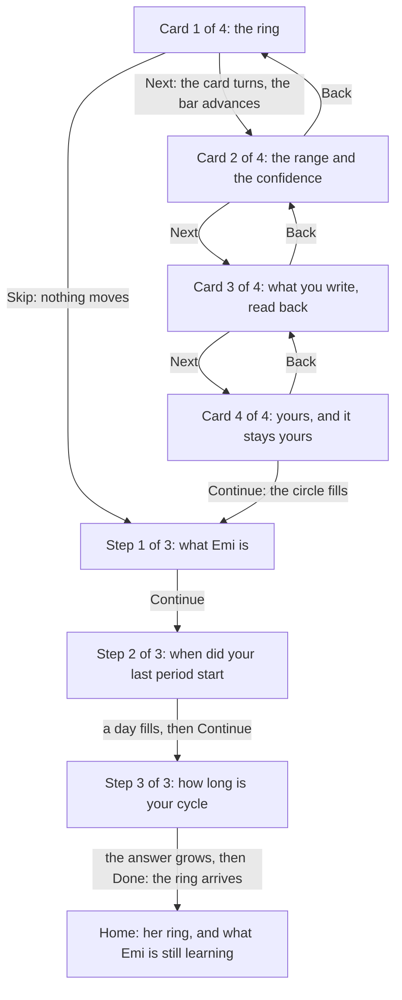
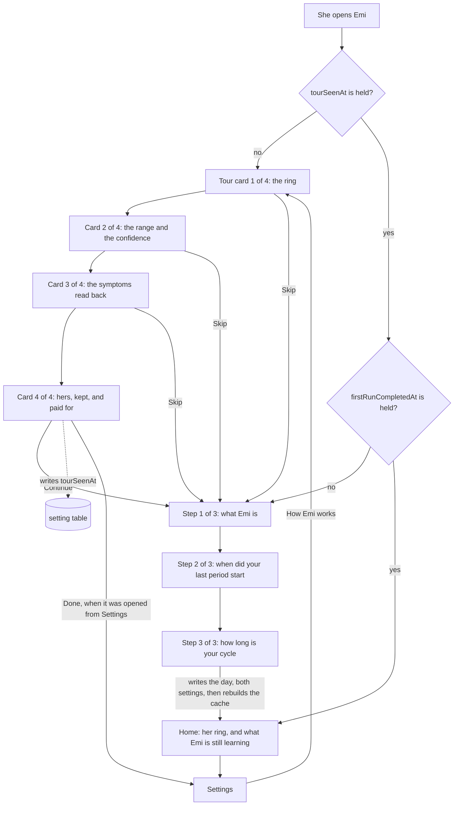

# Design: the tour she sees before Emi asks her anything

A woman opens Emi for the first time. She reads one screen about what Emi is. She says when her
last period started. She says how long her cycle is. Then she is on her home screen, and it says
this.

```
Emi
Nothing to draw yet
The ring needs a period. Log a day you bled and it appears.
Still learning
Emi needs 2 more complete cycles before it forecasts.
Until then Emi counts a cycle of 30 days, the length you gave at the first run.
Log today   History   Export   Settings
```

Those are the strings the application renders today. I read them out of the rendered tree under the
test runner, not off a simulator. The section on what is built today says how to run it again.

She told Emi the day she bled, thirty seconds earlier. The screen asks her for it again.

Nothing before that moment tells her what she gets for answering. The operator drove the
application in the simulator and said the product is unusable at the beginning, because a new woman
cannot see what Emi offers. This document designs the tour that shows her, and it repairs the screen
she lands on afterwards.

## How to read this document

Status: designed

Every section carries one status line, the same as `architecture.md`, `accounts.md` and
`privacy.md`. `Status: built` means the code is in this repository now. `Status: designed` means
this document describes it and nobody wrote it yet.

One section says built. It reports what the repository holds on 2026-09-19. Everything else is a
proposal.

This document builds no screen. The pull request that carries it changes no product code.

## The decision this design starts from

Status: designed

The operator settled the order, and it is not open. The tour comes before the two questions of the
first run. She can skip it.

This document designs that order. It proposes no other one.

## What is built today

Status: built

The first run is three screens, and contract SCREEN-1 holds it to three. They are
`apps/mobile/src/features/onboarding/WhatEmiIs.tsx`, `LastPeriod.tsx` and `CycleLength.tsx`. Their
words are in `copy.ts` beside them. The frame they share is `OnboardingScreen.tsx`, which draws the
mark, the words `Step 1 of 3`, a progress bar of one segment for each screen, the question, and one
button at the bottom.

`completeFirstRun` in `firstRun.ts` writes her answers. One transaction holds three writes: the day
she named, into `day_log`, with a flow of `medium`; `cycleLengthDays` into `setting`; and
`firstRunCompletedAt` into `setting`.

It does not rebuild the cycle cache. It calls `insertDayLog` directly, and the one function that
rebuilds the cache is `rebuildCycles`, which nothing on that path calls.

So the `cycle` table is empty when she reaches her home screen. `ringInputFor` returns nothing when
that table is empty, and `HomeScreen` then draws `homeCopy.noRing` in place of the ring.

I measured this rather than reading it. I drove the three screens through the router in a test,
answered them, and read back the database and the rendered tree.

```
pathname=/ cycles=0 days=[{"day":"2026-05-09"}]
noRing=true ring=false learning=true
```

One row in `day_log`. Nothing in `cycle`. No ring on the screen.

Then, in the same test, I called `rebuildCycles` once over the same database and looked at the home
screen again.

```
rebuilt=[{"startedOn":"2026-05-09","endedOn":null,"lengthDays":null,"periodLengthDays":null}]
noRing=false ring=true
```

The ring appeared. It read day 6, Follicular. The one day she gave is enough to draw her ring, and
the first run throws it away.

To reproduce both readings, write a test under `apps/mobile/tests/`, drive
`/onboarding/welcome` with `renderRouter`, press through the three screens, and read
`screen.queryByTestId('home-no-ring')`. I deleted my copy of that test before committing this
document, because step 2 of the path ships the real one.

## What the tour says, and where each promise comes from

Status: designed

`docs/features.md` names eight features. The tour draws from six promises inside them, and it
invents nothing. Every card below names the feature it comes from.

The six promises are the ring and the cycle day, the forecast as a range with a confidence, the
symptoms read back over six cycles, her data that nobody else can read, her history surviving a new
phone, and the price with what it buys.

There are four cards, not six and not eight.

Four, because a card she does not read is worth nothing, and the fifth card is where a person starts
pressing skip. Three of the four carry one promise each. The fourth carries three promises, because
they are one argument: nobody can read her data, it still reaches her next phone, and she pays money
so that neither of those has to be traded away.

Feature 1 is the brand and feature 8 is the documents. Neither is a promise to a woman opening the
application, so neither gets a card.

## The exact words of every card

Status: designed

The copy follows the rule the first run already follows, which is written at the top of
`apps/mobile/src/features/onboarding/copy.ts`. Say what happens. Never congratulate. No exclamation
mark. Write the number.

The words go in `tourCopy`, in the same file, so a test reads them without rendering a screen.

### Card 1 of 4, from feature 2

Title: Your cycle, in one ring.

Line: The ring is your cycle. A bead marks today, and the number inside it is the day you are on.

Line: Four arcs divide the ring: the days you bleed, the days after them, the days around
ovulation, and the days before your next period.

Action: Next.

### Card 2 of 4, from feature 3

Title: A range, and how sure Emi is.

Line: Emi says your next period falls between two days. It never names one day, because a day it
names is a day it can get wrong.

Line: Beside the range it writes high, medium or low confidence, and how many of your own cycles it
counted.

Line: Emi needs 2 complete cycles before it forecasts. Until then it says it is still learning, and
counts by the cycle length you give it.

Line: This is arithmetic on your own records. Emi is not a contraceptive. Emi is not a medical
device.

Action: Next.

The last line is one string and not two, and it opens with a sentence of its own. The wording gate
in `tools/pipeline/forbiddenClaims.ts` accepts a denial only where a full stop comes before it, so a
denial written as a string of its own is read as a claim and fails the build. The line in
`copy.ts` today carries the same shape, for the same reason.

The denial sits on this card rather than on the last one, because this is the card that makes a
claim about a forecast. The welcome screen of the first run keeps its own copy of the two sentences.
She reads them twice, four cards apart, and that is the correct number of times.

### Card 3 of 4, from feature 4

Title: What you write, read back to you.

Line: Log flow, mood, energy, temperature, weight and more than 70 symptoms, in one sheet.

Line: After six cycles Emi names the symptoms that came back at the same point in 3 of them or
more. A symptom you logged once is not a pattern, and Emi does not call it one.

Action: Next.

### Card 4 of 4, from features 5, 6 and 7

Title: Yours, and it stays yours.

Line: Every day you log is encrypted on this phone, with a key that never leaves it. The server
holds the result and cannot read one day of it.

Line: A recovery code you keep brings your history to a new phone. Nobody at Emi can open your
history, so nobody at Emi can hand it to anybody.

Line: One month free, then 29.99 pounds a year. There is no free version, because a free version is
paid for with your data.

Action: Continue.

The month and the price are the words `docs/contracts.md` uses for contract PAY-1 today. The
operator has not fixed the trial length. If that number moves, this line moves with it, and nothing
else in the tour changes.

### What the cards may not say

Status: designed

No card claims a single day of anything. No card names a certainty Emi does not hold. No card
carries a badge, and no card names a standard, because no auditor has read Emi.

The four words contract SCREEN-2 keeps under 14 points on the home screen are period, bleeding,
fertile and ovulation. The tour is free to write them at body size, which is 16 points, exactly as
`When did your last period start?` writes one at 26 points today. SCREEN-2 guards the screen she
opens in public every day. The tour is seen once, before anything about her is recorded, and it
carries no fact about her body at all.

## The frame the four cards share

Status: designed

One screen, four card bodies, in the shape `OnboardingScreen.tsx` already uses.

The header carries the mark, the words `1 of 4`, and the skip control at the right edge. It does not
say `Step`, so the tour is never read as a fourth step of a first run that SCREEN-1 holds to three.

Under the header, a progress bar of four segments.

The footer carries the action button. On cards 2, 3 and 4 a `Back` control sits under it, in the
shape the delete screen uses, so she can read a card again. Card 1 has no `Back`, because on a first
launch there is nothing behind the tour.

The four cards live in one route and not four. The cards ask her nothing, so there is nothing to
lose by moving between them, and one route keeps the skip control in one place.

The section on how it looks and how it moves carries the token for every surface of this frame, the
band and the sheet it is drawn on, the safe area, and each movement between one card and the next.

## The skip

Status: designed

The control sits in the header of every card, at the right edge, and it is at least 44 points on
both axes, which is contract SEE-3.

On the first run it says `Skip`. Pressing it writes the setting named under the data model, and goes to
`/onboarding/welcome`, which is the first of the two questions.

Skipping never reaches the home screen. The two answers are what the product needs to draw anything
at all, so nothing in the tour may step over them.

Opened from Settings, the same control says `Close` and returns to `/settings`. Those are two
different acts. Skipping refuses something she was offered. Closing leaves something she asked for.

## The field level data model

Status: designed

One row in the `setting` table, which migration 3 created and which holds a `key` and a `value`,
both text, both refused when empty. No migration is needed. The table takes a new key without a
schema change.

Key: `tourSeenAt`. It joins the `SettingKey` union and the `settingKeys` list in
`apps/mobile/src/data/settingRepository.ts`.

Value: the instant she left the tour, as an ISO 8601 string, which is the form `firstRunCompletedAt`
already carries.

Written by a new `markTourSeen(db, now)` in `apps/mobile/src/features/onboarding/tour.ts`, called on
the action of card 4 and on the skip. It writes only when no value is held, so the instant stays the
first time she saw the tour. Opening the tour from Settings therefore writes nothing at all.

Read by `tourIsSeen(db): boolean` in the same module, which mirrors `firstRunIsDone`.

One key and not two. A second key saying whether she skipped is a fact about her that nothing reads,
and a fact nothing reads is a fact Emi should not keep.

It never leaves the phone. `settingRepository.ts` says the table is local only, and the sync of
feature 6 finds its tables by reading the schema for a `revision` and a `synced_revision` column.
The `setting` table has neither, so the sync cannot see this row.

### What happens when she deletes everything

Status: designed

The row goes, and no code in the delete path changes.

`emptyTheDatabase` in `apps/mobile/src/services/vault/wipe.ts` reads every table out of
`sqlite_master` and empties it. The comment above it says why the list is read and never written
down. `setting` is in that list, so `tourSeenAt` and `firstRunCompletedAt` go together.

She then presses `Start again` on the deleted screen. That calls `reread()` on the first run
provider and replaces the route with `/`. So `reread()` must re-read the tour marker as well as the
first run marker. If it does not, she is sent straight back to the two questions with nothing
telling her why, which is the state this whole design exists to remove. The rules a test can fail
carry it.

### Whether a reinstall shows the tour again

Status: designed

It does, and that is the intended answer.

The value lives in the SQLite file in the application's own storage, and the platform removes that
file with the application. `firstRunCompletedAt` lives in the same file, so a reinstall asks her the
two questions again.

The tour is the answer to those questions being asked. A marker that outlived them would leave a
woman being asked her cycle length with nothing to tell her what the answer buys.

There is a place on the phone that does outlive a reinstall, and it is the keychain. Feature 5 step
7 of the path exists to prove the vault key survives one. The tour marker must not go there, for
exactly that reason.

## The way back in, from Settings

Status: designed

The Settings screen holds one row today, which is `Delete everything`. It gains one more.

Row label: How Emi works.

It sits above `Delete everything`, because a row that destroys everything stays last.

Pressing it opens card 1 of 4. The skip control reads `Close` and the action on card 4 reads `Done`.
Both return to `/settings`. Nothing on that path touches the first run, and nothing on it writes to
the database.

## The home screen before her first complete cycle

Status: designed

Two things are wrong with the screen she lands on, and they are separate.

### The ring is absent, and her own answer can draw it

The section on what is built today measured both halves of this. The first run writes her day and leaves the cycle cache
empty. One rebuild over the same database draws her ring at day 6.

So `completeFirstRun` finishes by calling `rebuildCycles`, after the commit and not inside it.
`replaceCycles` opens a transaction of its own, and SQLite refuses a transaction inside a
transaction, so a rebuild inside the existing `BEGIN` raises and rolls her answers back.

A rebuild that fails after the commit leaves her answers written and the cache empty, which is the
screen she gets today. The cache is a cache, so the next write repairs it. To close it completely,
the home route rebuilds when the `cycle` table is empty and `day_log` holds a bleeding day.

This changes no contract. SCREEN-2 already says the home screen shows the ring, the cycle day, the
phase name and the forecast range. The change makes that true 30 seconds earlier than it is true
today.

### The words under the ring do not say what is coming

`Still learning` and the two lines under it are correct and they are not enough. They say what Emi
cannot do yet. They do not say what arrives, or when, or what it will look like.

The learning block gains one line, and the two it has keep their words.

Line: Still learning.

Line: Emi needs 2 more complete cycles before it forecasts.

Line: Until then Emi counts a cycle of 30 days, the length you gave at the first run.

Line: When 2 cycles are complete, Emi shows the days your next period is likely to fall between,
and how sure it is.

The first three are the strings `cyclesWantedSentence` and `statedLengthSentence` produce today. The
fourth is new. It is the promise of card 2 of the tour, said again at the moment it is being waited
for.

The count in the new line is `learning.needsCycles`, read from the same value the second line reads,
so the two sentences can never name different numbers.

### The words when there is genuinely nothing to draw

`Nothing to draw yet. The ring needs a period. Log a day you bled and it appears.` stays, and it
stops being the screen she meets after the first run. After this design it is reached one way only,
which is a woman who deleted every bleeding day she had.

## How it looks, and how it moves

Status: designed

The operator walked another product's onboarding and captured 85 screens of it. The captures are
1290 by 2796 pixels, which is 430 by 932 points at three times scale. Every number below that says
measured comes from those pixels.

They are a reference for the quality and the shape. They are not a thing to reproduce. Emi copies no
screen, and the product is not named here.

### The tokens the onboarding uses

Status: designed

Emi has one design system and this adds no second palette. Every value below is a token that
`packages/tokens` holds today, except the three named as additions at the end.

The colours, by the surface each one paints.

- The band the drawing stands in, which is the screen ground: `colour.stone`.
- The sheet the words sit on: `colour.surface`.
- An answer row she has not chosen: `colour.sunk`, with its label in `colour.ink`.
- An answer row she has chosen: `colour.ember`, with its label in `colour.surface`. The palette
  approves that pair, because `surface` names `ember` in its `textOn` list.
- The action: `colour.ember` filled, with its label in `colour.surface`.
- The progress track: `colour.sunk`. The part of it she has reached: `colour.ember`.
- The rule above the footer: `colour.hairline`.

Two measured values are answered by a token rather than taken. The measured grey of an unchosen row
is `#F2F2F2`. Emi's `sunk` is `#F1EBE4`, which is the same lightness carrying the warmth the rest of
the application carries. The measured band is a vertical gradient from `#FFEBF7` to `#FFF0F7`. Emi's
band is `colour.stone`, flat, for the reason the refusals below give.

The corners.

- The top two corners of the sheet: `radius.sheet`, which is 24 points.
- An answer row: `radius.card`, which is 16 points. The measured radius is about 12. Emi rounds
  every card at 16, and one radius for one kind of thing is worth more than four points.
- The action: `radius.chip`, which is 10 points, and which is what the first run draws today.

The spacing. Every step is a multiple of four, which is what `space` already promises.

- The margin down both sides of the sheet: `space.base`.
- Between a title and the line under it: `space.snug`.
- Between two answer rows: `space.snug`, which is 16 points against a measured gap of about 13.
- Between the segments of the progress bar: `space.hair`.
- Inside the footer, around the action: `space.base`.

The type.

- A card title: `typeScale.title`, 26 points over 32.
- A line of a card, and the label of an answer row: `typeScale.body`, 16 over 24.
- The sentence revealed inside a chosen row: `typeScale.small`, 14 over 20.
- The count `1 of 4`: `typeScale.label`, 12 over 16, in the numeric face.

Two values are neither tokens nor measured. The height of the progress bar is 6 points, and it is a
constant named `PROGRESS_HEIGHT` inside `OnboardingScreen.tsx`. The drawing is 320 by 220 points,
which is `PIECE_WIDTH` and `PIECE_HEIGHT` in `brand/illustration/pieces.ts`. The tour reuses both
rather than adding a second bar height or a second drawing size.

The palette needs no new colour. Every surface the onboarding paints is answered by a colour that
`packages/tokens` already holds and the contrast test already measures. Contract TOKEN-1 keeps the
palette closed, and this design does not open it.

### The additions the system does not hold yet

Status: designed

Three durations, added to `packages/tokens` beside `RING_OPEN_MILLISECONDS`, so that no screen
writes a number of its own.

- `TOUR_CARD_MILLISECONDS`, for the card turning.
- `TOUR_REVEAL_MILLISECONDS`, for an answer row growing.
- `TOUR_CIRCLE_MILLISECONDS`, for the circle filling the screen.

Adding a token means regenerating `docs/brand.md` in the same change, because `npm run check:brand`
compares that document against the token package and fails on a difference of one character.

Four drawings are added to `brand/illustration/pieces.ts`, one for each card, and drawn by the
generator that directory already carries. Each one follows the style that is written down there:
two or three soft edged shapes, in the phase colours only, never in ember, on the stone ground.
Contract BRAND-4 refuses a body, a face, a flower, a droplet and blood, and the generator refuses a
drawing whose name carries one of those words before the pipeline ever reads it.

### The screen frame

Status: designed

One frame, from the top of the glass to the bottom, on every card of the tour and on every screen of
the first run.

1. The safe area inset at the top.
2. The header: the mark at the left, the count beside it, and the skip control at the right edge.
3. The progress bar, full width inside `space.base`.
4. The band, on `colour.stone`, holding the drawing.
5. The sheet, filled `colour.surface`, rounded at `radius.sheet` on its top two corners only, and
   running to the bottom of the screen. It holds the title, the lines, and anything she presses.
6. The footer, inside the sheet, above a `colour.hairline` rule: the action, and `Back` under it
   from card 2.
7. The safe area inset at the bottom.

The drawing stands in the band and the sheet starts under it, so the drawing reads as standing
behind the words rather than sitting inside them.

The inset is added to the padding and never replaces it. The header's top padding is `space.roomy`
plus whatever the phone reports at the top. The footer's bottom padding is `space.base` plus
whatever it reports at the bottom. No inset value is written in this document or in the code, for
two reasons: the number is the phone's, and a fix for the inset is in flight on another branch. On a
phone that reports zero the screen draws what it draws today.

### The movements

Status: designed

Every duration and every curve below is chosen and not observed. A photograph carries neither. Each
one takes the platform's own value where the platform has one, and says so.

What would prove any of them is a recording of the built screen, watched by a person. No test reads
a duration and concludes that a screen feels right.

**1. The card turns.** She presses `Next` or `Back`. The content inside the sheet leaves to one side
and the next card's content arrives from the other. The header, the bar and the drawing band do not
move. She is left looking at the next card. Chosen: 300 milliseconds on an ease in and ease out
curve, which is `LayoutAnimation.Presets.easeInEaseOut` as React Native ships it. I read the 300 in
`node_modules/react-native/Libraries/LayoutAnimation/LayoutAnimation.js`. Still fallback: the
content is replaced with no movement.

**2. The bar advances.** The card turns. The segment for the card she is arriving at fills with
`colour.ember`. She is left looking at a bar one segment further along. Chosen: the same 300, so
that the bar and the card arrive together rather than one after the other. Still fallback: the
segment is filled with no movement.

**3. The answer grows.** She chooses an answer on a question that offers a short list of them. The
row turns from `colour.sunk` to `colour.ember`, its label turns to `colour.surface`, and the row
grows downward to hold one sentence at `typeScale.small`. The rows under it are pushed down. Nothing
navigates. She is left looking at the same question, with her own answer explained inside it.
Chosen: 300 milliseconds, the same preset, because this is the same kind of move as a card turning
and two speeds would read as two systems. Still fallback: the row changes colour and the sentence
appears, with no growth.

Neither question asks for a short list today. The last period question is a calendar and the cycle
length question is a number she steps. So the cycle length screen takes this movement in its own
shape: the card under the stepper grows in place to hold one more sentence, naming what the length
she just set means for her first forecast. The stack of rows is specified here so that the first
question that does offer a short list draws it the same way.

**4. The circle fills.** She presses `Continue` on card 4 of the tour. A circle of `colour.ember`
grows out of the action until it covers the screen, with the ring mark held in the centre at a
constant size. She is left looking at the first question, drawn under the circle as it clears.
Chosen: 600 milliseconds, which is the value `RING_OPEN_MILLISECONDS` already holds, because this is
the same mark arriving and one mark may not have two speeds. Still fallback: no circle, and the
first question is drawn at once.

**5. The day fills.** She presses a day on the calendar of the last period question. That day's
square fills with `colour.ember` and its number turns to `colour.surface`. The day she pressed
before empties. She is left looking at the same calendar with one day chosen and the action ready.
Chosen: 300 milliseconds, the same preset. Still fallback: the two squares change colour with no
movement.

**6. The ring arrives.** She answers the last question and the home screen opens. The ring fades up
from 0.94 of its size. She is left looking at her own ring, on the day of her cycle she is on.
Chosen: nothing. This movement is built, it is `useOpeningMotion` in `CycleRing.tsx`, its duration
is `RING_OPEN_MILLISECONDS`, and contract SEE-4 already holds it still under reduced motion.

**7. The ones that move nothing.** `Skip` and `Close` leave the tour. `How Emi works` in Settings
opens it. `Done` on card 4 returns to Settings. Each one is a route change and carries no movement
of its own, so each one is named here rather than left out.

**8. The wait Emi does not show.** Nothing starts it, because nothing may. Emi computes nothing in
the onboarding that takes long enough to show. What happens when she answers the last question is
one transaction of three writes and one cache rebuild over a single day. This movement is named so
that nobody adds one later: a screen that says it is working may only be drawn while something is
genuinely working. The one place in the product where that will be true is the restore of her
history onto a second phone in feature 6, which waits on a network pull and on the key unwrap that
contract VAULT-2 measures.

### Reduced motion

Status: designed

Every movement above carries its still fallback, written beside it.

Success criterion 2.3.3 of the Web Content Accessibility Guidelines, which is called Animation from
Interactions, asks that motion started by an interaction can be turned off. It sits at level AAA,
and the contrast floor Emi already enforces is level AA. So this is Emi holding itself above its own
floor rather than meeting it.

The rule is one rule, and the application already holds it. `AccessibilityInfo.isReduceMotionEnabled`
is asked before the first frame is drawn. A phone that asks for less motion gets the end state at
once rather than a movement stopped halfway. A phone that will not answer is treated as a phone that
asked for less motion, which is the `catch` in `useOpeningMotion`.

Contract SEE-4 states this for the ring. Contract SCREEN-5 states it for the tour, and the rules a
test can fail hold it.

### Which screens carry a progress bar

Status: designed

A bar appears on a screen that belongs to a counted set, and it counts its own set alone.

- The four cards of the tour carry a bar of four segments, and the words `1 of 4`.
- The three screens of the first run carry a bar of three segments, and the words `Step 1 of 3`,
  which is built today.
- The two bars never join into one bar of seven. The tour can be skipped, and a bar that jumped from
  two of seven to five of seven would read as progress lost.
- A bar never goes backwards inside its set, and it reaches full on the last screen of its set.
- Nothing else carries one. The circle fill carries no bar, and the home screen carries no bar.

The measured reference carries a bar on 28 of its 85 screens. Read in order it climbs from 18 per
cent to 75 per cent and never goes backwards. The screens with no bar there are the ones that tell
her something between the questions, and the closing sequence before the price. Emi's rule says the
same thing by set rather than by screen. Emi's bars reach full, because each of Emi's two sets is
complete.

### What Emi does not copy

Status: designed

Seven things, each with the reason.

1. Social proof. Emi has no ratings to show, no count of women tracking with it, and no panel of
   experts to name. A screen carrying any of those would make a claim the product cannot support,
   and the wording gate in `tools/pipeline/forbiddenClaims.ts` would refuse most of that copy before
   a reviewer read it.
2. A tracking consent. Emi asks for none, because nothing leaves the phone. Contract KEEP-4 holds
   the dependency list to no analytics, no advertising identifier and no crash reporter that ships
   her content, so there is nothing to consent to.
3. A wait Emi is not performing. The movements above name it and refuse it.
4. The tap and hold. Emi takes the circle and leaves the gesture. A hold is a barrier for a person
   with limited control of her hands, and Emi's one irreversible act, which is `Delete everything`,
   is settled as a single press with no second confirmation. A hold on the tour would also give one
   button two ways to press it.
5. The gradient band. Every drawing in `brand/illustration` is generated on the stone ground, so a
   gradient behind one would show its edge. Emi's band is `colour.stone`, flat.
6. The shape and the width of the action. The measured action is a full pill, about 149 points wide
   by 49 tall, centred, about 50 points above the bottom edge. Emi's action runs the width of the
   sheet inside `space.base`, at `radius.chip`, with a minimum height of 44 points, which is what
   the first run draws today. A wider target is easier to reach, and the tour and the questions may
   not carry two different buttons.
7. The length. 85 screens is not a target. Emi's onboarding is four cards and three questions, and
   the count of cards is argued where the cards are named.

### The walk

Status: designed



## The flow

Status: designed



## The rules a test can fail

Status: designed

1. A first launch with an empty database shows card 1 of the tour, and not the welcome screen.
2. The four cards carry the four titles and every line of the card words, read from `tourCopy` and read
   again off the rendered screen.
3. No card of the tour, and no screen of the first run, carries any wording on the forbidden list
   of `tools/pipeline/forbiddenClaims.ts`, beyond the two approved denials.
4. The skip control on every card writes `tourSeenAt` and leaves her on `/onboarding/welcome`.
5. Skipping from any card never reaches `/`.
6. The action on card 4 writes `tourSeenAt` and leaves her on `/onboarding/welcome`.
7. A launch after the tour was seen shows the welcome screen and never a card.
8. A launch after the tour was seen and the first run was answered shows the home screen.
9. `markTourSeen` called twice leaves the first instant in the row.
10. The first run still asks for no account, no email address and no password, and SCREEN-1 still
    counts three screens. The existing cases of `2.3.test.tsx` stay green with no edit.
11. Every control of the tour is at least 44 points on both axes.
12. `Delete everything` empties the `setting` table, and the launch after it shows card 1 again.
13. `Start again` on the deleted screen shows card 1 again, in the same session, with no relaunch.
14. After the two questions the home screen draws the ring, on the cycle day counted from the day
    she named, and `home-no-ring` is absent.
15. The learning block names the number of cycles wanted and what arrives when they are complete,
    and the two numbers in it are equal.
16. The learning block still shows no confidence, which is contract CYCLE-3.
17. The `setting` table is absent from the tables the sync may send.
18. The Settings screen carries `How Emi works` above `Delete everything`, and pressing it shows
    card 1.
19. The tour opened from Settings returns to `/settings` from the skip control and from the action
    on card 4.
20. The tour opened from Settings writes nothing to the database.
21. No file under `apps/mobile/src` and none under `brand/` carries a hex colour. The lint rule of
    contract TOKEN-1 already refuses one, and the tour adds no exception.
22. Every colour, radius, space and type size the tour draws with is read from `@emi/tokens`.
23. The three duration tokens exist in `packages/tokens`, and `docs/brand.md` is regenerated, so
    `npm run check:brand` passes.
24. The four drawings exist in `brand/illustration`, each with a picture beside it, and none of
    their names carries a refused word.
25. The header padding is the token plus the reported top inset, and the footer padding is the
    token plus the reported bottom inset. A case reports an inset of 0 and one above 0, and reads
    the padding both times. No inset number appears in the source.
26. Every movement of the tour is still when `AccessibilityInfo.isReduceMotionEnabled` answers
    true, and still again when it refuses to answer at all.
27. The tour bar has four segments and the first run bar has three. Neither counts the other.
28. The bar of a set never goes backwards, and it is full on the last screen of its set.
29. No screen of the onboarding says it is working.

## The contract this needs

Status: designed

`SCREEN-5`, the tour. Verified by a test, and by the operator, who looks at the rendered cards.

Output: four cards before the first question, each naming one promise the feature map already makes,
skippable from any card, seen once and reachable again from Settings.

Errors: a card that names a promise no feature builds. A skip that reaches the home screen. A tour
shown twice without her asking for it. A card counted among the three screens of SCREEN-1. A
movement that keeps moving while the operating system asks for reduced motion. A screen that says
it is working while nothing is working.

Declaring it means one edit to `docs/contracts.md` and one to `docs/features.md`, in the same
change, because `npm run check:documents` fails on a contract that one document names and the other
does not. Step 1 of the path carries both.

No other contract changes. SCREEN-1 keeps its three screens. SCREEN-2 and CYCLE-3 keep their words.

## The path

Status: designed

Four steps. Each one is one intention and one pull request, and each reverts on its own.

The fourth step arrived with the feel and motion work. The three screens of the first run are built,
and the frame described above changes them, so that change is its own pull request rather than a
passenger on the tour.

Each step ships its behaviour test in the repository shape, in
`apps/mobile/tests/integration/<feature>.<step>.test.tsx`. The outer describe is the scenario line of
that step, written out in full.

These steps continue feature 2, which is the feature the first run belongs to, so the files are
`2.8`, `2.9`, `2.10` and `2.11`. If the operator gives the tour a feature of its own, the four file
names take that number and nothing else changes.

### 1. The tour, four cards, before the first question

Depends on: nothing.

Files: `apps/mobile/src/features/onboarding/copy.ts` for `tourCopy`,
`apps/mobile/src/features/onboarding/tour.ts` for `markTourSeen` and `tourIsSeen`,
`apps/mobile/src/features/onboarding/TourScreen.tsx`,
`apps/mobile/src/app/onboarding/tour.tsx`, `apps/mobile/src/app/index.tsx` for the redirect,
`apps/mobile/src/features/onboarding/FirstRunProvider.tsx` for the marker and for `reread`,
`apps/mobile/src/data/settingRepository.ts` for the key, `packages/tokens/src/ring.ts` for the three
duration tokens, `brand/illustration/pieces.ts` for the four drawings, `docs/brand.md` regenerated,
`docs/contracts.md` and `docs/features.md` for SCREEN-5, and
`apps/mobile/tests/integration/2.8.test.tsx`.

Behaviour: a first launch shows four cards, on the band and sheet frame, each with its drawing. She
moves through them, or she skips from any of them. Either way `tourSeenAt` is written and she lands
on the first question. A second launch goes straight to the first question.

Proof: rules 1 to 13, 17, and 21 to 29 of the rules a test can fail. The two questions are answered
in the same test, so the case ends on her home screen and not on a route name.

Mutation: make `markTourSeen` write nothing, and watch the second launch case go red because it
shows a card. Then make it write on the skip alone, and watch the case that finishes card 4 go red.

The scenario that proves it: she sees what Emi offers before Emi asks her anything.

### 2. The home screen before her first complete cycle

Depends on: nothing. It can ship before step 1 or after it.

Files: `apps/mobile/src/features/onboarding/firstRun.ts` for the rebuild after the commit,
`apps/mobile/src/app/index.tsx` for the repair when the cache is empty,
`apps/mobile/src/features/forecast/copy.ts` for the new sentence,
`apps/mobile/src/features/forecast/Learning.tsx`, and
`apps/mobile/tests/integration/2.9.test.tsx`.

Behaviour: the two questions end with her ring drawn, on the cycle day counted from the day she
named. The learning block says what arrives and how many cycles it waits for.

Proof: rules 14, 15 and 16 of the rules a test can fail. The test drives the three screens and reads the home screen
afterwards, so the assertion sits after the whole round trip and not on the call the first run made.

Mutation: take the rebuild back out of `completeFirstRun` and watch the ring case go red with
`home-no-ring` present. That is the state measured under what is built today, so the red is known in advance.

The scenario that proves it: she answers two questions and her own ring is on the screen.

### 3. The way back in, from Settings

Depends on: step 1.

Files: `apps/mobile/src/features/settings/copy.ts` for the row,
`apps/mobile/src/features/settings/SettingsScreen.tsx`,
`apps/mobile/src/app/settings/index.tsx`, `apps/mobile/src/app/onboarding/tour.tsx` for the return
it takes, and `apps/mobile/tests/integration/2.10.test.tsx`.

Behaviour: Settings carries `How Emi works`. It opens the tour. The skip control says `Close`, the
action on card 4 says `Done`, and both come back to Settings.

Proof: rules 18, 19 and 20 of the rules a test can fail. The test presses the row, reads a card,
presses the way out, and asserts she is on the Settings screen with the delete row under her thumb
again.

Mutation: send the return to `/` instead of `/settings`, and watch the case go red on the screen she
is left with.

The scenario that proves it: she opens the tour again from Settings and comes back where she was.

### 4. The frame and the movements of the three first run screens

Depends on: step 1, which builds the frame and the tokens the tour draws with.

Files: `apps/mobile/src/features/onboarding/OnboardingScreen.tsx` for the band and the sheet,
`apps/mobile/src/features/onboarding/LastPeriod.tsx` for the day that fills,
`apps/mobile/src/features/onboarding/CycleLength.tsx` for the card that grows,
`apps/mobile/src/features/onboarding/copy.ts` for the sentence that card reveals, and
`apps/mobile/tests/integration/2.11.test.tsx`.

Behaviour: the three screens of the first run are drawn on the same band and sheet the tour is drawn
on. A day she presses on the calendar fills. The card under the cycle length stepper grows in place
to say what the length she set means for her first forecast.

Proof: rules 21, 22, 25, 26, 27 and 28 of the rules a test can fail, read against the three screens
rather than the four cards. The test walks the whole first run and ends on the home screen.

Mutation: return true from the reduced motion reader and watch the case that asserts the card grew
go red, then watch it pass again with the reader restored.

The scenario that proves it: the questions look like the cards she just read.

## How sure I am

Status: designed

The plan overall: 85 percent.

The data model and the delete: 95 percent. The key joins a table that exists, the delete reads its
tables out of the schema, and I read both.

The home screen repair: 90 percent. I measured the empty cache and I measured the ring that one
rebuild produces. The 10 percent is the transaction shape. I did not run a rebuild inside the first
run's own `BEGIN` to watch SQLite refuse it.

The four cards and their words: 80 percent. Nobody has looked at them rendered. The number of cards
is a judgement and not a measurement.

The way back in from Settings: 90 percent. It is one row and one return value.

The tokens and the frame: 90 percent. Every surface is answered by a token the palette already
holds, and I read the palette, the scale and the contrast rules rather than assuming them. The 10
percent is the safe area, which I described as a relationship because the fix for it is on another
branch I did not read.

The movements: 60 percent, and that is the lowest number in this document. The shapes come from
still photographs. Every duration and every curve is chosen. Only a recording of the built screen,
watched by a person, moves this number.

## What I did not verify

Status: designed

I ran nothing on a phone. Every reading under what is built today comes from the test runner on this machine.

I did not render the four cards. The lines of the cards are counted in words, not in points, and a
line that wraps to four rows on a small screen is a thing only a picture shows.

I did not measure how long a woman spends on a tour card, and I found no published figure for it.
The choice of four cards rests on the promises in `docs/features.md` and on nothing measured.

I did not check the two store review guidelines for anything they say about a tour before a first
run.

I did not see the 85 captures. I worked from the measurements handed to me, and I have no way to
check a pixel in them.

I observed no timing at all. A still photograph carries none. Every duration and every curve in the
movements is chosen, and each one says so where it is written.

I did not read the branch that carries the safe area fix. No branch on the remote named for it at
the commit this work started from, which is why this document names a relationship and no number.

I did not draw the four illustration pieces, and I did not run the generator that refuses a drawing
by its name.

## What this design does not answer

Status: designed

The feature number these four steps belong to, which decides the name of every behaviour test file
in the path.

The trial length. Card 4 says one month because contract PAY-1 says one month. The operator has not
fixed it.

Where the paywall of feature 7 sits. It is not built. When it arrives it lands on this path, either
between the tour and the questions or after them, and that is an order only the operator can choose.

Whether the tour gets a rendered picture in `docs/story.md`. Every other screen of feature 2 has
one, and `check:story` reports a missing section without failing the run.

Whether the three durations belong in `packages/tokens/src/ring.ts` beside `RING_OPEN_MILLISECONDS`
or in a file of their own. Four durations is the point at which a motion file starts to earn its
place, and this design does not make that call.
