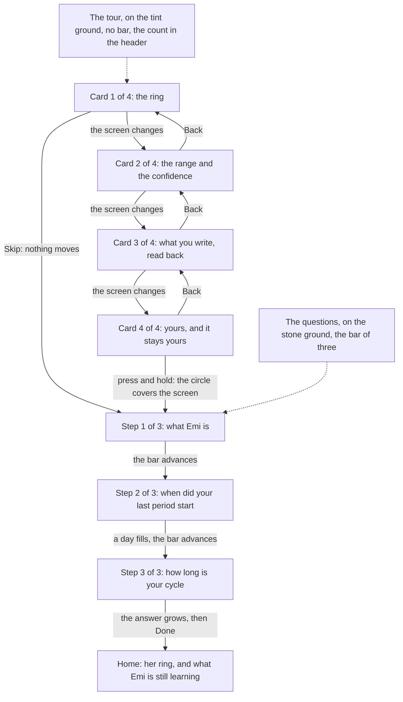
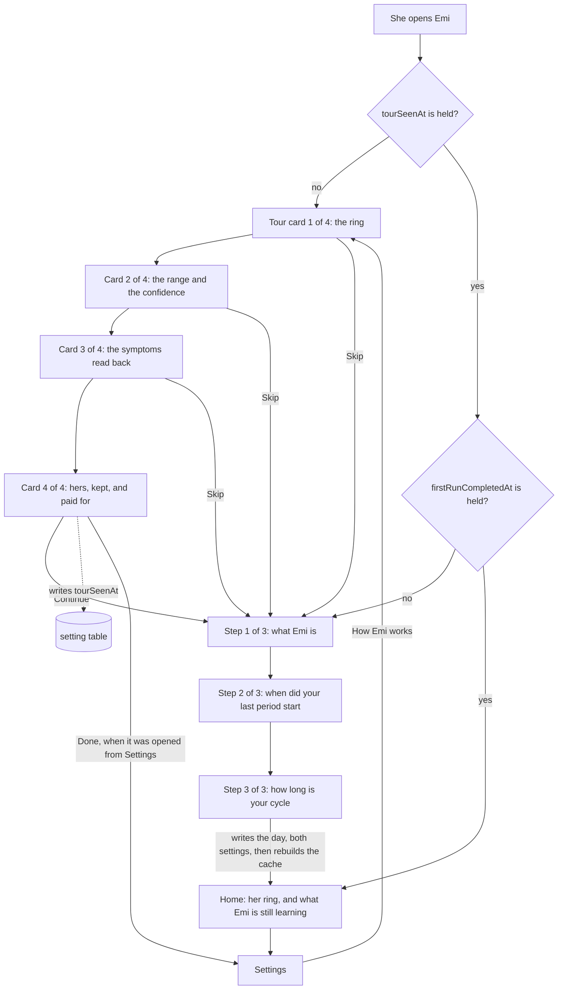

# Design: the tour she sees before Emi asks her anything

A woman opens Emi for the first time. She reads one screen about what Emi is. She says when her
last period started. She says how long her cycle is. Then she is on her home screen, and it says
this.

```
Emi
Nothing to draw yet
The ring needs a period. Log a day you bled and it appears.
Still learning
Emi needs 2 more complete cycles before it forecasts.
Until then Emi counts a cycle of 30 days, the length you gave at the first run.
Log today   History   Export   Settings
```

Those are the strings the application renders today. I read them out of the rendered tree under the
test runner, not off a simulator. The section on what is built today says how to run it again.

She told Emi the day she bled, thirty seconds earlier. The screen asks her for it again.

Nothing before that moment tells her what she gets for answering. The operator drove the
application in the simulator and said the product is unusable at the beginning, because a new woman
cannot see what Emi offers. This document designs the tour that shows her, and it repairs the screen
she lands on afterwards.

## How to read this document

Status: designed

Every section carries one status line, the same as `architecture.md`, `accounts.md` and
`privacy.md`. `Status: built` means the code is in this repository now. `Status: designed` means
this document describes it and nobody wrote it yet.

One section says built. It reports what the repository holds on 2026-09-19. Everything else is a
proposal.

This document builds no screen. The pull request that carries it changes no product code.

## The decision this design starts from

Status: designed

The operator settled the order, and it is not open. The tour comes before the two questions of the
first run. She can skip it.

This document designs that order. It proposes no other one.

## What is built today

Status: built

The first run is three screens, and contract SCREEN-1 holds it to three. They are
`apps/mobile/src/features/onboarding/WhatEmiIs.tsx`, `LastPeriod.tsx` and `CycleLength.tsx`. Their
words are in `copy.ts` beside them. The frame they share is `OnboardingScreen.tsx`, which draws the
mark, the words `Step 1 of 3`, a progress bar of one segment for each screen, the question, and one
button at the bottom.

`completeFirstRun` in `firstRun.ts` writes her answers. One transaction holds three writes: the day
she named, into `day_log`, with a flow of `medium`; `cycleLengthDays` into `setting`; and
`firstRunCompletedAt` into `setting`.

It does not rebuild the cycle cache. It calls `insertDayLog` directly, and the one function that
rebuilds the cache is `rebuildCycles`, which nothing on that path calls.

So the `cycle` table is empty when she reaches her home screen. `ringInputFor` returns nothing when
that table is empty, and `HomeScreen` then draws `homeCopy.noRing` in place of the ring.

I measured this rather than reading it. I drove the three screens through the router in a test,
answered them, and read back the database and the rendered tree.

```
pathname=/ cycles=0 days=[{"day":"2026-05-09"}]
noRing=true ring=false learning=true
```

One row in `day_log`. Nothing in `cycle`. No ring on the screen.

Then, in the same test, I called `rebuildCycles` once over the same database and looked at the home
screen again.

```
rebuilt=[{"startedOn":"2026-05-09","endedOn":null,"lengthDays":null,"periodLengthDays":null}]
noRing=false ring=true
```

The ring appeared. It read day 6, Follicular. The one day she gave is enough to draw her ring, and
the first run throws it away.

To reproduce both readings, write a test under `apps/mobile/tests/`, drive
`/onboarding/welcome` with `renderRouter`, press through the three screens, and read
`screen.queryByTestId('home-no-ring')`. I deleted my copy of that test before committing this
document, because step 2 of the path ships the real one.

## What the tour says, and where each promise comes from

Status: designed

`docs/features.md` names eight features. The tour draws from six promises inside them, and it
invents nothing. Every card below names the feature it comes from.

The six promises are the ring and the cycle day, the forecast as a range with a confidence, the
symptoms read back over six cycles, her data that nobody else can read, her history surviving a new
phone, and the price with what it buys.

There are four cards, not six and not eight.

Four, because a card she does not read is worth nothing, and the fifth card is where a person starts
pressing skip. Three of the four carry one promise each. The fourth carries three promises, because
they are one argument: nobody can read her data, it still reaches her next phone, and she pays money
so that neither of those has to be traded away.

Feature 1 is the brand and feature 8 is the documents. Neither is a promise to a woman opening the
application, so neither gets a card.

## The exact words of every card

Status: designed

The copy follows the rule the first run already follows, which is written at the top of
`apps/mobile/src/features/onboarding/copy.ts`. Say what happens. Never congratulate. No exclamation
mark. Write the number.

The words go in `tourCopy`, in the same file, so a test reads them without rendering a screen.

### Card 1 of 4, from feature 2

Title: Your cycle, in one ring.

Line: The ring is your cycle. A bead marks today, and the number inside it is the day you are on.

Line: Four arcs divide the ring: the days you bleed, the days after them, the days around
ovulation, and the days before your next period.

Action: Next.

### Card 2 of 4, from feature 3

Title: A range, and how sure Emi is.

Line: Emi says your next period falls between two days. It never names one day, because a day it
names is a day it can get wrong.

Line: Beside the range it writes high, medium or low confidence, and how many of your own cycles it
counted.

Line: Emi needs 2 complete cycles before it forecasts. Until then it says it is still learning, and
counts by the cycle length you give it.

Line: This is arithmetic on your own records. Emi is not a contraceptive. Emi is not a medical
device.

Action: Next.

The last line is one string and not two, and it opens with a sentence of its own. The wording gate
in `tools/pipeline/forbiddenClaims.ts` accepts a denial only where a full stop comes before it, so a
denial written as a string of its own is read as a claim and fails the build. The line in
`copy.ts` today carries the same shape, for the same reason.

The denial sits on this card rather than on the last one, because this is the card that makes a
claim about a forecast. The welcome screen of the first run keeps its own copy of the two sentences.
She reads them twice, four cards apart, and that is the correct number of times.

### Card 3 of 4, from feature 4

Title: What you write, read back to you.

Line: Log flow, mood, energy, temperature, weight and more than 70 symptoms, in one sheet.

Line: After six cycles Emi names the symptoms that came back at the same point in 3 of them or
more. A symptom you logged once is not a pattern, and Emi does not call it one.

Action: Next.

### Card 4 of 4, from features 5, 6 and 7

Title: Yours, and it stays yours.

Line: Every day you log is encrypted on this phone, with a key that never leaves it. The server
holds the result and cannot read one day of it.

Line: A recovery code you keep brings your history to a new phone. Nobody at Emi can open your
history, so nobody at Emi can hand it to anybody.

Line: One month free, then 29.99 pounds a year. There is no free version, because a free version is
paid for with your data.

Action: Continue.

The month and the price are the words `docs/contracts.md` uses for contract PAY-1 today. The
operator has not fixed the trial length. If that number moves, this line moves with it, and nothing
else in the tour changes.

### What the cards may not say

Status: designed

No card claims a single day of anything. No card names a certainty Emi does not hold. No card
carries a badge, and no card names a standard, because no auditor has read Emi.

The four words contract SCREEN-2 keeps under 14 points on the home screen are period, bleeding,
fertile and ovulation. The tour is free to write them at body size, which is 16 points, exactly as
`When did your last period start?` writes one at 26 points today. SCREEN-2 guards the screen she
opens in public every day. The tour is seen once, before anything about her is recorded, and it
carries no fact about her body at all.

## The frame the four cards share

Status: designed

One screen, four card bodies, in the shape `OnboardingScreen.tsx` already uses.

The header carries the mark, the words `1 of 4`, and the skip control at the right edge. It does not
say `Step`, so the tour is never read as a fourth step of a first run that SCREEN-1 holds to three.

The tour carries no progress bar. It asks her for nothing, and the rule for when a bar shows is in
the section on how it looks and how it moves. The count in the header says how far through she is.

The footer carries the action button. On cards 2, 3 and 4 a `Back` control sits under it, in the
shape the delete screen uses, so she can read a card again. Card 1 has no `Back`, because on a first
launch there is nothing behind the tour.

The four cards live in one route and not four. The cards ask her nothing, so there is nothing to
lose by moving between them, and one route keeps the skip control in one place.

The section on how it looks and how it moves carries the ground this frame is drawn on, the shape of
its empty space, the safe area, and every movement between one card and the next.

## The skip

Status: designed

The control sits in the header of every card, at the right edge, and it is at least 44 points on
both axes, which is contract SEE-3.

On the first run it says `Skip`. Pressing it writes the setting named under the data model, and goes to
`/onboarding/welcome`, which is the first of the two questions.

Skipping never reaches the home screen. The two answers are what the product needs to draw anything
at all, so nothing in the tour may step over them.

Opened from Settings, the same control says `Close` and returns to `/settings`. Those are two
different acts. Skipping refuses something she was offered. Closing leaves something she asked for.

## The field level data model

Status: designed

One row in the `setting` table, which migration 3 created and which holds a `key` and a `value`,
both text, both refused when empty. No migration is needed. The table takes a new key without a
schema change.

Key: `tourSeenAt`. It joins the `SettingKey` union and the `settingKeys` list in
`apps/mobile/src/data/settingRepository.ts`.

Value: the instant she left the tour, as an ISO 8601 string, which is the form `firstRunCompletedAt`
already carries.

Written by a new `markTourSeen(db, now)` in `apps/mobile/src/features/onboarding/tour.ts`, called on
the action of card 4 and on the skip. It writes only when no value is held, so the instant stays the
first time she saw the tour. Opening the tour from Settings therefore writes nothing at all.

Read by `tourIsSeen(db): boolean` in the same module, which mirrors `firstRunIsDone`.

One key and not two. A second key saying whether she skipped is a fact about her that nothing reads,
and a fact nothing reads is a fact Emi should not keep.

It never leaves the phone. `settingRepository.ts` says the table is local only, and the sync of
feature 6 finds its tables by reading the schema for a `revision` and a `synced_revision` column.
The `setting` table has neither, so the sync cannot see this row.

### What happens when she deletes everything

Status: designed

The row goes, and no code in the delete path changes.

`emptyTheDatabase` in `apps/mobile/src/services/vault/wipe.ts` reads every table out of
`sqlite_master` and empties it. The comment above it says why the list is read and never written
down. `setting` is in that list, so `tourSeenAt` and `firstRunCompletedAt` go together.

She then presses `Start again` on the deleted screen. That calls `reread()` on the first run
provider and replaces the route with `/`. So `reread()` must re-read the tour marker as well as the
first run marker. If it does not, she is sent straight back to the two questions with nothing
telling her why, which is the state this whole design exists to remove. The rules a test can fail
carry it.

### Whether a reinstall shows the tour again

Status: designed

It does, and that is the intended answer.

The value lives in the SQLite file in the application's own storage, and the platform removes that
file with the application. `firstRunCompletedAt` lives in the same file, so a reinstall asks her the
two questions again.

The tour is the answer to those questions being asked. A marker that outlived them would leave a
woman being asked her cycle length with nothing to tell her what the answer buys.

There is a place on the phone that does outlive a reinstall, and it is the keychain. Feature 5 step
7 of the path exists to prove the vault key survives one. The tour marker must not go there, for
exactly that reason.

## The way back in, from Settings

Status: designed

The Settings screen holds one row today, which is `Delete everything`. It gains one more.

Row label: How Emi works.

It sits above `Delete everything`, because a row that destroys everything stays last.

Pressing it opens card 1 of 4. The skip control reads `Close` and the action on card 4 reads `Done`.
Both return to `/settings`. Nothing on that path touches the first run, and nothing on it writes to
the database.

## The home screen before her first complete cycle

Status: designed

Two things are wrong with the screen she lands on, and they are separate.

### The ring is absent, and her own answer can draw it

The section on what is built today measured both halves of this. The first run writes her day and leaves the cycle cache
empty. One rebuild over the same database draws her ring at day 6.

So `completeFirstRun` finishes by calling `rebuildCycles`, after the commit and not inside it.
`replaceCycles` opens a transaction of its own, and SQLite refuses a transaction inside a
transaction, so a rebuild inside the existing `BEGIN` raises and rolls her answers back.

A rebuild that fails after the commit leaves her answers written and the cache empty, which is the
screen she gets today. The cache is a cache, so the next write repairs it. To close it completely,
the home route rebuilds when the `cycle` table is empty and `day_log` holds a bleeding day.

This changes no contract. SCREEN-2 already says the home screen shows the ring, the cycle day, the
phase name and the forecast range. The change makes that true 30 seconds earlier than it is true
today.

### The words under the ring do not say what is coming

`Still learning` and the two lines under it are correct and they are not enough. They say what Emi
cannot do yet. They do not say what arrives, or when, or what it will look like.

The learning block gains one line, and the two it has keep their words.

Line: Still learning.

Line: Emi needs 2 more complete cycles before it forecasts.

Line: Until then Emi counts a cycle of 30 days, the length you gave at the first run.

Line: When 2 cycles are complete, Emi shows the days your next period is likely to fall between,
and how sure it is.

The first three are the strings `cyclesWantedSentence` and `statedLengthSentence` produce today. The
fourth is new. It is the promise of card 2 of the tour, said again at the moment it is being waited
for.

The count in the new line is `learning.needsCycles`, read from the same value the second line reads,
so the two sentences can never name different numbers.

### The words when there is genuinely nothing to draw

`Nothing to draw yet. The ring needs a period. Log a day you bled and it appears.` stays, and it
stops being the screen she meets after the first run. After this design it is reached one way only,
which is a woman who deleted every bleeding day she had.

## How it looks, and how it moves

Status: designed

Two sets of measurements decide this section. The first is Emi's own rendered screens in
`brand/screens`. The second is 85 captured screens of another product's onboarding. The other
product is not named here, and no screen of it is reproduced.

The palette, the type scale, the spacing steps and the radii are not restated here. They are in
`docs/brand.md`, generated from `packages/tokens`, and contract TOKEN-1 keeps the palette closed.
This design writes no colour value. Where it needs a colour it names the token.

### What the measurements say

Status: designed

Emi is not cramped, and Emi does not show too much. Emi is quiet on 68.6 per cent of its rows,
against 71.8 per cent for the other walk. Emi shows 4.2 separate blocks on a screen, against 7.2.
Emi already puts less in front of her.

The difference is the shape of the empty space, not the amount of it. The other walk banks its
emptiness into one void: its largest single gap averages 33 per cent of the screen height. Emi
spreads the same emptiness thinly between every element, and its largest single gap averages 14.8
per cent. So the other walk reads as one block of content, then a void, then one action at the
bottom. Emi reads as an evenly spaced list, which is the shape of a form.

Emi has one ground. I counted `backgroundColor: colour.stone` in `apps/mobile/src` and found it in
eleven places. The other walk used five distinct grounds across an eighteen screen sample, and it
changes the ground when the subject changes, so a person can feel which part of the walk she is in.

Emi has almost no movement. `react-native-reanimated` at 4.5.1 is declared in
`apps/mobile/package.json` and no file in this repository imports it. Every animation line in the
application, ten of them, sits in `src/components/CycleRing.tsx`, and that file uses React Native's
own `Animated` rather than the declared library. The ring fades and scales open on the home screen.
Every other screen appears with no movement at all.

I read the last two of those in the repository at the commit this branch started from. The first
three were measured for me and I did not see the captures.

### The rule for empty space

Status: designed

A reviewer can apply this rule by looking at one screen.

1. One primary action on a screen, and one only. It is pinned above the bottom safe area inset. It
   is never a row in the middle of a list and it never scrolls.
2. The content starts at the top of the sheet and stops where it stops. It does not stretch to fill
   the height.
3. Everything left over collects in one gap, between the last line of content and the top of the
   action. That gap is the screen's void, and it is the largest gap on the screen by a wide margin.
4. The void is at least 25 per cent of the screen height. The measurement above is where that
   number came from: the other walk averages 33 per cent and Emi averages 14.8, and 25 is the point
   where the shape changes from a list into a statement without Emi copying a screen it did not
   design.
5. No other gap on the screen is larger than `space.roomy`.
6. A card that cannot hold a void of 25 per cent has too many words in it. The fix is fewer words,
   never less space.

What this changes in the code. `OnboardingScreen.tsx` today gives its scroll body
`justifyContent: 'space-between'` and gives the block she answers in `flexGrow: 1` with
`justifyContent: 'center'`. Those two lines are what spreads the emptiness evenly, and they are the
measured 14.8 per cent. The content stacks from the top instead, and the leftover height collects
above the pinned footer.

### The rule for backgrounds

Status: designed

The design system already holds more than one ground. Six colours carry the `ground` role in
`packages/tokens`, and `docs/brand.md` prints each one. The application uses one of them. So this
work adds no colour. It assigns the grounds the system already holds to the parts of the walk.

- The tour is drawn on `colour.emberTint`. That ground says Emi is talking.
- The three questions are drawn on `colour.stone`. That ground says she is answering, and it is the
  ground the rest of the product uses.
- The sheet over either ground is `colour.surface`, on every screen of both parts.

One boundary, once. The ground changes when the tour ends and the questions begin, and the circle
of movement 5 covers the screen at exactly that moment, so the change is never seen as a flash.

Two consequences follow from the palette, and both are rules a test can fail.

The count in the header cannot stay `colour.muted` on the tour. Muted reaches 4.36 against
`emberTint`, and the contrast floor is 4.5, so the palette refuses that pair. On the tour the count
takes `colour.body`, which reaches 6.22. I measured both with `contrastRatio` from the token
package.

Every drawing in `brand/illustration` paints its own ground as the first element of the file. I read
`welcome.svg` and the rect is there, filled with the stone value. So a drawing placed on the tint
would show a stone rectangle around itself. `pieces.ts` holds `GROUND` as one constant for every
piece, and it becomes a property of a piece instead. The four tour pieces are generated on the tint.
The three pieces that exist keep stone, so their committed files and pictures do not change by one
character.

### The screen frame

Status: designed

One frame, from the top of the glass to the bottom, on every card of the tour and on every screen of
the first run. Only the ground under it changes between the two parts.

1. The safe area inset at the top.
2. The header: the mark at the left, the count beside it, and the skip control at the right edge.
3. The progress bar, full width inside `space.base`, on the three questions only.
4. The band, on the ground of that part of the walk, holding the drawing.
5. The sheet, filled `colour.surface`, rounded at `radius.sheet` on its top two corners only, and
   running to the bottom of the screen. It holds the title, the lines, and anything she presses.
6. The void, inside the sheet, which is the rule for empty space above.
7. The footer, inside the sheet: the action, and `Back` under it from card 2.
8. The safe area inset at the bottom.

The drawing stands in the band and the sheet starts under it, so the drawing reads as standing
behind the words rather than sitting inside them.

The inset is added to the padding and never replaces it. The header's top padding is `space.roomy`
plus whatever the phone reports at the top. The footer's bottom padding is `space.base` plus
whatever it reports at the bottom. No inset value is written in this document or in the code, for
two reasons: the number is the phone's, and a fix for the inset is in flight on another branch. On a
phone that reports zero the screen draws what it draws today.

### Which library builds the movement

Status: designed

Every movement below is built on `react-native-reanimated`, and none on React Native's `Animated`.

Three reasons, in order of weight. The library is already a declared dependency, so the application
already carries its cost and uses none of it. It animates a layout change, which is what movement 3
needs, and `Animated` cannot animate the height of a row and push the rows under it down. It runs
the movement off the JavaScript thread, so a movement does not stutter while the first run writes
to the database, which is the one moment in the onboarding where both happen at once.

It also exports `useReducedMotion`, which answers the reduced motion rule in one hook rather than in
an effect for each screen. I read that export in `node_modules/react-native-reanimated/src/index.ts`
at 4.5.1.

`CycleRing.tsx` is left alone. It is built, it is proved by a test, and contract SEE-4 holds it. One
file on the other library is a smaller cost than a rewrite that this work does not need, and moving
it across is named in what this design does not answer.

### The movement catalogue

Status: designed

Nine movements. Each one says what starts it, what moves, how far, what she is left looking at, and
what happens when reduced motion is on.

**1. The screen changes, going forward.** She presses the action. The content inside the sheet
leaves to the left by a third of the screen width while it fades out, and the content of the next
screen arrives from a third of the screen width to the right while it fades in. The header, the
ground and the drawing band hold still. She is left looking at the next screen with its action
already in place. Reduced motion: the content is replaced, with no movement and no fade.

**2. The screen changes, going back.** She presses `Back`. The same movement runs with the two
directions swapped, so the walk has a direction she can feel. She is left looking at the screen she
read before. Reduced motion: the content is replaced.

**3. The progress bar advances.** The screen changes. The segment for the screen she is arriving at
fills from its left edge to its full width. Nothing else on the bar moves, and the bar never runs
backwards, so going back leaves the filled segments filled. She is left looking at a bar one segment
further along. Reduced motion: the segment is filled with no movement.

**4. A chosen answer fills and grows.** She presses an answer on a question that offers a short list
of them. The row fills from `colour.sunk` to `colour.ember`, its label turns to `colour.surface`,
and the row grows downward by the height of one sentence at the small size plus `space.snug`. The
rows below it move down by exactly that distance. Nothing navigates. She is left looking at the same
question, with her own answer explained inside it. Reduced motion: the row changes colour and the
sentence appears at its full height, with no growth and no push.

Neither question asks for a short list today. The last period question is a calendar and the cycle
length question is a number she steps. So the cycle length screen takes this movement in its own
shape: the card under the stepper grows in place to hold one more sentence, naming what the length
she just set means for her first forecast. The stack of rows is specified here so the first question
that does offer a short list draws it the same way.

**5. A press and hold grows a shape until it covers the screen.** She presses and holds the action
on the last card of the tour, which says so in its label. A circle of `colour.ember` grows out of
the control, from the radius of the control to a radius that reaches the furthest corner of the
screen, and the ring mark is held in the centre at a constant size while it grows. She is left
looking at the first question, drawn under the circle as it clears. Releasing before it completes
abandons it: the circle shrinks back into the control and nothing else happens. Reduced motion: no
circle, and a single press begins the questions at once.

The hold can never trap anybody. `Skip` sits in the header of the same card and reaches the same
first question with a single press. The control also declares an accessibility action, so an
assistive technology completes it without a hold.

**6. The primary action arrives, and answers a press.** The screen changes. The action fades in and
rises 8 points into its pinned place, a little after the content, so the eye reads the words before
it finds the button. While she holds it down it scales to 0.97 and returns when she lifts. She is
left looking at a control that answered her. Reduced motion: the action is drawn in place, and the
press is answered by the pressed fill alone, which is `colour.emberPressed`.

**7. The drawing arrives.** A screen opens. The drawing fades in and rises 12 points in the band
above the sheet. It moves once, on arrival, and never again while she is on that screen. She is left
looking at a drawing that settled rather than one that appeared. Reduced motion: the drawing is
drawn in place.

**8. A wait that advances.** A computation starts that takes long enough to see. An indicator
advances while it runs. It never sits still, and it never restarts from empty once it has advanced,
because an indicator that goes backwards reads as work that failed. She is left looking at the
result of the computation, never at the indicator. Reduced motion: the indicator does not spin or
travel; it redraws in steps as the work reports progress.

No screen of the tour and no screen of the first run draws this. Nothing there takes long enough:
the end of the first run is one transaction of three writes and one cache rebuild over a single day.
There is one genuine computation in the product, and it is the recovery code. `deriveRecoveryKey` in
`packages/crypto/src/recovery.ts` runs Argon2id over 19,456 kibibytes for two passes. The comment
above the parameters records about 106 milliseconds on the machine they were written on, and says a
phone is slower. Contract VAULT-2 puts a ceiling on that unlock and feature 6 step 8 measures it on
the slowest phone available. `RecoveryFlow.tsx` is built and no route renders it yet, so this
movement is specified here and drawn when that flow is routed.

**9. The ring arrives.** She answers the last question and the home screen opens. The ring fades up
from 0.94 of its size. She is left looking at her own ring, on the day of her cycle she is on.
Reduced motion: the ring arrives already open. This one movement is built, it is `useOpeningMotion`
in `CycleRing.tsx`, and contract SEE-4 already holds it.

Three things in the onboarding move nothing, and they are named so nobody looks for them. `Skip` and
`Close` leave the tour. `How Emi works` in Settings opens it. Each is a route change and carries no
movement of its own.

### The timings and the curves

Status: designed

Every duration and every curve below is chosen and not measured. A still photograph carries no
timing, so nothing in this list was observed. What would prove any of them is a recording of the
built screen, watched by a person. No test reads a duration and concludes that a screen feels right.

- The screen changing, forward or back: 300 milliseconds, ease in and ease out. That is the duration
  React Native ships for `LayoutAnimation.Presets.easeInEaseOut`, which I read in
  `node_modules/react-native/Libraries/LayoutAnimation/LayoutAnimation.js`, so it is the platform's
  own number rather than an invented one.
- The bar advancing: 300 milliseconds, ease in and ease out, so the bar and the screen arrive
  together rather than one after the other.
- An answer filling and growing: 300 milliseconds, ease in and ease out. It is the same kind of move
  as a screen changing, and two speeds for one kind of move read as two systems.
- The action arriving: 250 milliseconds, ease out, beginning 100 milliseconds after the content.
- The action answering a press: 100 milliseconds, ease out, both ways.
- The hold completing: 700 milliseconds. Long enough that a brush of the thumb does not complete it,
  short enough that she does not wonder whether it is working. Abandoning it: 200 milliseconds.
- The drawing arriving: 400 milliseconds, ease out.
- The wait indicator: one turn every 1,200 milliseconds while it has no progress to report.
- The ring arriving: 600 milliseconds, which is `RING_OPEN_MILLISECONDS` and is already in
  `packages/tokens`.

These live in `packages/tokens` as named durations beside `RING_OPEN_MILLISECONDS`, so that no
screen writes a number of its own, and one named easing travels with them. Adding a token means
regenerating `docs/brand.md` in the same change, because `npm run check:brand` compares that
document against the token package and fails on a difference of one character.

### When the progress bar shows

Status: designed

The bar shows on a screen that asks her for something. It does not show on a screen that gives her
something.

- The three screens of the first run carry the bar, and the words `Step 1 of 3`. They ask.
- The four cards of the tour carry no bar. They give. The header carries the words `1 of 4`, which
  is enough to say how far through she is without borrowing the shape of a question.
- No other screen in the product carries one.
- A bar counts one set and never joins another. There is one set, and it is the three questions.
- A bar never runs backwards, and it is full on the last screen of its set.

The other walk carries a bar on 28 of its 85 screens, and never on the screens that give something
back between the questions. Read in order, that bar climbs from 18 per cent to 75 per cent and never
falls. Emi states the same rule by what a screen does rather than by counting screens, and Emi's bar
reaches full, because Emi's one counted set is complete.

### What Emi does not copy

Status: designed

Four things, each with the reason.

1. Social proof. Emi has no ratings to show, no count of women tracking with it, and no panel of
   experts to name. A screen carrying any of those would make a claim the product cannot support,
   and the wording gate in `tools/pipeline/forbiddenClaims.ts` would refuse most of that copy before
   a reviewer read it.
2. A tracking consent. Emi asks for none, because nothing leaves the phone. Contract KEEP-4 holds
   the dependency list to no analytics, no advertising identifier and no crash reporter that ships
   her content, so there is nothing to consent to.
3. A wait Emi is not performing. Movement 8 names where the rule bites.
4. The length. 85 screens is not a target. Emi's onboarding is four cards and three questions, and
   the count of cards is argued where the cards are named.

### The walk

Status: designed



## The flow

Status: designed



## The rules a test can fail

Status: designed

1. A first launch with an empty database shows card 1 of the tour, and not the welcome screen.
2. The four cards carry the four titles and every line of the card words, read from `tourCopy` and read
   again off the rendered screen.
3. No card of the tour, and no screen of the first run, carries any wording on the forbidden list
   of `tools/pipeline/forbiddenClaims.ts`, beyond the two approved denials.
4. The skip control on every card writes `tourSeenAt` and leaves her on `/onboarding/welcome`.
5. Skipping from any card never reaches `/`.
6. The action on card 4 writes `tourSeenAt` and leaves her on `/onboarding/welcome`.
7. A launch after the tour was seen shows the welcome screen and never a card.
8. A launch after the tour was seen and the first run was answered shows the home screen.
9. `markTourSeen` called twice leaves the first instant in the row.
10. The first run still asks for no account, no email address and no password, and SCREEN-1 still
    counts three screens. The existing cases of `2.3.test.tsx` stay green with no edit.
11. Every control of the tour is at least 44 points on both axes.
12. `Delete everything` empties the `setting` table, and the launch after it shows card 1 again.
13. `Start again` on the deleted screen shows card 1 again, in the same session, with no relaunch.
14. After the two questions the home screen draws the ring, on the cycle day counted from the day
    she named, and `home-no-ring` is absent.
15. The learning block names the number of cycles wanted and what arrives when they are complete,
    and the two numbers in it are equal.
16. The learning block still shows no confidence, which is contract CYCLE-3.
17. The `setting` table is absent from the tables the sync may send.
18. The Settings screen carries `How Emi works` above `Delete everything`, and pressing it shows
    card 1.
19. The tour opened from Settings returns to `/settings` from the skip control and from the action
    on card 4.
20. The tour opened from Settings writes nothing to the database.
21. No file under `apps/mobile/src` and none under `brand/` carries a hex colour. The lint rule of
    contract TOKEN-1 already refuses one, and the tour adds no exception.
22. Every colour, radius, space and type size the tour draws with is read from `@emi/tokens`.
23. Every duration and every easing the onboarding uses is read from `packages/tokens`, and
    `docs/brand.md` is regenerated, so `npm run check:brand` passes. No duration is written in a
    screen.
24. The four drawings exist in `brand/illustration`, each with a picture beside it, and none of
    their names carries a refused word. The three drawings that exist today are unchanged, byte for
    byte, and so are their pictures.
25. The header padding is the token plus the reported top inset, and the footer padding is the
    token plus the reported bottom inset. A case reports an inset of 0 and one above 0, and reads
    the padding both times. No inset number appears in the source.
26. Every movement carries its still form when reduced motion is on, and every one of them is
    driven by `react-native-reanimated`. No file of the onboarding imports `Animated` from React
    Native.
27. The tour carries no progress bar. The three questions carry one of three segments.
28. The bar never runs backwards, and it is full on the last question.
29. No screen of the tour and no screen of the first run says it is working.
30. The largest gap on an onboarding screen is the one above the action, and it is at least a
    quarter of the screen height. A case measures every gap on each of the seven screens.
31. The tour is drawn on `colour.emberTint` and the three questions on `colour.stone`. The count in
    the header is `colour.body` on the tour, because the palette refuses `colour.muted` on that
    ground.
32. Releasing the hold before it completes begins nothing, and the skip control reaches the first
    question with one press.

## The contract this needs

Status: designed

`SCREEN-5`, the tour. Verified by a test, and by the operator, who looks at the rendered cards.

Output: four cards before the first question, each naming one promise the feature map already makes,
skippable from any card, seen once and reachable again from Settings.

Errors: a card that names a promise no feature builds. A skip that reaches the home screen. A tour
shown twice without her asking for it. A card counted among the three screens of SCREEN-1. A
movement that keeps moving while the operating system asks for reduced motion. A screen that says
it is working while nothing is working. A hold with no way past it for a person who cannot hold. A
progress bar on a screen that asks her for nothing.

Declaring it means one edit to `docs/contracts.md` and one to `docs/features.md`, in the same
change, because `npm run check:documents` fails on a contract that one document names and the other
does not. Step 1 of the path carries both.

No other contract changes. SCREEN-1 keeps its three screens. SCREEN-2 and CYCLE-3 keep their words.

## The path

Status: designed

Four steps. Each one is one intention and one pull request, and each reverts on its own.

The fourth step arrived with the feel and motion work. The three screens of the first run are built,
and the frame described above changes them, so that change is its own pull request rather than a
passenger on the tour.

Each step ships its behaviour test in the repository shape, in
`apps/mobile/tests/integration/<feature>.<step>.test.tsx`. The outer describe is the scenario line of
that step, written out in full.

These steps continue feature 2, which is the feature the first run belongs to, so the files are
`2.8`, `2.9`, `2.10` and `2.11`. If the operator gives the tour a feature of its own, the four file
names take that number and nothing else changes.

### 1. The tour, four cards, before the first question

Depends on: nothing.

Files: `apps/mobile/src/features/onboarding/copy.ts` for `tourCopy`,
`apps/mobile/src/features/onboarding/tour.ts` for `markTourSeen` and `tourIsSeen`,
`apps/mobile/src/features/onboarding/TourScreen.tsx`,
`apps/mobile/src/app/onboarding/tour.tsx`, `apps/mobile/src/app/(tabs)/index.tsx` for the redirect,
`apps/mobile/src/features/onboarding/FirstRunProvider.tsx` for the marker and for `reread`,
`apps/mobile/src/data/settingRepository.ts` for the key, `packages/tokens` for the named durations
and the easing, `brand/illustration/pieces.ts` for the ground of a piece and the four drawings,
`docs/brand.md` regenerated, `docs/contracts.md` and `docs/features.md` for SCREEN-5, and
`apps/mobile/tests/integration/2.8.test.tsx`.

Behaviour: a first launch shows four cards on the tint ground, each with its drawing, each with its
void above the pinned action, and none with a progress bar. She moves through them, or she skips
from any of them. Either way `tourSeenAt` is written and she lands on the first question. A second
launch goes straight to the first question.

Proof: rules 1 to 13, 17, and 21 to 32 of the rules a test can fail. The two questions are answered
in the same test, so the case ends on her home screen and not on a route name.

Mutation: make `markTourSeen` write nothing, and watch the second launch case go red because it
shows a card. Then make it write on the skip alone, and watch the case that finishes card 4 go red.

The scenario that proves it: she sees what Emi offers before Emi asks her anything.

### 2. The home screen before her first complete cycle

Depends on: nothing. It can ship before step 1 or after it.

Files: `apps/mobile/src/features/onboarding/firstRun.ts` for the rebuild after the commit,
`apps/mobile/src/app/(tabs)/index.tsx` for the repair when the cache is empty,
`apps/mobile/src/features/forecast/copy.ts` for the new sentence,
`apps/mobile/src/features/forecast/Learning.tsx`, and
`apps/mobile/tests/integration/2.9.test.tsx`.

Behaviour: the two questions end with her ring drawn, on the cycle day counted from the day she
named. The learning block says what arrives and how many cycles it waits for.

Proof: rules 14, 15 and 16 of the rules a test can fail. The test drives the three screens and reads the home screen
afterwards, so the assertion sits after the whole round trip and not on the call the first run made.

Mutation: take the rebuild back out of `completeFirstRun` and watch the ring case go red with
`home-no-ring` present. That is the state measured under what is built today, so the red is known in advance.

The scenario that proves it: she answers two questions and her own ring is on the screen.

### 3. The way back in, from Settings

Depends on: step 1.

Files: `apps/mobile/src/features/settings/copy.ts` for the row,
`apps/mobile/src/features/settings/SettingsScreen.tsx`,
`apps/mobile/src/app/(tabs)/settings/index.tsx`, `apps/mobile/src/app/onboarding/tour.tsx` for the return
it takes, and `apps/mobile/tests/integration/2.10.test.tsx`.

Behaviour: Settings carries `How Emi works`. It opens the tour. The skip control says `Close`, the
action on card 4 says `Done`, and both come back to Settings.

Proof: rules 18, 19 and 20 of the rules a test can fail. The test presses the row, reads a card,
presses the way out, and asserts she is on the Settings screen with the delete row under her thumb
again.

Mutation: send the return to `/` instead of `/settings`, and watch the case go red on the screen she
is left with.

The scenario that proves it: she opens the tour again from Settings and comes back where she was.

### 4. The frame and the movements of the three first run screens

Depends on: step 1, which builds the frame and the tokens the tour draws with.

Files: `apps/mobile/src/features/onboarding/OnboardingScreen.tsx` for the band and the sheet,
`apps/mobile/src/features/onboarding/LastPeriod.tsx` for the day that fills,
`apps/mobile/src/features/onboarding/CycleLength.tsx` for the card that grows,
`apps/mobile/src/features/onboarding/copy.ts` for the sentence that card reveals, and
`apps/mobile/tests/integration/2.11.test.tsx`.

Behaviour: the three screens of the first run keep the stone ground and take the rest of the frame
from the tour: the void above the pinned action, the drawing in the band, and the bar of three. A
day she presses on the calendar fills. The card under the cycle length stepper grows in place to say
what the length she set means for her first forecast.

Proof: rules 21, 22, 25, 26, 27, 28, 30 and 31 of the rules a test can fail, read against the three
screens rather than the four cards. The test walks the whole first run and ends on the home screen.

Mutation: return true from the reduced motion reader and watch the case that asserts the card grew
go red, then watch it pass again with the reader restored.

The scenario that proves it: the questions look like the cards she just read.

## How sure I am

Status: designed

The plan overall: 85 percent.

The data model and the delete: 95 percent. The key joins a table that exists, the delete reads its
tables out of the schema, and I read both.

The home screen repair: 90 percent. I measured the empty cache and I measured the ring that one
rebuild produces. The 10 percent is the transaction shape. I did not run a rebuild inside the first
run's own `BEGIN` to watch SQLite refuse it.

The four cards and their words: 80 percent. Nobody has looked at them rendered. The number of cards
is a judgement and not a measurement.

The way back in from Settings: 90 percent. It is one row and one return value.

The frame and the grounds: 90 percent. Every ground is a token the palette already holds, and I
measured the two contrast ratios that decide the colour of the count rather than assuming them. The
10 percent is the safe area, which I wrote as a relationship because the fix for it is on another
branch I did not read.

The rule for empty space: 75 percent. The rule is clear and a reviewer can apply it. The number in
it, a quarter of the screen height, is a judgement between two measurements and not a measurement of
its own.

The choice of library: 85 percent. The three reasons are read off the repository. I have not built a
layout movement on it here, so I have not seen it work in this application.

The movements: 60 percent, and that is the lowest number in this document. The shapes come from
still photographs. Every duration and every curve is chosen. Only a recording of the built screen,
watched by a person, moves this number.

## What I did not verify

Status: designed

I ran nothing on a phone. Every reading under what is built today comes from the test runner on this
machine.

I did not render the four cards. The lines of the cards are counted in words, not in points, and a
line that wraps to four rows on a small screen is a thing only a picture shows.

I did not measure how long a woman spends on a tour card, and I found no published figure for it.
The choice of four cards rests on the promises in `docs/features.md` and on nothing measured.

I did not check the two store review guidelines for anything they say about a tour before a first
run.

I did not see the 85 captures. I worked from the measurements handed to me, and I have no way to
check a pixel in them. I did not measure the rendered Emi screens either: the share of quiet rows,
the blocks per screen and the size of the largest gap were all handed to me. The two readings I took
myself are the count of grounds in the application and the state of the animation code, and both say
so where they appear.

I did not build a movement on `react-native-reanimated` in this repository, so I have not seen the
library run here. Nothing imports it yet, which is the whole reason it is named.

I observed no timing at all. A still photograph carries none. Every duration and every curve in the
movements is chosen, and each one says so where it is written.

I did not read the branch that carries the safe area fix. No branch on the remote named for it at
the commit this work started from, which is why this document names a relationship and no number.

I did not draw the four illustration pieces, and I did not run the generator that refuses a drawing
by its name.

## What this design does not answer

Status: designed

The feature number these four steps belong to, which decides the name of every behaviour test file
in the path.

The trial length. Card 4 says one month because contract PAY-1 says one month. The operator has not
fixed it.

Where the paywall of feature 7 sits. It is not built. When it arrives it lands on this path, either
between the tour and the questions or after them, and that is an order only the operator can choose.

Whether the tour gets a rendered picture in `docs/story.md`. Every other screen of feature 2 has
one, and `check:story` reports a missing section without failing the run.

Whether the named durations live beside `RING_OPEN_MILLISECONDS` in `packages/tokens/src/ring.ts`
or in a motion file of their own. Nine of them is past the point where a file of their own earns its
place, and this design does not make that call.

Whether `CycleRing.tsx` is brought across to `react-native-reanimated`. It is the one file on the
other library, it is built and proved, and leaving it there means the product carries two animation
systems. Moving it is its own pull request and it is not one of the four here.

Whether the tour keeps a second drawing style. The four tour pieces are generated on the tint ground
and the three first run pieces on stone, so the set holds two grounds from that point on. Nobody has
looked at the seven together.
