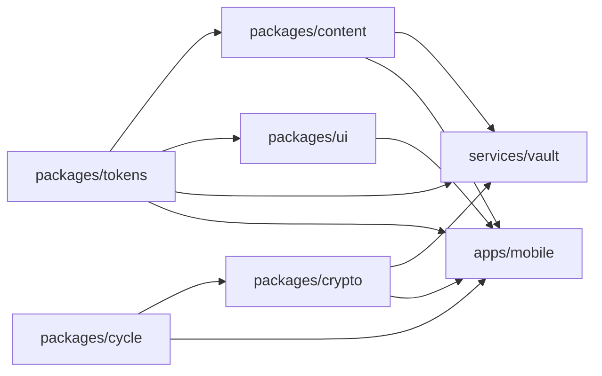

# The code structure review, 2026-09-20

This document reads the repository and changes nothing in it. Every number below was measured on
`main` at `aa95d82` on 2026-09-20. A later commit moves the numbers, so read them as a reading of
that commit and not as a standing fact.

The review answers one question. Does the shape of this repository hold the next screen to the same
standard as the last one? The type discipline and the package graph say yes. The user interface layer
says no, and section four says where.

## What was read

37 tracked markdown files. The eight documents in `docs/` plus the generated pages under
`docs/reference/`.

`docs/architecture.md` carries 21 sections. Each one carries a status line.

Ten pipeline checks guard the documents, the brand page, the reference pages, the features, the
story, the pictures and the wording.

The TypeScript source of `apps/mobile`, `packages`, `services` and `tools`, with the tests beside it.

## The measurements

387 TypeScript files, 58,692 lines. By area:

- `apps/mobile/src`, 9,804 lines in 112 files.
- `packages`, 8,999 lines in 67 files.
- `tools`, 10,598 lines in 46 files.
- `services`, 4,548 lines in 24 files.
- `apps/mobile/tests`, 17,785 lines in 99 files.

### The package graph

The graph has no cycle and no upward edge.

- `tokens` imports nothing.
- `cycle` imports nothing.
- `content` imports `tokens`.
- `ui` imports `tokens`.
- `crypto` imports `cycle`.
- `services/vault` imports `content`, `crypto` and `tokens`.
- `apps/mobile` imports all five packages.

### The screens

51 screen and component files sit under `apps/mobile/src`.

- Seven import `@emi/ui`.
- Zero use a `className`.
- 28 carry their own `StyleSheet.create`, 28 blocks in total.
- 19 write their own `Pressable` from react-native.
- 26 use a raw `Text`. 25 use a raw `View`.

The primary button appears in ten files. Each copy carries `backgroundColor: colour.surfaceTint` on
a rounded box, with the same paddings. The ten files are `ExportScreen`, `HomeScreen`, `LockScreen`,
`DayRefused`, `LogFlow`, `LogSheet`, `LastPeriod`, `OnboardingScreen`, `RecoveryScreen` and
`DeleteEverything`. No Button component exists anywhere in the repository.

`minHeight: MINIMUM_TAP_TARGET` is written out 30 times across 19 files. Six test files measure tap
targets through `apps/mobile/tests/fixtures/tapTargets.ts`.

### The functions

321 top level exported functions. 37 of them run past 30 lines. The longest five are `dynamoStore`
at 249 lines, `LogSheet` at 173, `LastPeriod` at 103, `LockGate` at 84 and `CycleRing` at 79.

14 functions are exported, and no file but their own reaches them. Seven sit in
`services/vault/src/handlers`. Five sit in `packages/tokens/tests/designSystem.test.ts`. One sits in
`packages/crypto/src/record.ts`. One sits in `services/vault/src/store/dynamo.ts`.

`tools/pipeline/documentation.ts` carries 39 exported symbols in one file.
`tools/documentation/generateReference.ts` carries 28.

### The features and the two homes

Thirteen feature directories sit under `apps/mobile/src/features`. The Today route,
`app/(tabs)/index.tsx`, reaches into four of them: cycle, forecast, home and onboarding.

Two homes now hold a shared component. `apps/mobile/src/components` holds `CycleRing`, which 8 files
use, and `Screen`, which 11 files use. `packages/ui` holds the gluestack copies, the icon and the
dock. Nothing says which home takes the next one.

### The comments

Comment density across the source is 17 per cent, 2,796 lines of 16,058. Two files run past half.
`services/vault/src/store/accounts.ts` is 56 per cent comment. `records.ts` is 50 per cent.

### The tests

The mobile tier covers 94.72 per cent of statements, 84.48 per cent of branches and 97.4 per cent of
functions. 1,113 tests run in 62 suites. No source file sits at zero. The lowest is
`app/(tabs)/settings/index.tsx` at 75 per cent of four statements.

### Type discipline

Zero uses of `any` in a code position. Zero `@ts-ignore`. Zero `@ts-expect-error`. Zero
`eslint-disable`. Zero boolean parameters. Zero hexadecimal colours in source.

Every package `index.ts` is re-export only. No other line sits in one.

`eslint.config.mjs` carries one structural rule, `no-restricted-syntax`. It refuses a hexadecimal
colour in source. It refuses a size written without a face.

## The diagram

An arrow points from a package to the package that imports it. The left side is what the right side
depends on. `tokens` and `cycle` are the leaves.

No arrow points the other way. That is the finding. A leaf never reaches back into the thing that
imports it, so a change to `apps/mobile` cannot reach `tokens`, and the graph holds no cycle.

## The findings

Each finding states the principle, the measurement, the failure it lets through, and the files. They
are ranked by the failure, never by the work each one costs.

### One. There is no record of any decision

The principle. A reader must be able to tell a decision from an accident.

The measurement. No file in the repository matches decision, adr or rfc. `docs/architecture.md` has
21 sections. Not one of them is the user interface layer, the component approach or the patterns. The
only text that names gluestack as a choice is `packages/ui/README.md`. It says what gluestack is and
how to add a component. It does not say why the operator chose it, or what else was weighed.

The failure. A question nobody wrote down stays unanswered. The next reader cannot tell which shape
was chosen and which shape simply happened, so they repeat the weighing or they guess. The first
screen landed on 2026-09-17. `packages/ui` did not exist until 2026-09-20, 82 merges later. Nothing
in the repository explains what changed in between.

The files. `docs/architecture.md`, `packages/ui/README.md`.

### Two. The design system is guarded for colour and refused for components

The principle. A rule that only a reviewer enforces is a rule that stops being enforced.

The measurement. A linter rule refuses a hexadecimal colour in source, and there are zero of them.
Nothing refuses a new `StyleSheet.create`, and there are 28. Nothing refuses a raw `Pressable`, and
there are 19.

The failure. The next screen looks like the last 28 rather than like the prototype. The pipeline
stays green while it happens, because the only guarded half of the design system is the colour.

The files. `eslint.config.mjs`, the 28 files that carry a `StyleSheet.create` under
`apps/mobile/src`.

### Three. The primary button is copied into ten files

The principle. Three uses earn an abstraction. This is ten.

The measurement. The primary button appears in ten files and no Button component exists. The tap
target rule, `minHeight: MINIMUM_TAP_TARGET`, is written out 30 times across 19 files. Six test files
measure a tap target.

The failure. A screen that copies the block slightly wrong passes the pipeline, because only six
screens are measured. A woman then presses a control that is too small to press, on a screen the
tests never sized.

The files. `ExportScreen`, `HomeScreen`, `LockScreen`, `DayRefused`, `LogFlow`, `LogSheet`,
`LastPeriod`, `OnboardingScreen`, `RecoveryScreen`, `DeleteEverything`, and
`apps/mobile/tests/fixtures/tapTargets.ts`.

### Four. Two homes hold a shared component and nothing says which

The principle. One kind of thing lives in one place, and a document names the place.

The measurement. `apps/mobile/src/components` holds `CycleRing` and `Screen`. `packages/ui` holds
the gluestack copies, the icon and the dock. No document states the rule.

The failure. The next shared component goes wherever its author looked last. The two sets then drift
apart, and a reader has to search both before writing anything.

The files. `apps/mobile/src/components/CycleRing.tsx`, `apps/mobile/src/components/Screen.tsx`,
`packages/ui/README.md`.

### Five. 37 functions run past the limit the standards set

The principle. The standards set 30 lines. A function nobody can read in one screen is a function
nobody reads before changing it.

The measurement. 37 exported functions run past 30 lines, of 321. Three run past 100: `dynamoStore`
at 249, `LogSheet` at 173 and `LastPeriod` at 103.

The failure. A change lands inside a function the author read half of. The test suite covers the
function as a whole, so a branch nobody read stays covered and nobody notices which branch moved.

The files. `services/vault/src/store/dynamo.ts`, `apps/mobile/src/features/log/LogSheet.tsx`,
`apps/mobile/src/features/onboarding/LastPeriod.tsx`.

### Six. 14 symbols are exported and nothing reaches them

The principle. An export says other code may depend on this. A word that says that falsely costs a
reader time.

The measurement. 14 functions are exported and no file but their own reaches them. Seven sit in
`services/vault/src/handlers`, five in `packages/tokens/tests/designSystem.test.ts`, one in
`packages/crypto/src/record.ts` and one in `services/vault/src/store/dynamo.ts`.

The failure. A reader who asks whether a change is safe searches the whole repository to learn that
the export was decoration. They pay that search every time, and the answer is the same every time.

The files. `services/vault/src/handlers`, `packages/tokens/tests/designSystem.test.ts`,
`packages/crypto/src/record.ts`, `services/vault/src/store/dynamo.ts`.

### Seven. One tooling file holds 39 exports

The principle. A file has one reason to change.

The measurement. `tools/pipeline/documentation.ts` carries 39 exported symbols.
`tools/documentation/generateReference.ts` carries 28.

The failure. One file with 39 reasons to change. Two sessions editing two unrelated checks meet in
the same file, and a reader of the history cannot tell the two changes apart.

The files. `tools/pipeline/documentation.ts`, `tools/documentation/generateReference.ts`.

### Eight. Two vault store files run past half comments

The principle. A comment says something the code cannot. Volume is the damage.

The measurement. `services/vault/src/store/accounts.ts` is 56 per cent comment.
`services/vault/src/store/records.ts` is 50 per cent. The source as a whole is 17 per cent.

The failure. The repository's own standard names it. A reader who learns the comments are noise stops
reading the one comment that matters.

The files. `services/vault/src/store/accounts.ts`, `services/vault/src/store/records.ts`.

## What is already strong

The package graph is acyclic and no edge points upward. A leaf cannot reach the thing that imports
it.

The type discipline is complete. No escape hatch is used anywhere: no `any` in a code position, no
`@ts-ignore`, no `@ts-expect-error`, no `eslint-disable`.

Coverage is 94.72 per cent of statements and no source file sits at zero.

The documents generate themselves, and a comparison of every byte stops them drifting from the code
they describe.

Words live in one catalogue in three languages. Each feature names only the keys it uses.

## The numbered path

Each step is one intention and one pull request. Each one reverts alone. Each one is written for
somebody who was not in this conversation. They are numbered by what depends on what, never by what
matters most. The operator chooses which steps run, and in what order, and whether a step runs at
all.

### 1. A decisions document exists

Files. `docs/design/decisions.md`, named in `docs/README.md`.

What changes. One document records the choices the repository already rests on: gluestack as the
component source, copies in `packages/ui` rather than a dependency, the token package, the vault that
holds ciphertext and no key, and the three test tiers. Each entry says what was chosen, what else was
weighed, and what would change the answer.

What proves it. `npm run check:documents` passes. A test reads the document and refuses an entry that
names no alternative, so an entry that records a choice without its cost fails the run.

### 2. A Button lives in `@emi/ui`

Files. `packages/ui/src/Button.tsx`, `packages/ui/src/index.ts`, `packages/ui/tests/Button.test.tsx`.

What changes. One Button, drawn with the prototype's classes. The tap target floor sits inside it, so
no caller writes `minHeight` again.

What proves it. A test renders the Button and measures its height against
`apps/mobile/tests/fixtures/tapTargets.ts`. A mutation that lowers the floor inside the Button is
watched failing, then watched passing again.

### 3. The ten copies of the primary button call the Button

Files. `ExportScreen`, `HomeScreen`, `LockScreen`, `DayRefused`, `LogFlow`, `LogSheet`, `LastPeriod`,
`OnboardingScreen`, `RecoveryScreen`, `DeleteEverything`.

What changes. Ten copies of a rounded box become ten calls. Nothing she sees changes.

What proves it. Each screen's existing test still passes, and each picture under `brand/screens` is
redrawn and compared. Depends on step 2.

### 4. The tap target test measures every screen with something to press

Files. `apps/mobile/tests/fixtures/tapTargets.ts`, and one case for each screen that carries a
control.

What changes. The measurement stops covering six screens and covers every screen with something to
press.

What proves it. The test names each screen it measured, and a run that measures fewer screens than
the application holds fails. One screen's control is shrunk by hand, the test is watched failing, and
the control is restored.

### 5. `Screen` moves to `@emi/ui`

Files. `packages/ui/src/Screen.tsx`, `packages/ui/README.md`, the 11 files that use `Screen`.

What changes. `Screen` leaves `apps/mobile/src/components`. `packages/ui/README.md` states which home
takes a shared component, and why the other home exists.

What proves it. The 11 callers compile and their tests pass. The README states the rule in one
sentence. `npm run check:reference` passes, because `Screen` now has a reference page.

### 6. `CycleRing` moves to the feature that owns it

Files. `apps/mobile/src/features/cycle/CycleRing.tsx`, and the 8 files that use it.

What changes. `CycleRing` leaves `apps/mobile/src/components`. `apps/mobile/src/components` then
holds nothing, and the step deletes the directory.

What proves it. The 8 callers compile and their tests pass. The ring picture in `brand/ring` is
redrawn and compared. Depends on step 5.

### 7. Thirteen steps, one for each feature directory

Each step moves one feature directory's screens from `StyleSheet` to the prototype's classes. Each
one is its own pull request, and each one redraws the pictures of the screens it touched. The
thirteen are:

- 7a. `apps/mobile/src/features/chrome`
- 7b. `apps/mobile/src/features/cycle`
- 7c. `apps/mobile/src/features/export`
- 7d. `apps/mobile/src/features/forecast`
- 7e. `apps/mobile/src/features/history`
- 7f. `apps/mobile/src/features/home`
- 7g. `apps/mobile/src/features/lock`
- 7h. `apps/mobile/src/features/log`
- 7i. `apps/mobile/src/features/onboarding`
- 7j. `apps/mobile/src/features/recovery`
- 7k. `apps/mobile/src/features/settings`
- 7l. `apps/mobile/src/features/today`
- 7m. `apps/mobile/src/features/type`

What proves each one. The feature's existing tests pass unchanged, because what she sees does not
change. The pictures of that feature's screens are redrawn, and `npm run check:pictures` compares the
markup. Depends on steps 2 and 5.

### 8. A linter rule refuses `StyleSheet.create` under `apps/mobile/src`

Files. `eslint.config.mjs`, and the test that covers the rule.

What changes. `no-restricted-syntax` gains one more refusal. The rule lands only once nothing uses
`StyleSheet.create`, so it starts life with zero violations.

What proves it. A file that calls `StyleSheet.create` is handed to the linter and the linter refuses
it. `npm run lint` passes over the repository. Depends on every part of step 7.

### 9. The 14 symbols nothing reaches lose their export

Files. `services/vault/src/handlers`, `packages/tokens/tests/designSystem.test.ts`,
`packages/crypto/src/record.ts`, `services/vault/src/store/dynamo.ts`.

What changes. 14 functions stop being exported. Each one stays where it is and keeps its tests.

What proves it. `npm run typecheck` and `npm test` pass. `npm run check:reference` passes, and the
reference pages lose 14 symbols, which is the visible half of the change.

### 10. `dynamoStore` is split

Files. `services/vault/src/store/dynamo.ts`, and the files the split creates beside it.

What changes. The largest function in the repository, at 249 lines, becomes several functions that
each read in one screen. The behaviour does not change.

What proves it. The vault store tests pass unchanged. A mutation inside each new function is watched
failing, so the split does not hide a branch that no test reached.

### 11. The two vault store files are trimmed to the comments that earn their place

Files. `services/vault/src/store/accounts.ts`, `services/vault/src/store/records.ts`.

What changes. Every comment that restates its line is deleted. Every comment that states a constraint
the code cannot show stays.

What proves it. `npm run check:reference` passes, which refuses an exported symbol with no comment
and refuses a comment that holds no word its declaration does not already carry. The two files fall
from 56 and 50 per cent to something near the repository's 17.

Then stop. Nothing above is built by this document, and nothing above is ranked for the operator.
