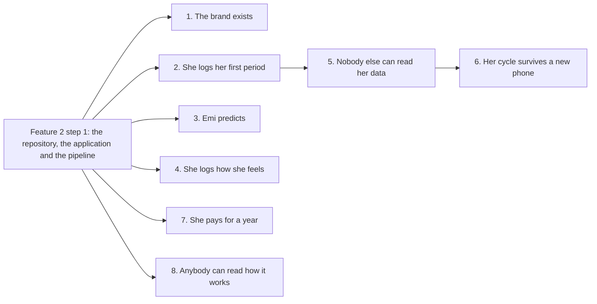

# The features of Emi, and what version 1 does not do

Emi is a period and cycle tracker. Seven features build version 1. An eighth feature writes the
documents you are reading now.

This document is the map. It names each feature, and it names every contract that the feature
builds. It also names what version 1 refuses to do, because a reader who knows what is absent can
plan around it.

## How to read this document

A contract says what one part of Emi must do, and it names every error that part must produce. The
contracts are in `contracts.md`. Each one carries an identifier, for example `TOKEN-1`.

Every contract appears once in the map below, under the feature that first makes it true. A later
feature can extend a contract, and the line says so when it does.

A test reads this document and `contracts.md` together. A contract in one document and absent from
the other fails the pipeline. The same test refuses a contract that the map names twice.

This document does not say what is built today. `architecture.md` says that, section by section,
with a status line under every heading.

## The order the features arrive in

Feature 2 step 1 creates the repository, the workspace packages and the pipeline. No other step has
anywhere to write until it lands. After it, feature 1 and feature 2 run together.

Feature 5 waits for feature 2, because a row must exist before Emi can encrypt it. Feature 6 waits
for feature 5, because a payload is worth sending only after an envelope exists. Feature 7 waits for
feature 2 alone. Feature 3 and feature 4 start their own packages early, and their screens wait for
the day log table in feature 2 step 2.

Nothing in the tooling holds this order. The operator holds it.

## Feature 1: The brand exists

The logo, the icon, the measured palette, the three fonts, the icon set and the illustration style,
on one sheet a person can look at. Seven steps.

The palette is measured and not chosen by eye. Each text colour carries the ground it sits on and
its contrast ratio, and a colour below the floor fails the build.

The sheet draws the ring, and feature 2 builds the ring geometry, because the arcs come from her own
cycle.

The contracts it builds:

- `TOKEN-1` the colour set, in one module, and a lint rule that refuses a colour written anywhere
  else.
- `TOKEN-2` a measured contrast ratio for every text colour, and a floor the build enforces.
- `TOKEN-3` the six type sizes, their line heights and their faces.
- `BRAND-1` the wordmark, with the open ring in place of the dot of the `i`.
- `BRAND-2` the application icon, in every size both stores ask for, from one source.
- `BRAND-4` the illustration style, which refuses a body, a face, a flower, a droplet and blood.
- `SEE-2` the rule that a phase fill never carries text, and the darker ink partner that does.

## Feature 2: She opens Emi and logs her first period

The repository, the application, the pipeline and the first run, ending with her own period on the
ring. Seven steps.

This feature carries the infrastructure of the repository, because step 1 is the first moment
anything can be shown at all.

The contracts it builds:

- `TABLE-1` the day log table, its eight columns, its unique day and the revision that rises on
  every write.
- `SCREEN-1` the first run, in three screens, with no account and no email address.
- `SCREEN-2` the home screen, with the ring, the cycle day and the phase name. Feature 3 adds the
  forecast range.
- `SCREEN-4` a past day, opened, read and edited, with the ring redrawn.
- `BRAND-3` the ring geometry: four arcs, a gap of ground between them, and a bead on today.
- `SEE-1` the ring read without colour, by the gap and by the written phase name.
- `SEE-3` a tap target of at least 44 points on both axes.
- `SEE-4` the ring held still when the operating system asks for reduced motion.

## Feature 3: Emi predicts, and says how sure it is

The next period as a range with a confidence, and the fertile window as an estimate, computed on the
phone. Six steps.

The forecast is a range and never a single day. A woman who is told the fourteenth and bleeds on the
sixteenth was told something false.

The contracts it builds:

- `CYCLE-1` a cycle starts on the first bleeding day that she did not mark unexpected.
- `CYCLE-2` the forecast, from the median of the last six lengths and their spread.
- `CYCLE-3` the learning state, before two cycles exist, with no confidence shown.
- `CYCLE-4` the estimated ovulation day and the fertile window, with no claim about pregnancy.
- `CYCLE-5` confidence bands whose edges come from published distributions, cited in the code.
- `TABLE-2` the cycle table as a cache, rebuilt from the day log and never written by hand.

## Feature 4: She logs how she feels

Seventy symptoms, mood, energy, temperature, weight and unexpected bleeding, in one sheet, read back
over six cycles. Six steps.

The symptom catalogue is the data this feature starts from. Each symptom carries a slug that never
changes, because six cycles of her history point at that slug. `ENVELOPE-2` validates a record
against that catalogue.

The contracts it builds:

- `SCREEN-3` the log sheet: flow, mood, energy, symptoms, temperature, weight and a note, saved in
  one action.

## Feature 5: Her data cannot be read by anybody else

The vault key in the keychain, every row encrypted, the biometric lock, the export and the one
action that deletes everything. Six steps.

Until this feature, the payload column holds plain bytes. After it, every write goes through the
envelope and every read comes back through it.

The contracts it builds:

- `ENVELOPE-1` the record format: a version byte, a 24 byte nonce, then the ciphertext and its tag.
- `ENVELOPE-2` the plaintext shape, as canonical JSON, with every field range refused at the edge.
- `ENVELOPE-3` fixed vectors, checked in, so a change to the format goes red.
- `VAULT-1` the vault key, made once, kept in the keychain, and never transmitted.
- `VAULT-3` the biometric lock on return from the background, on by default.
- `KEEP-2` the export, as a file she can read and a file a machine can read.
- `KEEP-3` delete everything in one action, with no cooling off period. Feature 6 deletes the
  account on the server.
- `KEEP-4` a dependency list with no analytics, no advertising identifier and no crash reporter that
  ships her content.

## Feature 6: Her cycle survives a new phone

The encrypted vault in Amazon Web Services, the recovery code, and her history restored onto a
second phone. Seven steps.

The whole cloud lives here. The server holds ciphertext and no key, so it can store a day and never
read one.

The contracts it builds:

- `TABLE-3` the sync state row, of which exactly one may exist.
- `TABLE-4` the vault table, whose every attribute a test reads to prove no day is in it.
- `ENVELOPE-4` the service that imports the validator alone, and holds no key of any kind.
- `VAULT-2` the recovery code, the salt and the wrapped vault key, with the unlock time measured.
- `WIRE-1` register an account from a public key, signed by the key that it registers.
- `WIRE-2` put a record, refusing a revision that does not rise.
- `WIRE-3` pull the records written after a cursor.
- `WIRE-4` delete every item of an account, with no confirmation on the server.
- `AUTH-1` the request signature, over the method, the path, the instant and the hash of the body.
- `KEEP-1` a log line that carries a request identifier and a duration, and nothing about her.

## Feature 7: She pays for a year, and the price is the promise

One month free, then 29.99 pounds a year. Read and export stay open forever if she stops paying. Six
steps.

The price is the product. There is no free tier, because a free tier is paid for with her data.

The contracts it builds:

- `PAY-1` one yearly product at 29.99 pounds, with a one month introductory free period, in both
  stores.
- `PAY-2` the entitlement, read on launch, kept when the store cannot be reached.
- `PAY-3` the receipt checked on the server, against the store that issued it.
- `PAY-4` a lapse that stops new writes and nothing else.
- `WIRE-5` a pull and a delete that work whatever the subscription says.

## Feature 8: Anybody can read how it works

The architecture, the privacy claim, the brand, this map and a readme in every package. Six steps.

This feature builds no contract of its own. It writes down what the other seven build, and it adds
the pipeline checks that stop these documents drifting from the code.

## What version 1 does not do

Each item below is out of version 1. Each one is a candidate for version 2. Nothing here is a
promise about when.

- Partner sharing, and tracking more than one partner.
- Medication tracking of every kind.
- Weight, beyond the single field in the day record.
- The mode for premenstrual dysphoric disorder.
- The mode for polycystic ovary syndrome.
- The mode for perimenopause.
- Import from another tracker, such as Flo or Clue.
- Import from a health platform, such as Apple Health.
- The reconstruction of a history from a photograph.
- Every wearable device.
- The conversational assistant.
- The doctor's report as a formatted document.
- The condition guides.
- Any certification.

Two of these refusals need a reason.

The conversational assistant is out because it cannot exist at the same time as the promise. A
model that answers a question about a cycle is a call to a server, and the call carries the
question. Emi keeps the promise and drops the assistant.

Certification is out because nobody has audited Emi. A badge that no auditor signed is a claim the
code cannot support. Emi is not a contraceptive. Emi is not a medical device. Emi makes no claim
that it can prevent a pregnancy or achieve one.

The export in feature 5 covers the plainer half of the doctor's report. She can take every field out
of Emi and hand it to a doctor. It is a file and not a formatted document.
