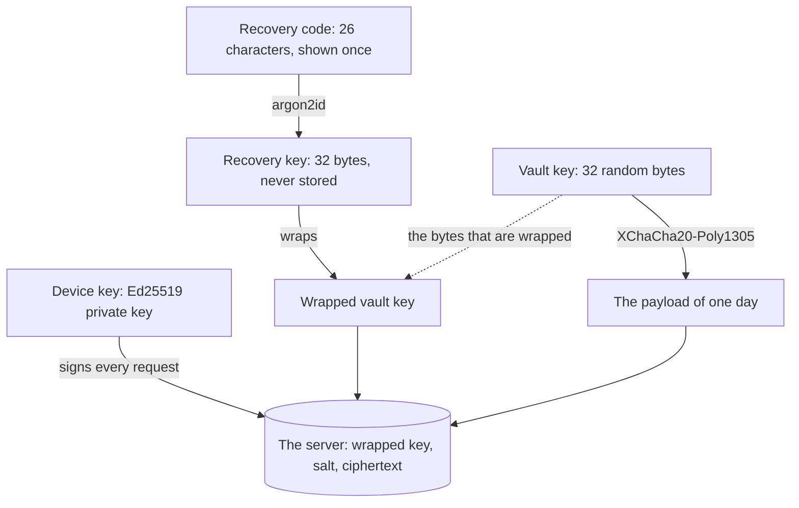

# What the encryption defends, and what it does not

Emi rests on one claim: nobody else can read her days. This repository is public so that a reader
can check the claim against the code rather than believe the marketing.

This document says which keys exist, where each one lives, what one day looks like once it is
encrypted, and the four attacks Emi accepts rather than fixes. The refusals are the part that makes
the rest worth reading.

Emi is not a contraceptive. Emi is not a medical device. Emi makes no claim to prevent or achieve a
pregnancy, and it carries no certification badge that an auditor did not sign.

## How to read this document

Status: built

Every section carries one status line, the same as `architecture.md`. `Status: built` means the
code is in this repository now. `Status: designed` means `.krewe/design.md` describes it and nobody
wrote it yet.

On 2026-09-17 the envelope is `built` and the keys around it are `designed`. `packages/crypto`
seals and opens a day, and fixed vectors hold the format still. Nothing writes through it yet: the
`payload` column of the day log holds plain bytes, and there is no keychain, no account and no
server. A document that described an empty package as though it protected somebody would be worse
than no document.

The wording rules below are `built`. A test reads every document, every source file and every
string in the application, and fails the pipeline on the forbidden wording.

## The claim, in one line

Status: designed

Emi encrypts each day on the phone, with a key that stays on the phone, and sends only the result.

Nothing that leaves the phone can be read by Emi, by Amazon Web Services, or by anybody who takes a
copy of the database. The server keeps ciphertext, a revision number and a write time. It holds no
key, so there is no request anybody can make of it that returns a day.

## The keys, and what guards each one

Status: designed

There are five keys. Two live on the phone and never leave it. One lives in her hands. One is
computed when she needs it. One lives on the server and is useless there.

### The vault key

Lives: the keychain on the phone, as `emi.vaultKey.v1`, through expo-secure-store.

Defence: it is 32 random bytes from `expo-crypto`, and it is never transmitted. It encrypts every
payload. Without it the ciphertext is 53 bytes of noise, so a copy of the server database, or of
the phone database on its own, buys nothing.

### The device key

Lives: the keychain on the phone, as `emi.deviceKey.v1`.

Defence: it is an Ed25519 private key. It signs the method, the path, the instant and the digest of
the body of every request, so a request nobody signed is refused. The server stores the public half
only. A person who steals the public half can prove nothing and read nothing, because this key
never touches a payload.

### The recovery code

Lives: her hands. It is shown once, at setup, and Emi never stores it.

Defence: it is 26 characters of Crockford base 32, which carries 130 bits. Guessing it is not an
attack anybody can run. Emi cannot read it back to her later, which is the same property that stops
anybody else reading it.

### The recovery key

Lives: nowhere. It is computed from the recovery code and the salt when she restores a phone, and
it is dropped again.

Defence: `argon2id` with 19456 kibibytes of memory, two passes and one lane turns the code into 32
bytes. The memory cost is what makes a guessing run expensive rather than cheap. Step 6.4 measures
the real cost on a device and raises the parameters to whatever keeps the unlock under one second.

### The wrapped vault key

Lives: the server, in the account item, beside a 16 byte salt.

Defence: it is the vault key encrypted under the recovery key, so the server holds it and can do
nothing with it. It is the one thing that lets a new phone read her old days. That is why losing
the recovery code loses the data.

## One day, once it is encrypted

Status: built

The plaintext is canonical json. The keys are sorted and there is no whitespace, so the same day
always produces the same bytes.

The envelope is bytes, in this order.

- one byte, the format version, `0x01`
- 24 bytes, a random nonce, fresh for every single write
- the ciphertext, and its 16 byte authentication tag

The cipher is XChaCha20-Poly1305 from `@noble/ciphers`. The envelope costs 41 bytes on top of the
plaintext, whatever the day holds.

One implementation lives in `packages/crypto`. It seals a day and opens it again today. The
application will use it to encrypt and to decrypt. The vault service will import it only to refuse
a malformed envelope, and never to decrypt, because the service has no key. The fixed vectors in
`packages/crypto/tests/vectors.json` hold the format still, so a change to it is caught rather
than shipped.

The day log still writes the payload column as plain bytes. Step 5.3 sends every row through the
envelope, and until it does, this section describes a package rather than a product.

The `day` column beside the payload is a copy of the date, kept in the clear so the application can
query by date. It stays on the phone. It is not part of the envelope that is sent.

## What Emi does not defend against

Status: designed

Four attacks are stated here rather than fixed. Each one is written with what she can do about it.

### A lost phone and a lost recovery code

The days are gone. Emi cannot recover them, and an Emi that could recover them would be an Emi that
could read them. There is no support desk that can help, by design.

What to do: write the recovery code down at setup, and keep it away from the phone. The setup screen
says this in one sentence before it shows the code.

### A phone somebody else can unlock

A person holding an unlocked phone reads everything on the screen, because the application has the
key in order to work at all.

What to do: turn the biometric lock on. It is step 5.4 and it is on by default. Emi also hides the
preview while the application is in the background, so a glance at the switcher shows nothing.

### A phone running something hostile

The key sits in the keychain of the phone. Software that already owns the operating system, through
a compromise or a jailbreak, can reach what the operating system will hand it. No application can
defend itself from underneath. Emi does not pretend otherwise.

What to do: keep the operating system current, and do not run Emi on a jailbroken phone.

### What the outside learns without reading a day

The server learns how many records an account holds, and the instant of each write. Padding those
write times would cost battery and buy little. Apple or Google also knows she bought a subscription
to Emi, because the store takes the payment.

What to do: nothing on her side. It is stated here so that a reader can weigh it, rather than find
it later.

## The wording Emi may not use

Status: built

A test reads every tracked document, every source file and the store listing copy, and fails the
pipeline when it finds the wording of a claim Emi cannot support. The list is in
`tools/pipeline/forbiddenClaims.ts` and the test is beside it.

Emi never says a day is safe, because no day is. The fertile window is an estimate of when
ovulation is likely, and it is drawn from her own past cycles.

No auditor has looked at Emi, so no standard is named here and no certification badge appears
anywhere in the product. When one signs something, this section changes and the badge arrives with
it.

One sentence may carry a forbidden word: a sentence that denies the claim. Those sentences are
listed in the same module, so adding one is a deliberate act a reviewer can see in the diff.
