# The story of Emi

Emi is a period and cycle tracker. This document shows what it looks like. It follows one woman
through the product, one feature at a time, and it puts a picture under each thing she does.

`features.md` names the eight features. `contracts.md` says what each part must do. Neither one
shows anybody a screen, so a person who wants to know what Emi looks like has to run it. This is the
document that answers that instead.

## How to read it

A section tells one feature. The sections are in the order `features.md` gives.

A beat is a sentence and a picture. The sentence says what she does. The picture shows the screen
she does it on.

No picture here was captured from a phone, and none is a mockup. Every one comes from the code, in
one of two ways, and the line under each picture says which way and names the command that makes it
again.

A picture of a screen is rendered under the test runner. The runner mounts the screen the
application ships, reads the tree it produced, and draws that tree in a browser. A picture of a
drawing, which is everything in feature 1, is written by a generator of its own from the numbers in
the token package.

One thing a rendered screen does not carry. A browser lays a screen out in rows where a phone
lays it out in columns, which the renderer restores by hand, so a control can sit a little higher up
the frame than it does on a phone. The face is the one that ships: the page loads the same font
files the application loads, under the same names, so every word is drawn in Plus Jakarta Sans.

Every feature in `features.md` has a section here. The pipeline runs `npm run check:story`, and a
feature with no section now stops it, because a story that quietly tells less than the product does
is the thing this check exists to catch. It fails too when the story names a picture that is not
there, and when the line under a picture does not say how the picture was made. It names, without
failing, every picture in `brand/screens` that no section shows.

Three sections show no picture, and each one says why on its own line, beginning `Nothing to show:`.
The run repeats those reasons every time, so a section that has quietly stopped being true is read
by whoever runs the check rather than by nobody.

## Feature 1: The brand exists

She sees the mark before she sees a screen: on the home screen of her phone, in the store, and on
the first screen of the first run. This feature is everything that is drawn rather than written.
Every number in it is measured and not chosen by eye, and the whole of it sits on one sheet.

The pictures in this section are made differently from the rest of the story. Each one is written by
a generator of its own rather than under the test runner, so the line under each names the command
that writes it again.

She reads the name first. The mark is `emi` in lowercase Fraunces, and the dot of the `i` is a ring
with a gap of 40 degrees opening at the upper left, which is the same open ring her cycle is drawn
on.

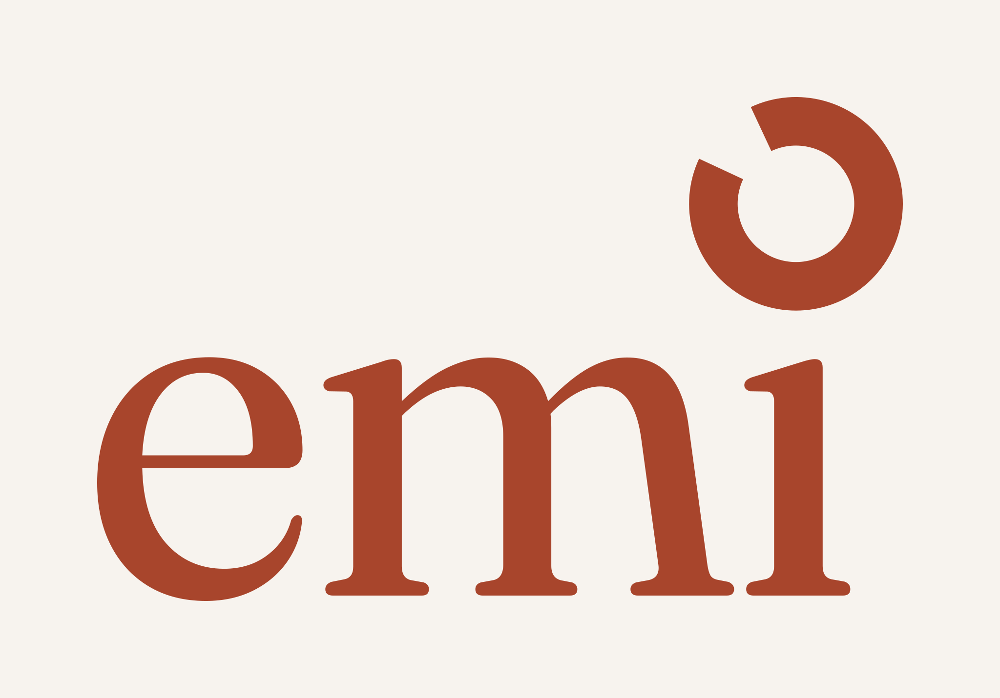

Drawn by its own generator, rather than under the test runner. `npm run generate:logo` writes this
file from the numbers in `brand/logo/geometry.ts`, and a test redraws it and refuses a file edited by
hand.

On the home screen of her phone the mark is the ring alone, at 56 percent of the width and sitting a
little above the middle so it reads as centred. One program writes all 24 files the two stores ask
for from that one drawing.

Drawn by its own generator, rather than under the test runner. `npm run generate:app-icon` writes
every size from `brand/logo/emi-ring.svg`, and a test refuses a size a store asks for and nobody
wrote.

She can read every word on every ground, because the palette is measured rather than chosen.
Eighteen colours, each text colour carrying the ground it sits on and the ratio it was measured at,
and a pair below 4.5 to 1 fails the build. Text never sits on a phase fill: each phase colour has a
darker ink partner that carries the words.

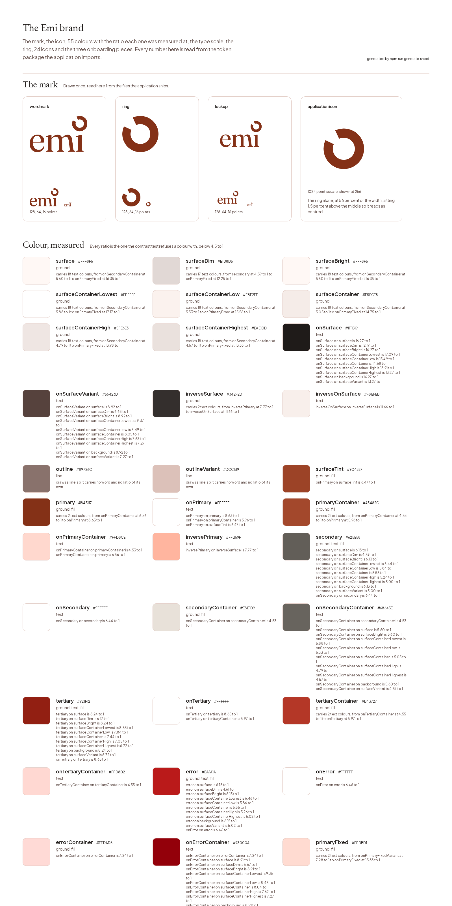

Drawn by its own generator, rather than under the test runner. `npm run generate:sheet` writes the
page from `packages/tokens`, and `npm run check:sheet` fails when the committed page and the tokens
disagree by one character.

She reads Emi in three faces. Newsreader carries the display roles and the headings, Plus Jakarta
Sans carries what she reads at length, and JetBrains Mono carries a number, a unit or a label.
Thirteen roles, each with the line height the token package fixes, and every sentence on the page is
one Emi writes.

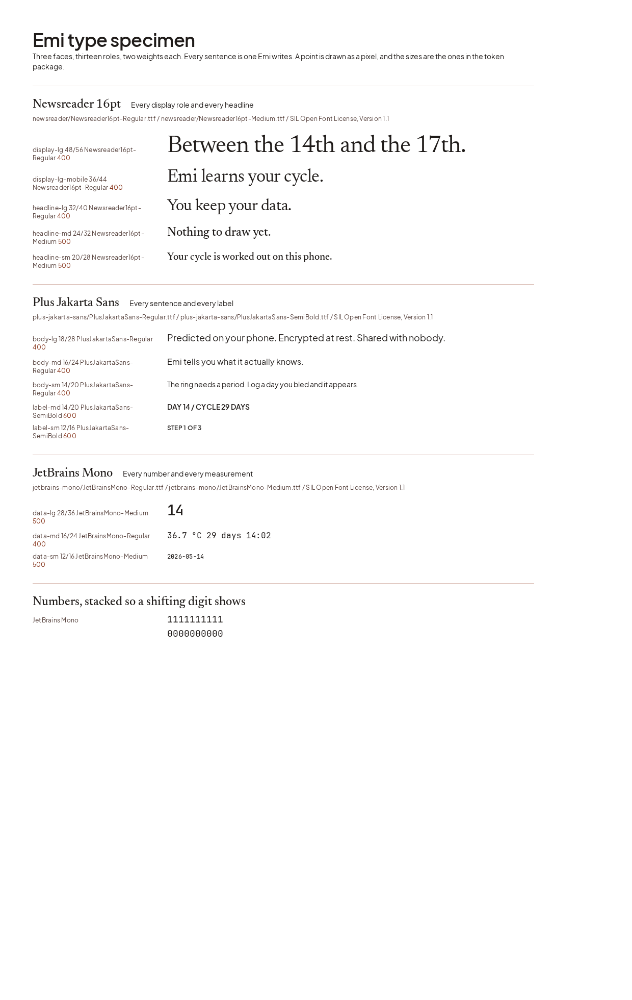

Drawn by its own generator, rather than under the test runner. `npm run generate:specimen` reads the
type scale and the font files from `packages/tokens`, so the page cannot name a size the application
does not have.

The ring carries the meaning, so the words do not have to. Each arc is sized by the days of that
phase, three degrees of ground sit at every boundary, the days she has had are solid where the days
ahead are at a fifth, and the ember bead is today. Feature 2 draws it from her own cycle.

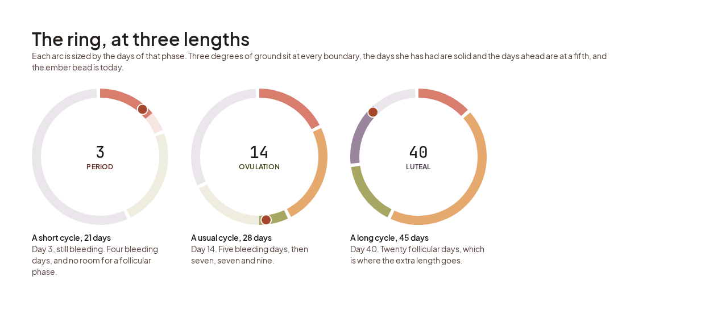

Drawn by its own generator, rather than under the test runner. `npm run generate:ring-picture` draws
it from the geometry in `packages/tokens/src/ring.ts`, which is the arithmetic the screen draws
with.

Every symbol she presses comes from one set. Twenty drawings, one weight, on a 24 point grid and
shown at it. Each one leaves its colour as `currentColor`, so the screen that uses it decides the
colour and nobody writes a value into the drawing.

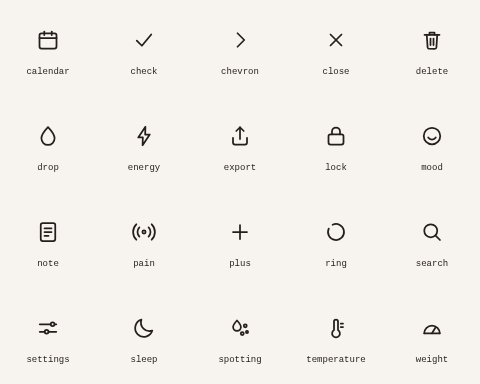

Drawn by its own generator, rather than under the test runner. Run
`node --experimental-strip-types brand/icons/generate.ts`, which reads the directory and writes the
token module that names them.

An illustration is two or three soft shapes in the phase colours, and never a picture of a thing.
The style refuses a body, a face, a flower, a droplet and blood, because a stranger at arm's length
must learn nothing from her screen, and a test reads every drawing and every file name for those
five subjects.

Drawn by its own generator, rather than under the test runner. Run
`node --experimental-strip-types brand/illustration/render.ts`, which draws each piece into the
picture beside it.

## Feature 2: She opens Emi and logs her first period

She installs Emi and opens it. Three screens ask her two things, and then she is on her own ring
with her own period on it. Nothing leaves the phone, and she is never asked who she is.

She opens Emi for the first time and it asks her nothing about herself. It says what Emi does, what
it never does, and the two things it refuses to be.

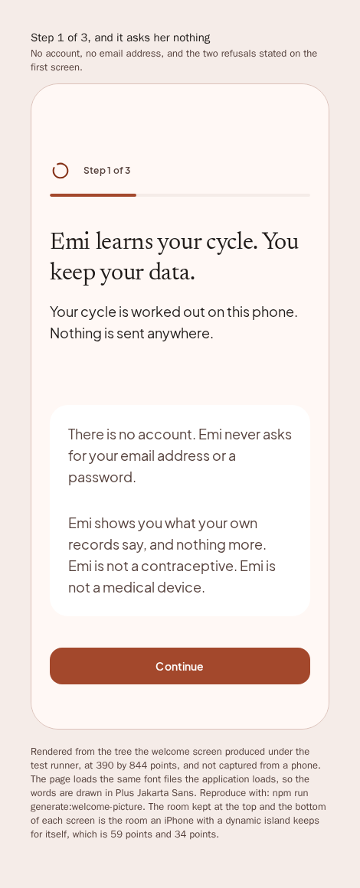

Rendered under the test runner at 390 by 844 points, and not captured from a phone. Draw it again
with `npm run generate:welcome-picture`.

It asks when her last period started, and it opens on the month she is in. Today and yesterday sit
above the calendar, because those are the two answers she gives most. A day she has not lived is
drawn faint and takes no press.

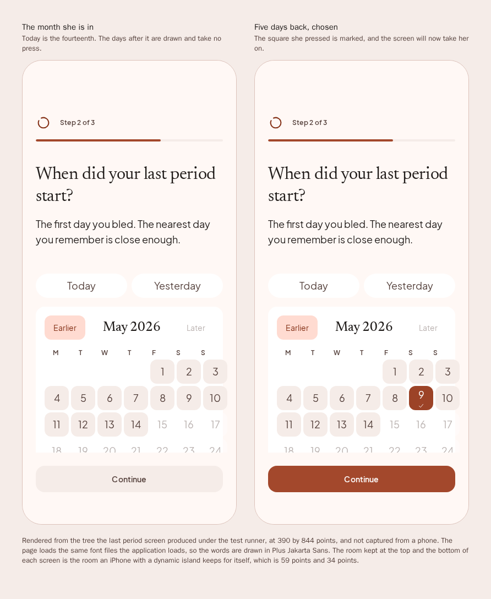

Rendered under the test runner at 390 by 844 points, and not captured from a phone. Draw it again
with `npm run generate:last-period-picture`.

It asks how long her cycle runs. The number starts at 28 days, and one press moves it by one day,
between 21 and 45. Emi corrects this itself once it has seen two cycles of her own, and the screen
says so.

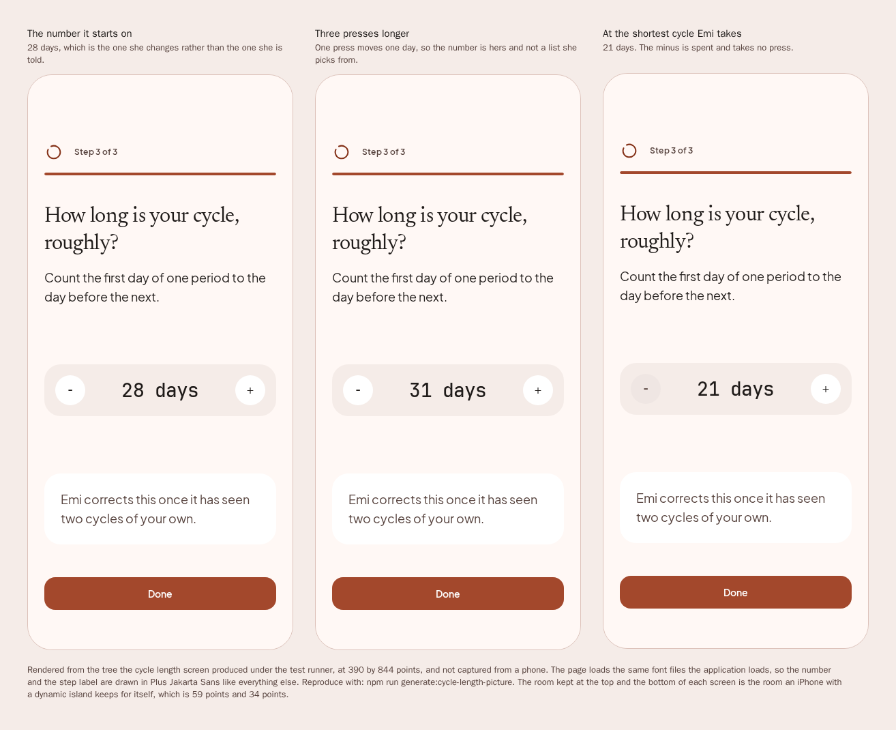

Rendered under the test runner at 390 by 844 points, and not captured from a phone. Draw it again
with `npm run generate:cycle-length-picture`.

Her answers make the ring, and the ring is the product. It carries the day of her cycle and the
phase she is in, so she can read it across a room and nobody beside her can. It draws what her own
records support and no more: with one cycle recorded Emi says it is still learning, and it gives a
range with a confidence only once it has two.

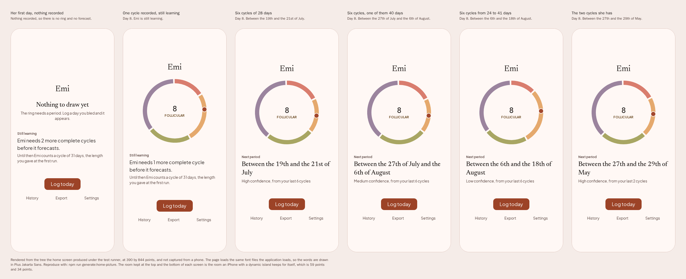

Rendered under the test runner at 390 by 844 points, and not captured from a phone. Draw it again
with `npm run generate:home-picture`.

She bleeds, so she logs the day. She presses one of five flow values and the ring redraws around
her. A day she marks as not her period is kept and never starts a cycle.

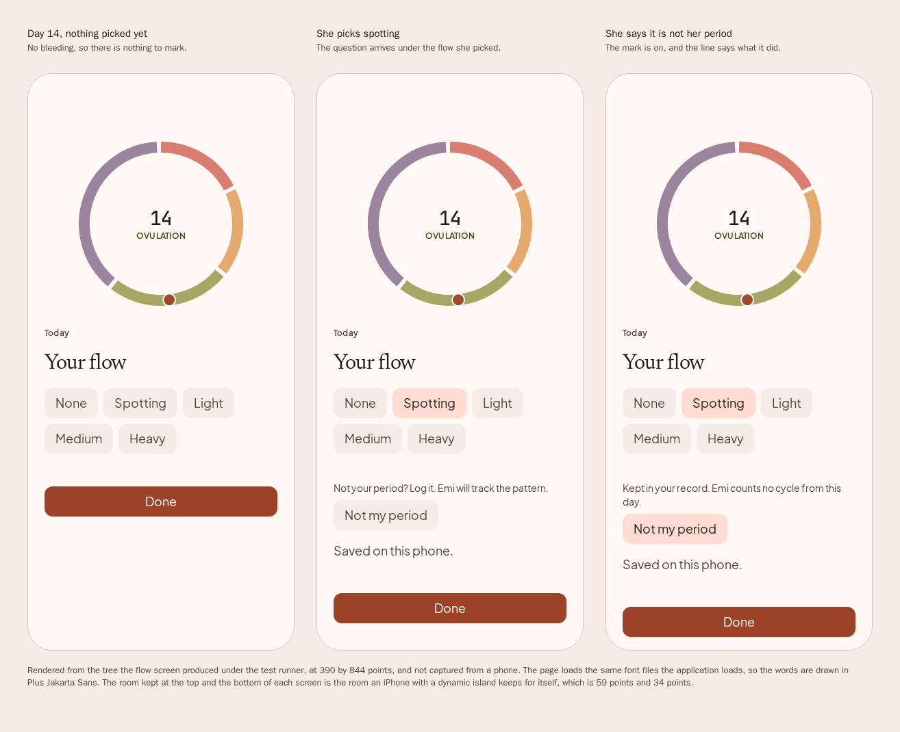

Rendered under the test runner at 390 by 844 points, and not captured from a phone. Draw it again
with `npm run generate:flow-picture`.

She forgot a day of that period, and it is now several days later. She opens that day at its own
address and corrects it. The ring beside the picker stays on today, because what a corrected day
changes is where she stands now. A day she has not lived is refused by the write and not only by the
screen.

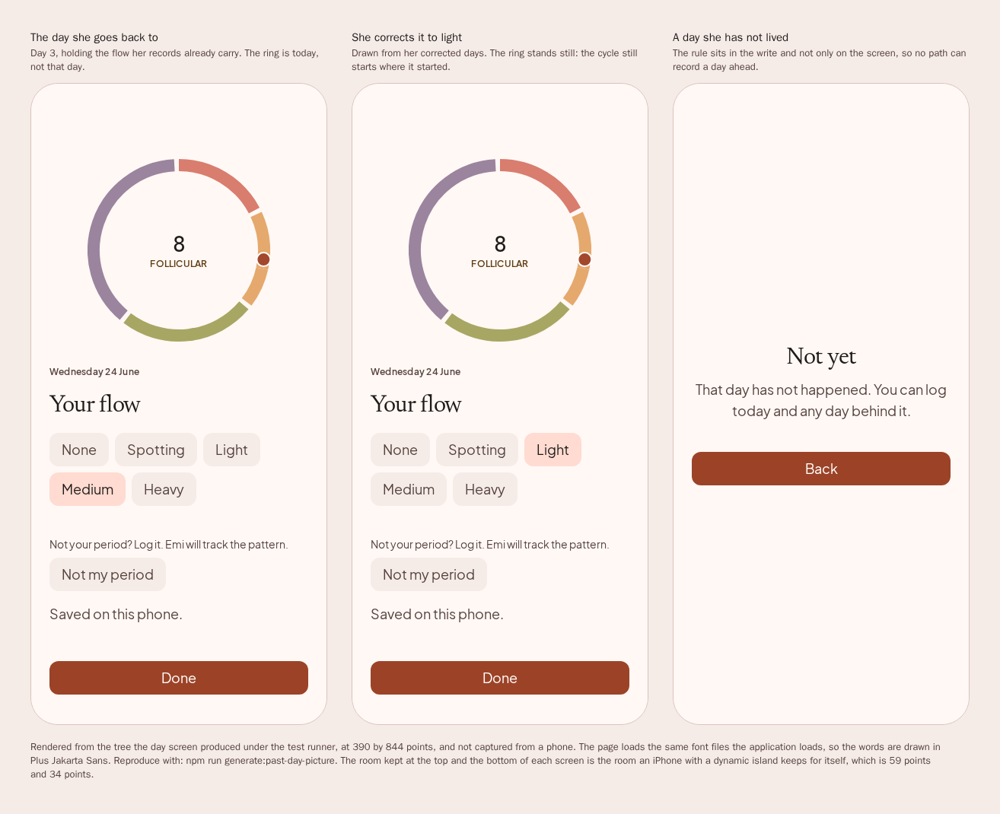

Rendered under the test runner at 390 by 844 points, and not captured from a phone. Draw it again
with `npm run generate:past-day-picture`.

## Feature 3: Emi predicts, and says how sure it is

Emi works out when her next period is likely to start, and it says so as a range with a confidence
beside it. The arithmetic runs on her phone, on her own last six cycles, and nothing is sent
anywhere to produce it. A woman told the fourteenth who bleeds on the sixteenth was told something
false, so the forecast is a range and never a single day.

She reads it in the same place she reads the ring. Before two cycles are complete Emi says it is
still learning, names how many more it wants, and counts by the length she gave at the first run,
with no confidence shown, because a confidence is a statement about the spread of her own cycles and
one cycle has no spread. Once she has two, the same place carries two dates and how sure Emi is of
them: high when her cycles sit close together, low when they do not.

Rendered under the test runner at 390 by 844 points, and not captured from a phone. Draw it again
with `npm run generate:home-picture`.

Three things behind that sentence have nothing to show, because they are arithmetic rather than
screens. The next start is the last start plus the median of her last six cycle lengths, the median
rather than the mean so one long cycle after an illness does not drag every forecast behind it. The
width of the range comes from how far her own lengths sit from each other. The confidence band
edges come from one published study of 612,613 cycles from 124,648 users, quoted in
`packages/cycle/src/confidence.ts` with its identifier, so a reader can check an edge against the
source rather than trust it.

Two things this feature names that no screen shows today. The fertile window is built and tested:
it runs from five days before the estimated ovulation day to one day after it, it is never drawn as
a single date, and the estimate says what it is worth. No screen renders it, so there is no picture
of it here. Emi never says a day is safe, because no day is. And the cycle table is a cache rebuilt
from her day log rather than written by hand, which is a table and not a thing to look at.

## Feature 4: She logs how she feels

A period tracker that only holds bleeding days tells her what she already knows. This feature is
everything else about a day: her mood, her energy, a waking temperature, a weight, and seventy
symptoms she can look through or search. One press of save writes the whole day.

She says how she feels. The sheet opens with the ten moods, then energy from one to five, then the
two measurements, then the other sixty symptoms in seven groups. Nothing here is typed twice: a
symptom is a slug that never changes, so six cycles of her history still point at it after the
wording on the chip is rewritten.

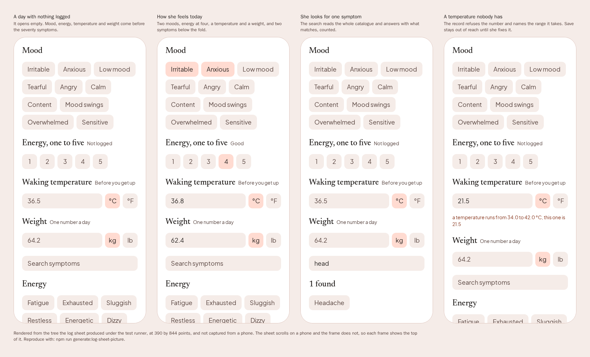

Rendered under the test runner at 390 by 844 points, and not captured from a phone. Draw it again
with `npm run generate:log-sheet-picture`.

She bleeds on a day she did not expect to, and says so. A day she marks that way is kept in full and
never starts a cycle, so one odd day does not move every forecast behind it.

Rendered under the test runner at 390 by 844 points, and not captured from a phone. Draw it again
with `npm run generate:flow-picture`.

Months later the logging pays. The history lists her last six cycles and names the symptoms that
came back at the same point in three or more of them, with the count beside each one. A symptom she
logged once is not named, because calling a coincidence a pattern is the one failure this screen can
have, and Emi says how many cycles it still wants rather than guessing early.

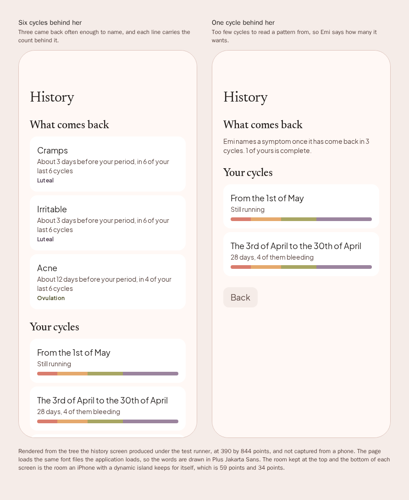

Rendered under the test runner at 390 by 844 points, and not captured from a phone. Draw it again
with `npm run generate:history-picture`.

Two things this feature does not have yet. `SCREEN-3` names a note beside the rest of the day, and
no note field is built. And no screen opens the sheet: `/log` reaches the flow row, the sheet is
driven by its own tests, and the picture above is rendered from the component rather than from a
route she can walk to.

## Feature 5: Her data cannot be read by anybody else

Every day she logs is encrypted on her phone before it reaches the database, with a key made once
on that phone and kept in the keychain. Nobody at Emi can read a row, which is why nobody at Emi can
recover one either. This feature is that promise, and the three places she meets it.

She comes back to Emi and the phone asks who she is. Emi decides to lock on the way out rather than
on the way back, because asking the phone a question takes a moment and a screen drawn during that
moment is a screen a stranger reads. The lock is on by default, and what the task switcher keeps of
Emi is the wordmark and nothing she wrote.

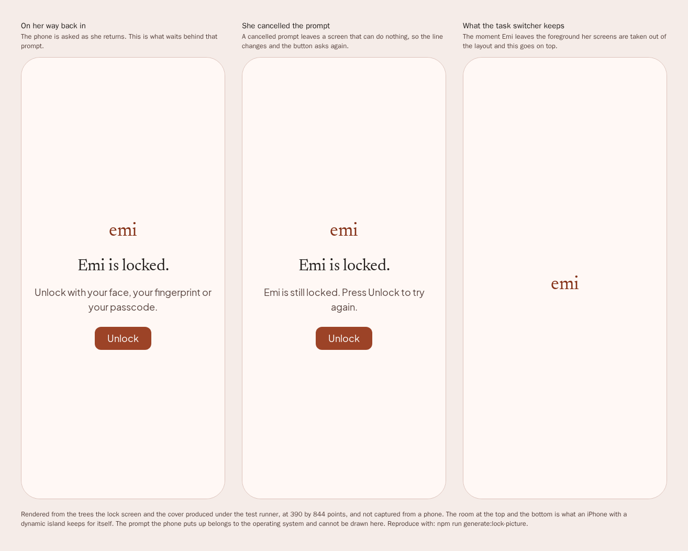

Rendered under the test runner at 390 by 844 points, and not captured from a phone. Draw it again
with `npm run generate:lock-picture`.

She takes her record out. One press writes two files: a page she can read and hand to a doctor, and
a JSON file a machine can read. Both hold everything she logged, in the wording Emi uses on screen,
and neither one is sent anywhere.

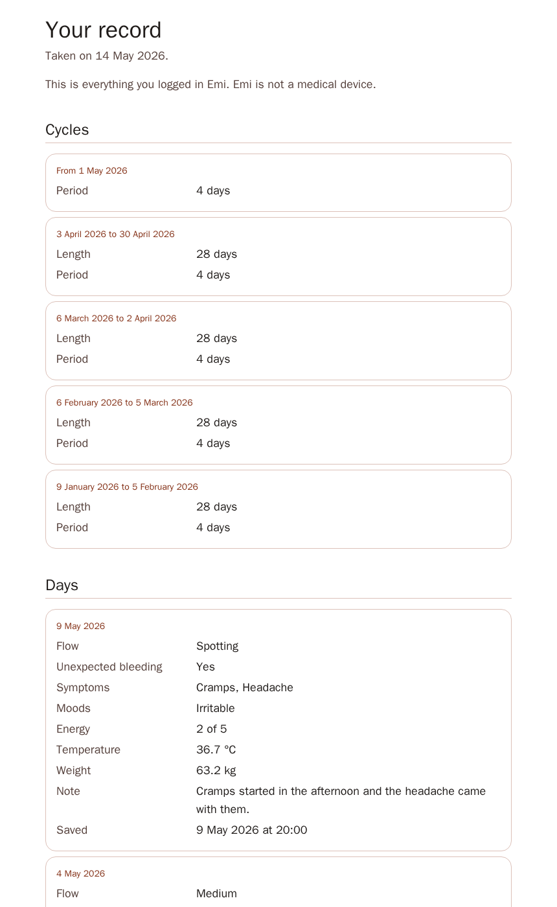

Rendered under the test runner at 860 by 1400 points, and not captured from a phone. It is the file
the application writes, opened in a browser. Draw it again with `npm run generate:export-picture`.

She decides to leave, and one press is the whole of it. The screen lists what goes before she
presses it, the way back out is an ordinary button beside the one that deletes, and there is no
cooling off period and no undo. What comes back is an empty ring, because nobody at Emi can put any
of it back.

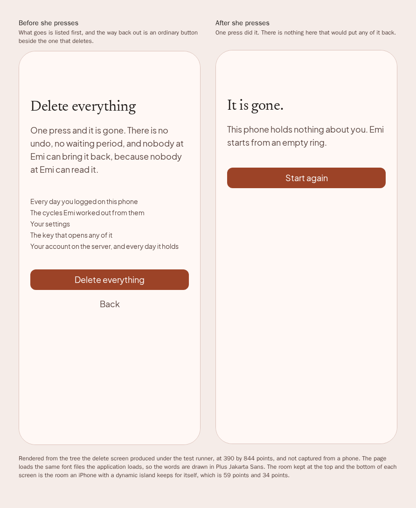

Rendered under the test runner at 390 by 844 points, and not captured from a phone. Draw it again
with `npm run generate:delete-picture`.

Under all three there is nothing to photograph. A stored day is a version byte, a 24 byte nonce and
then the ciphertext with its tag, and the plaintext inside it is canonical JSON whose every field is
refused at the edge if it is out of range. Fixed vectors are checked in, so a change to that format
turns a test red rather than turning her old days into noise. The key lives in the keychain and is
never transmitted, and a scan of the dependency list refuses an analytics library, an advertising
identifier and any crash reporter that would carry her content off the phone.

One line on the delete screen is ahead of the product. It says her account on the server goes too,
and the vault in Amazon Web Services is designed rather than running: `docs/architecture.md` says so,
and a build carrying no vault address never made an account for there to be anything to take. The
code for that half is written and feature 6 is where it arrives. Until then the delete has nothing
up there to reach, and the screen has a second sentence for the case where it cannot.

## Feature 6: Her cycle survives a new phone

She loses her phone, buys another one, and her history is still hers. That is the whole of this
feature, and it is the one place a cloud exists at all: an encrypted vault in Amazon Web Services
that holds ciphertext and no key, so it can store a day and never read one.

The half that runs on the phone is written. Her phone makes a device key, keeps it in the keychain,
and signs every request over the method, the path, the instant and a hash of the body. The recovery
code, which is the only thing that can unwrap her vault key on a second phone, has its screens:
`RecoverySetup`, `ShowRecoveryCode` and `ConfirmRecoveryCode`. The service that answers is written
too, with one handler each to register an account from a public key, to put a record, to pull the
records after a cursor and to delete every item of an account.

Nothing to show: the vault is not running, `docs/architecture.md` says so, no route opens the
recovery screens, and nothing yet sends a day up or pulls one down. A second phone cannot restore
her history today, so there is no screen of this to photograph.

## Feature 7: She pays for a year, and the price is the promise

One month free, then 29.99 pounds a year, and no free tier at all, because a free tier is paid for
with her data. If she stops paying she keeps what she wrote: reading her history and exporting it
stay open forever, and only new writes stop.

None of that is built. There is no product in either store, nothing reads an entitlement on launch,
no receipt is checked anywhere, and no screen asks her for money. The design is in `features.md` as
five contracts and nothing in the application answers to them yet.

Nothing to show: not one line of this feature is built, so every screen it will have is a design
rather than a picture, and drawing one here would be an illustration of a product that does not
exist.

## Feature 8: Anybody can read how it works

The repository is public so that a reader can check the privacy claim against the code that makes
it. This feature is the readable half of that: the architecture, the privacy document, the feature
map, the contracts, the brand sheet, the reference pages, the licences and the document you are
reading now.

It builds no contract of its own. What it does build is the set of checks that stop these documents
drifting from the code, and the pipeline runs all of them: the documents check renders every
diagram and holds `features.md` and `contracts.md` to each other, the brand and reference and sheet
checks regenerate their pages and fail on a difference of one character, the feature check reads the
scenarios, and `check:story` holds this document to the features and to the pictures on disk.

Nothing to show: this feature writes documents and checks rather than screens, so there is nothing
in the application to draw. The documents themselves are the artefact, and they are in `docs/`.
