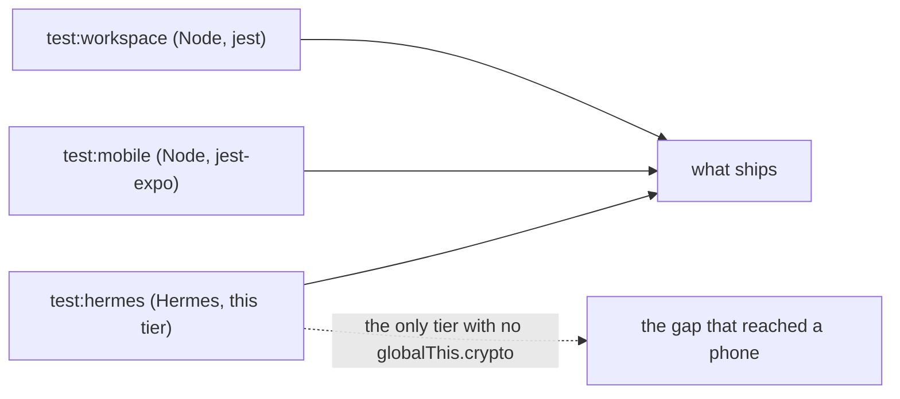

# tools/hermes

The third test tier. It runs on Hermes, the engine a phone runs, and it exists because the other
two tiers run on Node and Node is not that engine.

Node carries globals a phone has never had. The one that cost something is `crypto`. The day vault
sealed a record without handing the envelope a random source, the envelope fell back to
`globalThis.crypto`, every test passed on Node, and the application died the first time a woman
finished the first run. Nothing in the repository could see it, because nothing in the repository
ran on the engine that refuses.

## How to run it

From the root of the repository:

    npm run test:hermes

It is also the third thing `npm test` runs, and the pipeline runs it as a step of its own.

## What runs here

Code with no native module under it:

`packages/crypto`, which is the whole reason the tier exists. The frozen vectors in
`packages/crypto/tests/vectors.json` and `packages/crypto/tests/signatureVectors.json` are sealed,
opened, signed and verified on the engine, so the bytes a phone writes are held to the bytes the
service reads.

`apps/mobile/src/services/vault/dayVault.ts`, with a deterministic random source in place of
`phoneRandom`, because `expo-crypto` is a native module and cannot load here.

`apps/mobile/src/features/onboarding/days.ts` and the pure day arithmetic in `@emi/cycle`.

## What does not run here, so do not try

Anything that imports `react-native`, `expo-router`, `expo-sqlite`, `expo-secure-store` or
`expo-crypto`. A bare engine has no native module and no React Native runtime under it, so those
modules cannot load at all. This tier is a floor under the other two and never a replacement for
either.

## The prelude is the part that matters

`prelude.ts` installs the globals a phone has and this engine does not, and nothing else. Each
entry names who provides it on a phone: React Native's `InitializeCore` provides `console`, Hermes
itself provides `TextEncoder` from version 0.17, and Expo's runtime installs `TextDecoder` and
`structuredClone` from `expo/src/winter/runtime.native.ts`.

`TextEncoder` is the one of those that no file in the repository installs, so here is why the
engine is credited with it. Expo's own `TextEncoderStream` calls `new TextEncoder()` and neither
Expo nor React Native puts one there. The crash itself says the same thing: `sealRecord` builds the
record bytes through `new TextEncoder()` before it ever draws a nonce, so on the phone the encoder
ran and the random source is what refused.

Nothing installs `crypto`, on a phone or here, and that absence is the whole gate. Every entry
added to the prelude is one refusal this tier stops being able to catch, so add one only when a
real phone provides it, and say who. The prelude reads `globalThis.crypto` after everything it
imports has loaded and throws when something put one there.

## What this tier does not promise

The engine is 0.12.0 and a phone runs 0.17. `hermes-engine-cli` is the newest Hermes published as a
command line tool, because Meta stopped publishing standalone releases after 0.13.0, and npm marks
the package as no longer supported. So a difference between those two builds is not covered here.
Two differences are already known and paid for: 0.12 has no `class` syntax, so
`tools/hermes/babel.config.json` rewrites classes and a phone does not, and 0.12 has no
`TextEncoder`, so the prelude stands one in. A case in `cases/canonical.ts` holds that stand in to
known bytes rather than to itself, because an encoder checked against its own decoder passes with
both halves wrong.

No native module is covered. No React Native runtime is covered. No screen is covered.

The engine ships for macOS and for 64 bit Linux. On anything else the tier refuses by name rather
than falling back to Node, because Node is the engine it exists to stop trusting.

## The trap

A run that discovers no case reports the same nothing as a run where every case passed. So the
runner counts what it collected, prints `cases ran <count>`, and refuses a count of zero. The
reader in `outcome.ts` refuses it a second time, along with a run that printed no count at all.
When you add a case, read the count and watch it move.

Hermes lists the globals a bundle reaches but never declares. Those lines are the compiler saying
what the code depends on, not a failure, and the last line of the run is the one that decides.
